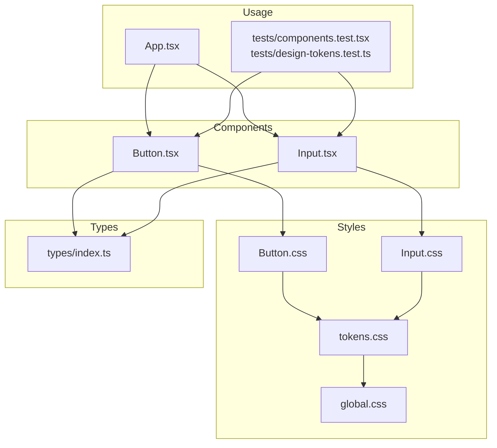
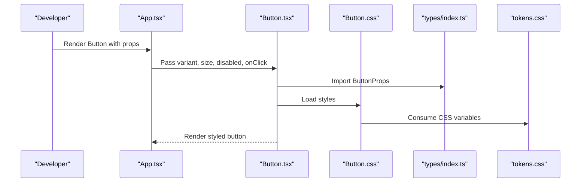
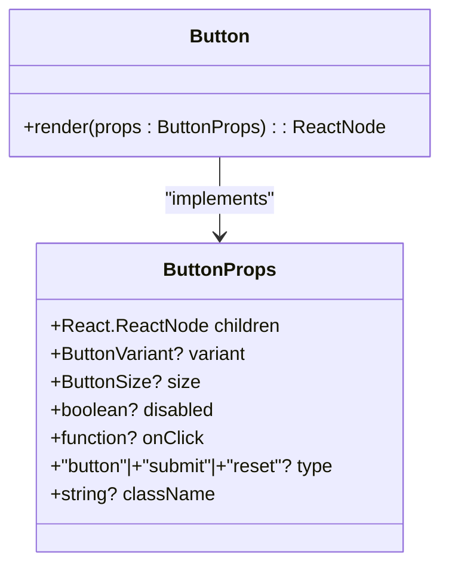
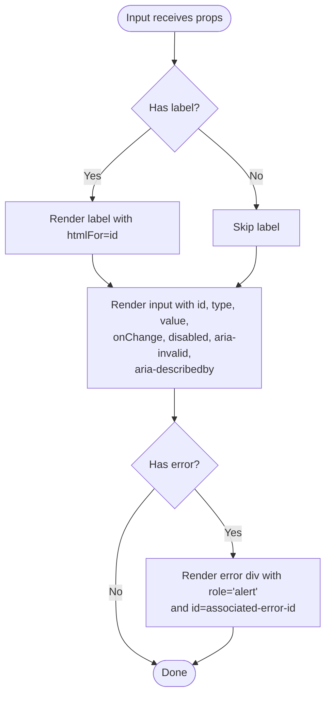
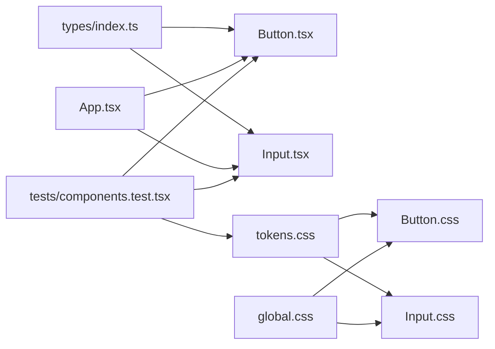

# Base Components

<cite>
**Referenced Files in This Document**
- [Button.tsx](file://src/components/Button/Button.tsx)
- [Button.css](file://src/components/Button/Button.css)
- [Input.tsx](file://src/components/Input/Input.tsx)
- [Input.css](file://src/components/Input/Input.css)
- [index.ts (types)](file://src/types/index.ts)
- [tokens.css](file://src/styles/tokens.css)
- [global.css](file://src/styles/global.css)
- [App.tsx](file://src/App.tsx)
- [components.test.tsx](file://tests/components.test.tsx)
- [design-tokens.test.ts](file://tests/design-tokens.test.ts)
</cite>

## Table of Contents
1. [Introduction](#introduction)
2. [Project Structure](#project-structure)
3. [Core Components](#core-components)
4. [Architecture Overview](#architecture-overview)
5. [Detailed Component Analysis](#detailed-component-analysis)
6. [Dependency Analysis](#dependency-analysis)
7. [Performance Considerations](#performance-considerations)
8. [Troubleshooting Guide](#troubleshooting-guide)
9. [Conclusion](#conclusion)
10. [Appendices](#appendices)

## Introduction
This document describes the base UI components that form the foundation of the design system: Button and Input. It explains variants, sizes, disabled states, accessibility features, and how the components consume design tokens via CSS custom properties. It also documents the TypeScript prop interfaces that ensure type safety, provides usage patterns for forms and validation, and outlines composition and integration approaches with other UI elements.

## Project Structure
The base components live under src/components with dedicated folders per component, each containing a TypeScript implementation and a CSS module. Shared design tokens are defined in src/styles/tokens.css and imported globally via src/styles/global.css. Type definitions for props are centralized in src/types/index.ts. Example usage appears in src/App.tsx, and component behavior is verified by tests in tests/components.test.tsx and tests/design-tokens.test.ts.

**Diagram sources**
- [Button.tsx:1-34](file://src/components/Button/Button.tsx#L1-L34)
- [Button.css:1-65](file://src/components/Button/Button.css#L1-L65)
- [Input.tsx:1-50](file://src/components/Input/Input.tsx#L1-L50)
- [Input.css:1-59](file://src/components/Input/Input.css#L1-L59)
- [tokens.css:1-108](file://src/styles/tokens.css#L1-L108)
- [global.css:1-157](file://src/styles/global.css#L1-L157)
- [index.ts (types):1-100](file://src/types/index.ts#L1-L100)
- [App.tsx:1-148](file://src/App.tsx#L1-L148)
- [components.test.tsx:28-65](file://tests/components.test.tsx#L28-L65)
- [design-tokens.test.ts:1-106](file://tests/design-tokens.test.ts#L1-L106)

**Section sources**
- [Button.tsx:1-34](file://src/components/Button/Button.tsx#L1-L34)
- [Input.tsx:1-50](file://src/components/Input/Input.tsx#L1-L50)
- [index.ts (types):1-100](file://src/types/index.ts#L1-L100)
- [tokens.css:1-108](file://src/styles/tokens.css#L1-L108)
- [global.css:1-157](file://src/styles/global.css#L1-L157)
- [App.tsx:1-148](file://src/App.tsx#L1-L148)
- [components.test.tsx:28-65](file://tests/components.test.tsx#L28-L65)
- [design-tokens.test.ts:1-106](file://tests/design-tokens.test.ts#L1-L106)

## Core Components
This section documents the Button and Input components, their variants, sizes, disabled states, accessibility attributes, and how they integrate with the design system’s type definitions and tokens.

- Button
  - Variants: primary, secondary
  - Sizes: sm, md, lg
  - Disabled state: applies disabled attribute and reduced opacity
  - Accessibility: supports focus-visible outline and forwards onClick handler
  - Composition: renders children inside a button element with computed class names

- Input
  - Form integration: accepts label, placeholder, value, onChange, error, disabled, type, id, className
  - Validation: displays error message and sets aria-invalid and aria-describedby when error is present
  - Keyboard navigation: standard input behavior with focus-visible outline via global styles
  - Placeholder behavior: placeholder text color and reduced opacity
  - Composition: wraps an optional label and an input, rendering an error alert region when error is provided

Both components derive their visual consistency from design tokens consumed via CSS custom properties defined in tokens.css and imported by each component’s stylesheet.

**Section sources**
- [Button.tsx:5-31](file://src/components/Button/Button.tsx#L5-L31)
- [Button.css:3-64](file://src/components/Button/Button.css#L3-L64)
- [Input.tsx:5-46](file://src/components/Input/Input.tsx#L5-L46)
- [Input.css:3-58](file://src/components/Input/Input.css#L3-L58)
- [index.ts (types):13-40](file://src/types/index.ts#L13-L40)
- [tokens.css:8-107](file://src/styles/tokens.css#L8-L107)
- [global.css:124-127](file://src/styles/global.css#L124-L127)

## Architecture Overview
The base components follow a predictable pattern:
- Props are typed centrally in types/index.ts
- Components render semantic HTML elements (button, input)
- Stylesheets import tokens.css and apply design tokens via CSS custom properties
- Global focus-visible styles ensure accessible focus management
- App.tsx demonstrates usage in a real layout

**Diagram sources**
- [App.tsx:74-77](file://src/App.tsx#L74-L77)
- [Button.tsx:1-34](file://src/components/Button/Button.tsx#L1-L34)
- [Button.css:1-65](file://src/components/Button/Button.css#L1-L65)
- [index.ts (types):20-28](file://src/types/index.ts#L20-L28)
- [tokens.css:8-107](file://src/styles/tokens.css#L8-L107)

## Detailed Component Analysis

### Button Component
- Implementation highlights
  - Accepts children, variant, size, disabled, onClick, type, className
  - Builds a class list combining base, variant, and size modifiers
  - Renders a native button with disabled and onClick forwarded
- Variants and sizes
  - Variant classes: primary, secondary
  - Size classes: sm, md, lg
- Accessibility and UX
  - Focus visible outline via global focus styles
  - Disabled state reduces opacity and sets disabled attribute
- Style consumption
  - Imports tokens.css and uses --color-accent, --color-border-focus, --border-radius, --border-width, --space-* tokens, and --transition-fast

**Diagram sources**
- [index.ts (types):13-28](file://src/types/index.ts#L13-L28)
- [Button.tsx:5-31](file://src/components/Button/Button.tsx#L5-L31)

**Section sources**
- [Button.tsx:5-31](file://src/components/Button/Button.tsx#L5-L31)
- [Button.css:3-64](file://src/components/Button/Button.css#L3-L64)
- [index.ts (types):13-28](file://src/types/index.ts#L13-L28)
- [global.css:124-127](file://src/styles/global.css#L124-L127)

### Input Component
- Implementation highlights
  - Accepts label, placeholder, value, onChange, error, disabled, type, id, className
  - Generates a stable id if none provided
  - Wraps an optional label and an input; renders an error region with role="alert" when error is present
  - Sets aria-invalid and aria-describedby for assistive technologies
- Validation and error handling
  - Applies an error class to the input and displays a styled error message
  - Uses aria-invalid and aria-describedby to associate error messaging with the input
- Accessibility and UX
  - Focus-visible outline via global styles
  - Placeholder text styled with reduced opacity and secondary color
  - Disabled state applies reduced opacity and background color matching the base palette
- Style consumption
  - Imports tokens.css and uses --color-text-primary, --color-text-secondary, --color-accent, --color-border, --color-border-focus, --color-background, --color-background-elevated, --border-radius, --border-width, --space-* tokens, and --transition-fast

**Diagram sources**
- [Input.tsx:5-46](file://src/components/Input/Input.tsx#L5-L46)
- [Input.css:3-58](file://src/components/Input/Input.css#L3-L58)

**Section sources**
- [Input.tsx:5-46](file://src/components/Input/Input.tsx#L5-L46)
- [Input.css:3-58](file://src/components/Input/Input.css#L3-L58)
- [index.ts (types):30-40](file://src/types/index.ts#L30-L40)
- [global.css:124-127](file://src/styles/global.css#L124-L127)

### Prop Interfaces and Type Safety
The types/index.ts file defines:
- StatusType union for status-related components
- ButtonVariant and ButtonSize unions for Button
- InputProps for Input, including label, placeholder, value, onChange, error, disabled, type, id, className
- Additional component prop interfaces for other UI elements

These interfaces ensure compile-time safety for component props and enable consistent usage across the application.

**Section sources**
- [index.ts (types):8-40](file://src/types/index.ts#L8-L40)

### Practical Usage Examples
Examples in App.tsx demonstrate:
- Basic Button usage with primary and secondary variants and disabled state
- Small-sized Buttons for status controls and step navigation
- Input usage with label, placeholder, value, onChange, and error messaging

These examples illustrate composition patterns within a layout and how components integrate with state management.

**Section sources**
- [App.tsx:50-127](file://src/App.tsx#L50-L127)

## Dependency Analysis
The components depend on:
- Centralized type definitions in types/index.ts
- Design tokens via tokens.css consumed by component CSS
- Global focus styles in global.css for accessible focus management
- App.tsx for usage demonstrations
- Test suites validating behavior and token usage

**Diagram sources**
- [index.ts (types):1-100](file://src/types/index.ts#L1-L100)
- [Button.tsx:1-3](file://src/components/Button/Button.tsx#L1-L3)
- [Input.tsx:1-3](file://src/components/Input/Input.tsx#L1-L3)
- [Button.css](file://src/components/Button/Button.css#L1)
- [Input.css](file://src/components/Input/Input.css#L1)
- [global.css:124-127](file://src/styles/global.css#L124-L127)
- [App.tsx:1-148](file://src/App.tsx#L1-L148)
- [components.test.tsx:28-65](file://tests/components.test.tsx#L28-L65)
- [design-tokens.test.ts:1-106](file://tests/design-tokens.test.ts#L1-L106)

**Section sources**
- [index.ts (types):1-100](file://src/types/index.ts#L1-L100)
- [Button.tsx:1-3](file://src/components/Button/Button.tsx#L1-L3)
- [Input.tsx:1-3](file://src/components/Input/Input.tsx#L1-L3)
- [Button.css](file://src/components/Button/Button.css#L1)
- [Input.css](file://src/components/Input/Input.css#L1)
- [global.css:124-127](file://src/styles/global.css#L124-L127)
- [App.tsx:1-148](file://src/App.tsx#L1-L148)
- [components.test.tsx:28-65](file://tests/components.test.tsx#L28-L65)
- [design-tokens.test.ts:1-106](file://tests/design-tokens.test.ts#L1-L106)

## Performance Considerations
- Prefer minimal re-renders by passing stable callbacks and avoiding unnecessary prop churn
- Use className to compose additional styles rather than inlining styles
- Keep error messages concise to minimize DOM updates during validation
- Leverage CSS transitions defined in tokens for smooth interactions

## Troubleshooting Guide
- Button does not reflect disabled state
  - Ensure disabled prop is passed and not shadowed by className overrides
  - Confirm CSS disables pointer events and reduces opacity
- Input error message not announced by screen readers
  - Verify error prop is set and aria-invalid and aria-describedby are applied
  - Ensure the error region has role="alert" and a stable id
- Focus outline not visible
  - Check that global focus-visible styles are loaded and not overridden by local styles
- Styles not updating with design tokens
  - Confirm tokens.css is imported by component CSS and global.css is included

**Section sources**
- [Button.css:21-24](file://src/components/Button/Button.css#L21-L24)
- [Input.tsx:37-38](file://src/components/Input/Input.tsx#L37-L38)
- [Input.css:54-58](file://src/components/Input/Input.css#L54-L58)
- [global.css:124-127](file://src/styles/global.css#L124-L127)
- [tokens.css:8-107](file://src/styles/tokens.css#L8-L107)

## Conclusion
Button and Input provide a consistent, accessible, and type-safe foundation for the design system. They consume design tokens through CSS custom properties, support essential variants and sizes, and integrate seamlessly with forms and layouts. Their prop interfaces and test coverage ensure reliability and maintainability across the application.

## Appendices
- Design tokens verification tests confirm adherence to spacing, typography, and color constraints.
- Component tests validate behavior such as click handling, disabled state, and error display.

**Section sources**
- [design-tokens.test.ts:1-106](file://tests/design-tokens.test.ts#L1-L106)
- [components.test.tsx:28-65](file://tests/components.test.tsx#L28-L65)