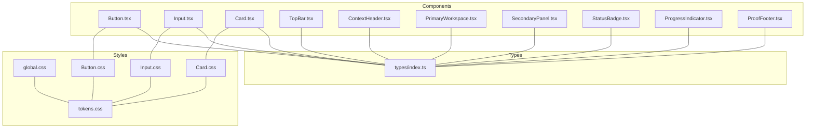
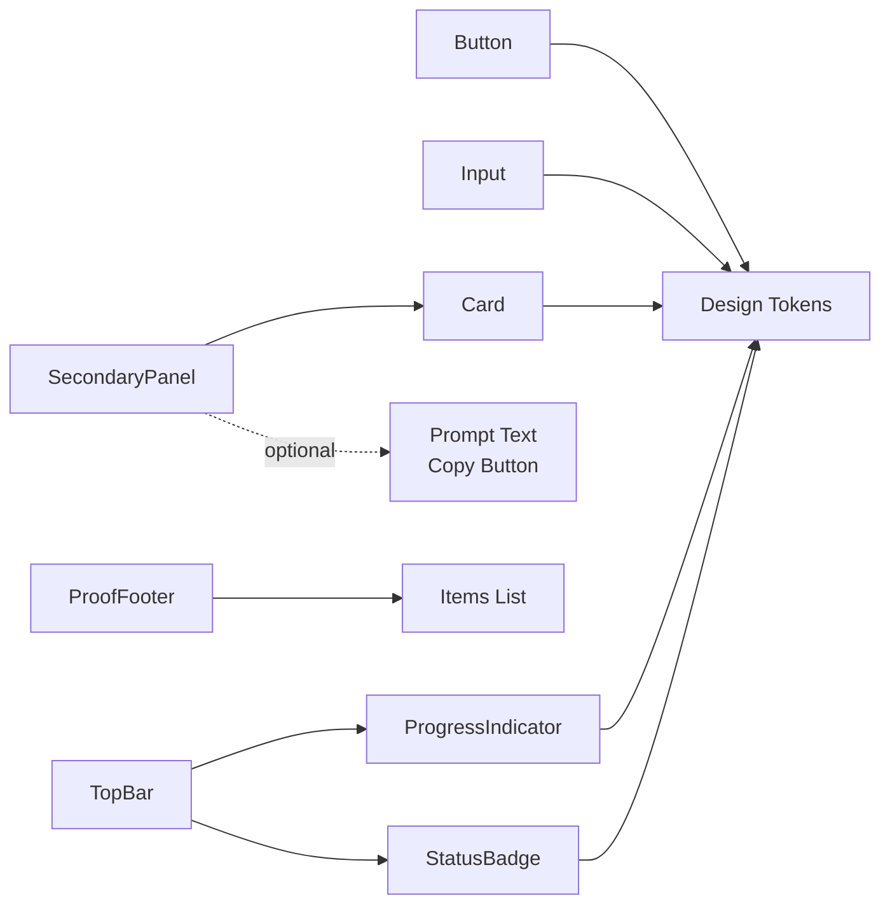
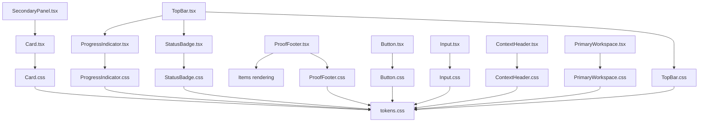

# Component Library Reference

<cite>
**Referenced Files in This Document**
- [Button.tsx](file://src/components/Button/Button.tsx)
- [Button.css](file://src/components/Button/Button.css)
- [Input.tsx](file://src/components/Input/Input.tsx)
- [Input.css](file://src/components/Input/Input.css)
- [Card.tsx](file://src/components/Card/Card.tsx)
- [Card.css](file://src/components/Card/Card.css)
- [TopBar.tsx](file://src/components/TopBar/TopBar.tsx)
- [ContextHeader.tsx](file://src/components/ContextHeader/ContextHeader.tsx)
- [PrimaryWorkspace.tsx](file://src/components/PrimaryWorkspace/PrimaryWorkspace.tsx)
- [SecondaryPanel.tsx](file://src/components/SecondaryPanel/SecondaryPanel.tsx)
- [StatusBadge.tsx](file://src/components/StatusBadge/StatusBadge.tsx)
- [ProgressIndicator.tsx](file://src/components/ProgressIndicator/ProgressIndicator.tsx)
- [ProofFooter.tsx](file://src/components/ProofFooter/ProofFooter.tsx)
- [index.ts (types)](file://src/types/index.ts)
- [tokens.css](file://src/styles/tokens.css)
- [global.css](file://src/styles/global.css)
</cite>

## Table of Contents
1. [Introduction](#introduction)
2. [Project Structure](#project-structure)
3. [Core Components](#core-components)
4. [Architecture Overview](#architecture-overview)
5. [Detailed Component Analysis](#detailed-component-analysis)
6. [Dependency Analysis](#dependency-analysis)
7. [Performance Considerations](#performance-considerations)
8. [Troubleshooting Guide](#troubleshooting-guide)
9. [Conclusion](#conclusion)
10. [Appendices](#appendices)

## Introduction
This document describes the component library that composes a cohesive design system. It explains the component architecture pattern, how components consume design tokens, and how they compose to form consistent user interfaces. It documents the prop interfaces, states, variants, accessibility features, customization options, and responsive behavior for:
- Base components: Button, Input
- Layout components: TopBar, ContextHeader, PrimaryWorkspace
- Content components: Card
- Utility components: StatusBadge, ProgressIndicator, SecondaryPanel, ProofFooter

## Project Structure
The library is organized by feature-based component folders under src/components, each exporting a React component and its stylesheet. Shared design tokens live under src/styles, and a central types/index.ts defines all component prop interfaces.

**Diagram sources**
- [Button.tsx:1-34](file://src/components/Button/Button.tsx#L1-L34)
- [Input.tsx:1-50](file://src/components/Input/Input.tsx#L1-L50)
- [Card.tsx:1-17](file://src/components/Card/Card.tsx#L1-L17)
- [TopBar.tsx:1-30](file://src/components/TopBar/TopBar.tsx#L1-L30)
- [ContextHeader.tsx:1-19](file://src/components/ContextHeader/ContextHeader.tsx#L1-L19)
- [PrimaryWorkspace.tsx:1-17](file://src/components/PrimaryWorkspace/PrimaryWorkspace.tsx#L1-L17)
- [SecondaryPanel.tsx:1-44](file://src/components/SecondaryPanel/SecondaryPanel.tsx#L1-L44)
- [StatusBadge.tsx:1-23](file://src/components/StatusBadge/StatusBadge.tsx#L1-L23)
- [ProgressIndicator.tsx:1-26](file://src/components/ProgressIndicator/ProgressIndicator.tsx#L1-L26)
- [ProofFooter.tsx:1-32](file://src/components/ProofFooter/ProofFooter.tsx#L1-L32)
- [tokens.css:1-108](file://src/styles/tokens.css#L1-L108)
- [global.css:1-157](file://src/styles/global.css#L1-L157)
- [index.ts (types):1-100](file://src/types/index.ts#L1-L100)

**Section sources**
- [tokens.css:1-108](file://src/styles/tokens.css#L1-L108)
- [global.css:1-157](file://src/styles/global.css#L1-L157)
- [index.ts (types):1-100](file://src/types/index.ts#L1-L100)

## Core Components
This section summarizes the base and utility building blocks and how they integrate into larger layouts.

- Button
  - Purpose: Action trigger with variants and sizes.
  - Props: children, variant, size, disabled, onClick, type, className.
  - Accessibility: Inherits native button semantics; disabled state handled.
  - Variants: primary, secondary.
  - Sizes: sm, md, lg.
  - States: hover, focus-visible, disabled.
  - Customization: className extension; consumes tokens for colors, spacing, typography, transitions.

- Input
  - Purpose: Text field with optional label, error messaging, and accessibility attributes.
  - Props: label, placeholder, value, onChange, error, disabled, type, id, className.
  - Accessibility: aria-invalid, aria-describedby, auto-generated id when omitted.
  - States: focus, disabled, error.
  - Customization: className extension; error variant applied via class.

- Card
  - Purpose: Container for grouping related content with subtle elevation.
  - Props: children, className.
  - Customization: className extension.

- StatusBadge
  - Purpose: Lightweight semantic indicator with predefined statuses.
  - Props: status, className.
  - Statuses: not-started, in-progress, shipped.
  - Customization: className extension.

- ProgressIndicator
  - Purpose: Visual progress tracker with numeric step display and fill bar.
  - Props: currentStep, totalSteps, className.
  - Customization: className extension.

- SecondaryPanel
  - Purpose: Sidebar panel containing a Card with step metadata and optional copyable prompt.
  - Props: stepTitle, explanation, promptText?, className.
  - Behavior: Clipboard copy action for promptText.
  - Composition: Uses Card internally.

- ProofFooter
  - Purpose: Completion checklist footer with check/uncheck indicators.
  - Props: items (array of label/checked), className.
  - Behavior: Renders items with checkbox glyphs and labels.

- TopBar
  - Purpose: Application header with app name, progress indicator, and status badge.
  - Props: appName, currentStep, totalSteps, status, className.
  - Composition: Uses ProgressIndicator and StatusBadge.

- ContextHeader
  - Purpose: Page-level headline and subtext container.
  - Props: headline, subtext, className.
  - Customization: className extension.

- PrimaryWorkspace
  - Purpose: Main content area container.
  - Props: children, className.
  - Customization: className extension.

**Section sources**
- [Button.tsx:5-31](file://src/components/Button/Button.tsx#L5-L31)
- [Button.css:1-65](file://src/components/Button/Button.css#L1-L65)
- [Input.tsx:5-47](file://src/components/Input/Input.tsx#L5-L47)
- [Input.css:1-59](file://src/components/Input/Input.css#L1-L59)
- [Card.tsx:5-14](file://src/components/Card/Card.tsx#L5-L14)
- [Card.css:1-10](file://src/components/Card/Card.css#L1-L10)
- [StatusBadge.tsx:11-20](file://src/components/StatusBadge/StatusBadge.tsx#L11-L20)
- [ProgressIndicator.tsx:5-23](file://src/components/ProgressIndicator/ProgressIndicator.tsx#L5-L23)
- [SecondaryPanel.tsx:6-41](file://src/components/SecondaryPanel/SecondaryPanel.tsx#L6-L41)
- [ProofFooter.tsx:5-29](file://src/components/ProofFooter/ProofFooter.tsx#L5-L29)
- [TopBar.tsx:7-27](file://src/components/TopBar/TopBar.tsx#L7-L27)
- [ContextHeader.tsx:5-15](file://src/components/ContextHeader/ContextHeader.tsx#L5-L15)
- [PrimaryWorkspace.tsx:5-13](file://src/components/PrimaryWorkspace/PrimaryWorkspace.tsx#L5-L13)
- [index.ts (types):20-99](file://src/types/index.ts#L20-L99)

## Architecture Overview
The design system follows a consistent pattern:
- Each component exports a React functional component and a CSS module.
- Styles import shared design tokens to keep color, spacing, typography, and layout uniform.
- Components expose a minimal set of props defined centrally in types/index.ts.
- Utility components (StatusBadge, ProgressIndicator) are composed into higher-level containers (TopBar, SecondaryPanel).

**Diagram sources**
- [TopBar.tsx:1-30](file://src/components/TopBar/TopBar.tsx#L1-L30)
- [ProgressIndicator.tsx:1-26](file://src/components/ProgressIndicator/ProgressIndicator.tsx#L1-L26)
- [StatusBadge.tsx:1-23](file://src/components/StatusBadge/StatusBadge.tsx#L1-L23)
- [SecondaryPanel.tsx:1-44](file://src/components/SecondaryPanel/SecondaryPanel.tsx#L1-L44)
- [Card.tsx:1-17](file://src/components/Card/Card.tsx#L1-L17)
- [ProofFooter.tsx:1-32](file://src/components/ProofFooter/ProofFooter.tsx#L1-L32)
- [Button.tsx:1-34](file://src/components/Button/Button.tsx#L1-L34)
- [Input.tsx:1-50](file://src/components/Input/Input.tsx#L1-L50)
- [tokens.css:1-108](file://src/styles/tokens.css#L1-L108)

## Detailed Component Analysis

### Button
- Props interface: [ButtonProps:20-28](file://src/types/index.ts#L20-L28)
- Variants and sizes: [Button.css selectors:26-64](file://src/components/Button/Button.css#L26-L64)
- Accessibility: Native button element; disabled state prevents interaction.
- States: hover, focus-visible, disabled.
- Composition: Accepts children and merges className with internal modifiers.

Usage patterns:
- Primary call-to-action: [Button.tsx:7-8](file://src/components/Button/Button.tsx#L7-L8)
- Secondary action: [Button.tsx:7-8](file://src/components/Button/Button.tsx#L7-L8)
- Disabled state: [Button.tsx:9-9](file://src/components/Button/Button.tsx#L9-L9)
- Event handler: [Button.tsx:10-10](file://src/components/Button/Button.tsx#L10-L10)

Customization:
- Extend appearance via className while preserving base styles: [Button.tsx:12-12](file://src/components/Button/Button.tsx#L12-L12)
- Tokens used: colors, spacing, typography, transitions: [Button.css:1-65](file://src/components/Button/Button.css#L1-L65), [tokens.css:14-97](file://src/styles/tokens.css#L14-L97)

Accessibility features:
- Focus visible outline for keyboard navigation: [Button.css:16-19](file://src/components/Button/Button.css#L16-L19)
- Disabled state handled by browser: [Button.tsx:25-25](file://src/components/Button/Button.tsx#L25-L25)

Responsive behavior:
- Font sizes and paddings scale with tokens; no explicit media queries present.

Integration patterns:
- Combine with Input in forms: [Input.tsx:18-20](file://src/components/Input/Input.tsx#L18-L20), [Button.tsx:10-10](file://src/components/Button/Button.tsx#L10-L10)

**Section sources**
- [Button.tsx:5-31](file://src/components/Button/Button.tsx#L5-L31)
- [Button.css:1-65](file://src/components/Button/Button.css#L1-L65)
- [index.ts (types):20-28](file://src/types/index.ts#L20-L28)
- [tokens.css:14-97](file://src/styles/tokens.css#L14-L97)

### Input
- Props interface: [InputProps:30-40](file://src/types/index.ts#L30-L40)
- Accessibility:
  - Auto-generated id when missing: [Input.tsx:16-16](file://src/components/Input/Input.tsx#L16-L16)
  - aria-invalid and aria-describedby for assistive tech: [Input.tsx:37-38](file://src/components/Input/Input.tsx#L37-L38)
  - Error message rendered with role="alert": [Input.tsx:41-43](file://src/components/Input/Input.tsx#L41-L43)
- States: focus, disabled, error.
- Composition: Optional label, input, and error message.

Usage patterns:
- Controlled value with onChange: [Input.tsx:18-20](file://src/components/Input/Input.tsx#L18-L20)
- Error presentation: [Input.tsx:40-44](file://src/components/Input/Input.tsx#L40-L44)

Customization:
- className extension: [Input.tsx:23-23](file://src/components/Input/Input.tsx#L23-L23)
- Error variant class: [Input.tsx:32-32](file://src/components/Input/Input.tsx#L32-L32)
- Tokens used: colors, borders, spacing, transitions: [Input.css:1-59](file://src/components/Input/Input.css#L1-L59), [tokens.css:14-97](file://src/styles/tokens.css#L14-L97)

**Section sources**
- [Input.tsx:5-47](file://src/components/Input/Input.tsx#L5-L47)
- [Input.css:1-59](file://src/components/Input/Input.css#L1-L59)
- [index.ts (types):30-40](file://src/types/index.ts#L30-L40)
- [tokens.css:14-97](file://src/styles/tokens.css#L14-L97)

### Card
- Props interface: [CardProps:42-45](file://src/types/index.ts#L42-L45)
- Purpose: Provide elevated container with subtle border and padding.

Usage patterns:
- Wrap content in SecondaryPanel: [SecondaryPanel.tsx:20-20](file://src/components/SecondaryPanel/SecondaryPanel.tsx#L20-L20)

Customization:
- className extension: [Card.tsx:7-7](file://src/components/Card/Card.tsx#L7-L7)
- Tokens used: background, border, spacing: [Card.css:1-10](file://src/components/Card/Card.css#L1-L10), [tokens.css:14-42](file://src/styles/tokens.css#L14-L42)

**Section sources**
- [Card.tsx:5-14](file://src/components/Card/Card.tsx#L5-L14)
- [Card.css:1-10](file://src/components/Card/Card.css#L1-L10)
- [index.ts (types):42-45](file://src/types/index.ts#L42-L45)
- [tokens.css:14-42](file://src/styles/tokens.css#L14-L42)

### StatusBadge
- Props interface: [StatusBadgeProps:47-50](file://src/types/index.ts#L47-L50)
- Statuses: not-started, in-progress, shipped.
- Labels mapped internally: [StatusBadge.tsx:5-9](file://src/components/StatusBadge/StatusBadge.tsx#L5-L9)

Usage patterns:
- Render status in TopBar: [TopBar.tsx:23-23](file://src/components/TopBar/TopBar.tsx#L23-L23)

Customization:
- className extension: [StatusBadge.tsx:13-13](file://src/components/StatusBadge/StatusBadge.tsx#L13-L13)
- Tokens used: colors, spacing: [StatusBadge.css:1-23](file://src/components/StatusBadge/StatusBadge.css#L1-L23), [tokens.css:22-32](file://src/styles/tokens.css#L22-L32)

**Section sources**
- [StatusBadge.tsx:11-20](file://src/components/StatusBadge/StatusBadge.tsx#L11-L20)
- [index.ts (types):47-50](file://src/types/index.ts#L47-L50)
- [tokens.css:22-32](file://src/styles/tokens.css#L22-L32)

### ProgressIndicator
- Props interface: [ProgressIndicatorProps:52-56](file://src/types/index.ts#L52-L56)
- Dynamic width via inline style: [ProgressIndicator.tsx:16-18](file://src/components/ProgressIndicator/ProgressIndicator.tsx#L16-L18)

Usage patterns:
- Render progress in TopBar: [TopBar.tsx:20-20](file://src/components/TopBar/TopBar.tsx#L20-L20)

Customization:
- className extension: [ProgressIndicator.tsx:8-8](file://src/components/ProgressIndicator/ProgressIndicator.tsx#L8-L8)
- Tokens used: colors, spacing, typography: [ProgressIndicator.css:1-26](file://src/components/ProgressIndicator/ProgressIndicator.css#L1-L26), [tokens.css:14-69](file://src/styles/tokens.css#L14-L69)

**Section sources**
- [ProgressIndicator.tsx:5-23](file://src/components/ProgressIndicator/ProgressIndicator.tsx#L5-L23)
- [index.ts (types):52-56](file://src/types/index.ts#L52-L56)
- [tokens.css:14-69](file://src/styles/tokens.css#L14-L69)

### SecondaryPanel
- Props interface: [SecondaryPanelProps:77-82](file://src/types/index.ts#L77-L82)
- Composition: Uses Card; optionally renders prompt text and a copy button.
- Behavior: Clipboard write operation for promptText.

Usage patterns:
- Provide step metadata and optional prompt: [SecondaryPanel.tsx:6-11](file://src/components/SecondaryPanel/SecondaryPanel.tsx#L6-L11)

Customization:
- className extension: [SecondaryPanel.tsx:10-10](file://src/components/SecondaryPanel/SecondaryPanel.tsx#L10-L10)
- Tokens used: colors, spacing, typography: [SecondaryPanel.css:1-44](file://src/components/SecondaryPanel/SecondaryPanel.css#L1-L44), [tokens.css:14-69](file://src/styles/tokens.css#L14-L69)

**Section sources**
- [SecondaryPanel.tsx:6-41](file://src/components/SecondaryPanel/SecondaryPanel.tsx#L6-L41)
- [index.ts (types):77-82](file://src/types/index.ts#L77-L82)
- [tokens.css:14-69](file://src/styles/tokens.css#L14-L69)

### ProofFooter
- Props interface: [ProofFooterProps:84-90](file://src/types/index.ts#L84-L90)
- Behavior: Renders a checklist with checkbox glyphs and labels.

Usage patterns:
- Provide items array with label and checked state: [ProofFooter.tsx:5-8](file://src/components/ProofFooter/ProofFooter.tsx#L5-L8)

Customization:
- className extension: [ProofFooter.tsx:7-7](file://src/components/ProofFooter/ProofFooter.tsx#L7-L7)
- Tokens used: colors, spacing, typography: [ProofFooter.css:1-32](file://src/components/ProofFooter/ProofFooter.css#L1-L32), [tokens.css:14-69](file://src/styles/tokens.css#L14-L69)

**Section sources**
- [ProofFooter.tsx:5-29](file://src/components/ProofFooter/ProofFooter.tsx#L5-L29)
- [index.ts (types):84-90](file://src/types/index.ts#L84-L90)
- [tokens.css:14-69](file://src/styles/tokens.css#L14-L69)

### TopBar
- Props interface: [TopBarProps:58-64](file://src/types/index.ts#L58-L64)
- Composition: Contains appName, ProgressIndicator, StatusBadge.

Usage patterns:
- Assemble application header: [TopBar.tsx:7-27](file://src/components/TopBar/TopBar.tsx#L7-L27)

Customization:
- className extension: [TopBar.tsx:12-12](file://src/components/TopBar/TopBar.tsx#L12-L12)
- Tokens used: layout dimensions, colors, spacing: [TopBar.css:1-30](file://src/components/TopBar/TopBar.css#L1-L30), [tokens.css:77-79](file://src/styles/tokens.css#L77-L79)

**Section sources**
- [TopBar.tsx:7-27](file://src/components/TopBar/TopBar.tsx#L7-L27)
- [index.ts (types):58-64](file://src/types/index.ts#L58-L64)
- [tokens.css:77-79](file://src/styles/tokens.css#L77-L79)

### ContextHeader
- Props interface: [ContextHeaderProps:66-70](file://src/types/index.ts#L66-L70)
- Purpose: Provide page-level headline and subtext.

Usage patterns:
- Render context-aware header: [ContextHeader.tsx:5-15](file://src/components/ContextHeader/ContextHeader.tsx#L5-L15)

Customization:
- className extension: [ContextHeader.tsx:8-8](file://src/components/ContextHeader/ContextHeader.tsx#L8-L8)
- Tokens used: typography, spacing: [ContextHeader.css:1-19](file://src/components/ContextHeader/ContextHeader.css#L1-L19), [tokens.css:47-72](file://src/styles/tokens.css#L47-L72)

**Section sources**
- [ContextHeader.tsx:5-15](file://src/components/ContextHeader/ContextHeader.tsx#L5-L15)
- [index.ts (types):66-70](file://src/types/index.ts#L66-L70)
- [tokens.css:47-72](file://src/styles/tokens.css#L47-L72)

### PrimaryWorkspace
- Props interface: [PrimaryWorkspaceProps:72-75](file://src/types/index.ts#L72-L75)
- Purpose: Main content area container.

Usage patterns:
- Wrap primary page content: [PrimaryWorkspace.tsx:5-13](file://src/components/PrimaryWorkspace/PrimaryWorkspace.tsx#L5-L13)

Customization:
- className extension: [PrimaryWorkspace.tsx:7-7](file://src/components/PrimaryWorkspace/PrimaryWorkspace.tsx#L7-L7)
- Tokens used: layout dimensions: [PrimaryWorkspace.css:1-17](file://src/components/PrimaryWorkspace/PrimaryWorkspace.css#L1-L17), [tokens.css:78-79](file://src/styles/tokens.css#L78-L79)

**Section sources**
- [PrimaryWorkspace.tsx:5-13](file://src/components/PrimaryWorkspace/PrimaryWorkspace.tsx#L5-L13)
- [index.ts (types):72-75](file://src/types/index.ts#L72-L75)
- [tokens.css:78-79](file://src/styles/tokens.css#L78-L79)

## Dependency Analysis
Component dependencies and composition relationships:

**Diagram sources**
- [TopBar.tsx:1-30](file://src/components/TopBar/TopBar.tsx#L1-L30)
- [ProgressIndicator.tsx:1-26](file://src/components/ProgressIndicator/ProgressIndicator.tsx#L1-L26)
- [StatusBadge.tsx:1-23](file://src/components/StatusBadge/StatusBadge.tsx#L1-L23)
- [SecondaryPanel.tsx:1-44](file://src/components/SecondaryPanel/SecondaryPanel.tsx#L1-L44)
- [Card.tsx:1-17](file://src/components/Card/Card.tsx#L1-L17)
- [ProofFooter.tsx:1-32](file://src/components/ProofFooter/ProofFooter.tsx#L1-L32)
- [Button.tsx:1-34](file://src/components/Button/Button.tsx#L1-L34)
- [Input.tsx:1-50](file://src/components/Input/Input.tsx#L1-L50)
- [tokens.css:1-108](file://src/styles/tokens.css#L1-L108)

**Section sources**
- [index.ts (types):1-100](file://src/types/index.ts#L1-L100)
- [tokens.css:1-108](file://src/styles/tokens.css#L1-L108)

## Performance Considerations
- Minimal re-renders: Prefer passing primitive props and memoizing handlers at usage sites.
- CSS-in-JS alternatives: Current implementation uses CSS modules with tokens; maintain single stylesheet per component to reduce bundle overhead.
- Inline styles: ProgressIndicator uses inline style for width; acceptable for small dynamic values but avoid frequent updates in tight loops.
- Accessibility attributes: Ensure aria-* attributes are stable to prevent assistive tech churn.

## Troubleshooting Guide
Common issues and resolutions:
- Input focus styles not visible:
  - Verify focus-visible styles and global focus rules: [Input.css:33-37](file://src/components/Input/Input.css#L33-L37), [global.css:124-127](file://src/styles/global.css#L124-L127)
- Button disabled state not respected:
  - Confirm disabled prop is passed to native button: [Button.tsx:25-25](file://src/components/Button/Button.tsx#L25-L25)
- Input error state not announced:
  - Ensure aria-invalid and aria-describedby are set with error message id: [Input.tsx:37-38](file://src/components/Input/Input.tsx#L37-L38), [Input.tsx:41-43](file://src/components/Input/Input.tsx#L41-L43)
- Progress bar width incorrect:
  - Validate currentStep and totalSteps are positive numbers and totalSteps > 0: [ProgressIndicator.tsx:16-18](file://src/components/ProgressIndicator/ProgressIndicator.tsx#L16-L18)
- Clipboard permission errors:
  - Handle navigator.permissions API or user gesture requirements in host app context: [SecondaryPanel.tsx:12-16](file://src/components/SecondaryPanel/SecondaryPanel.tsx#L12-L16)

**Section sources**
- [Input.css:33-37](file://src/components/Input/Input.css#L33-L37)
- [global.css:124-127](file://src/styles/global.css#L124-L127)
- [Button.tsx:25-25](file://src/components/Button/Button.tsx#L25-L25)
- [Input.tsx:37-38](file://src/components/Input/Input.tsx#L37-L38)
- [Input.tsx:41-43](file://src/components/Input/Input.tsx#L41-L43)
- [ProgressIndicator.tsx:16-18](file://src/components/ProgressIndicator/ProgressIndicator.tsx#L16-L18)
- [SecondaryPanel.tsx:12-16](file://src/components/SecondaryPanel/SecondaryPanel.tsx#L12-L16)

## Conclusion
The component library enforces a consistent design system through shared design tokens, standardized prop interfaces, and predictable composition patterns. Components are accessible by default, customizable via className extension, and structured to support responsive and inclusive user experiences.

## Appendices

### Design Token Consumption Patterns
- Color system: background, text, accent, semantic colors, borders: [tokens.css:14-32](file://src/styles/tokens.css#L14-L32)
- Spacing system: 8px, 16px, 24px, 40px, 64px increments: [tokens.css:38-42](file://src/styles/tokens.css#L38-L42)
- Typography: headings, body, font sizes, line heights, letter spacing: [tokens.css:47-69](file://src/styles/tokens.css#L47-L69)
- Layout: topbar height, workspace widths: [tokens.css:77-79](file://src/styles/tokens.css#L77-L79)
- Borders and shadows: radius, width, subtle shadow: [tokens.css:84-89](file://src/styles/tokens.css#L84-L89)
- Interactions: transitions: [tokens.css:96-97](file://src/styles/tokens.css#L96-L97)

**Section sources**
- [tokens.css:1-108](file://src/styles/tokens.css#L1-L108)

### Component Prop Interfaces Summary
- ButtonProps: [index.ts (types):20-28](file://src/types/index.ts#L20-L28)
- InputProps: [index.ts (types):30-40](file://src/types/index.ts#L30-L40)
- CardProps: [index.ts (types):42-45](file://src/types/index.ts#L42-L45)
- StatusBadgeProps: [index.ts (types):47-50](file://src/types/index.ts#L47-L50)
- ProgressIndicatorProps: [index.ts (types):52-56](file://src/types/index.ts#L52-L56)
- TopBarProps: [index.ts (types):58-64](file://src/types/index.ts#L58-L64)
- ContextHeaderProps: [index.ts (types):66-70](file://src/types/index.ts#L66-L70)
- PrimaryWorkspaceProps: [index.ts (types):72-75](file://src/types/index.ts#L72-L75)
- SecondaryPanelProps: [index.ts (types):77-82](file://src/types/index.ts#L77-L82)
- ProofFooterProps: [index.ts (types):84-90](file://src/types/index.ts#L84-L90)

**Section sources**
- [index.ts (types):1-100](file://src/types/index.ts#L1-L100)