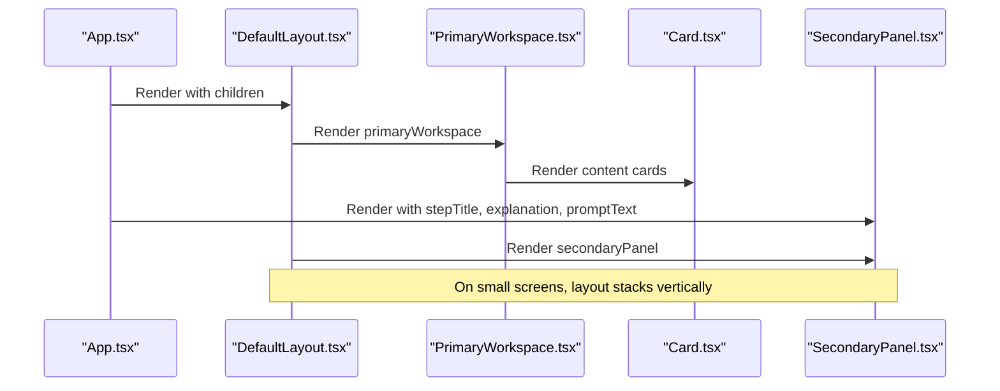
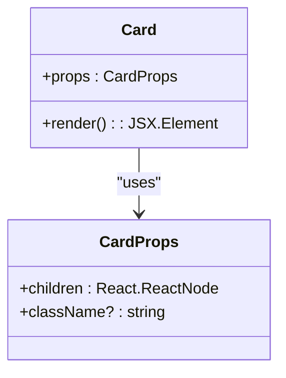
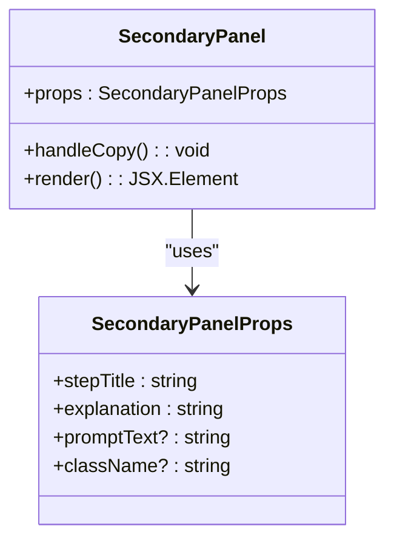
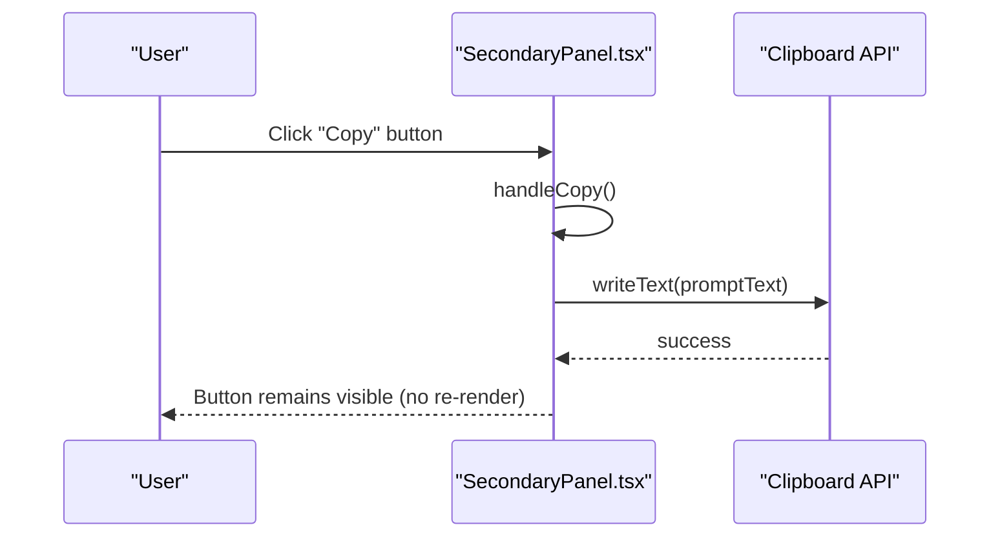
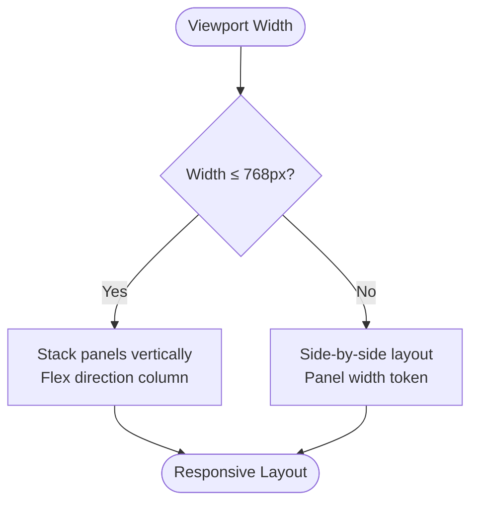
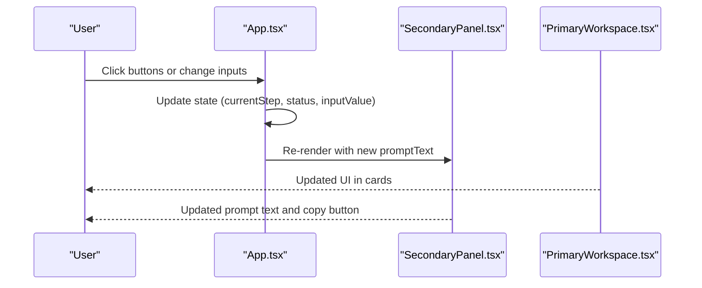
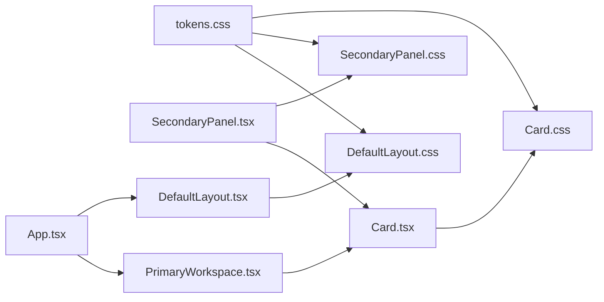

# Content Components

<cite>
**Referenced Files in This Document**
- [Card.tsx](file://src/components/Card/Card.tsx)
- [Card.css](file://src/components/Card/Card.css)
- [SecondaryPanel.tsx](file://src/components/SecondaryPanel/SecondaryPanel.tsx)
- [SecondaryPanel.css](file://src/components/SecondaryPanel/SecondaryPanel.css)
- [tokens.css](file://src/styles/tokens.css)
- [utilities.css](file://src/styles/utilities.css)
- [types/index.ts](file://src/types/index.ts)
- [DefaultLayout.tsx](file://src/layouts/DefaultLayout/DefaultLayout.tsx)
- [DefaultLayout.css](file://src/layouts/DefaultLayout/DefaultLayout.css)
- [PrimaryWorkspace.tsx](file://src/components/PrimaryWorkspace/PrimaryWorkspace.tsx)
- [App.tsx](file://src/App.tsx)
</cite>

## Table of Contents
1. [Introduction](#introduction)
2. [Project Structure](#project-structure)
3. [Core Components](#core-components)
4. [Architecture Overview](#architecture-overview)
5. [Detailed Component Analysis](#detailed-component-analysis)
6. [Dependency Analysis](#dependency-analysis)
7. [Performance Considerations](#performance-considerations)
8. [Troubleshooting Guide](#troubleshooting-guide)
9. [Conclusion](#conclusion)
10. [Appendices](#appendices)

## Introduction
This document explains the content presentation components that display information and facilitate user interaction. It focuses on the Card and SecondaryPanel components, detailing their structure, styling patterns, spacing and typography tokens, and integration within the DefaultLayout. It also covers interactive behaviors, hover states, and responsive design considerations for mobile-first layouts.

## Project Structure
The content components are organized under the components directory, with dedicated CSS files and TypeScript props defined in a shared types module. They integrate into the DefaultLayout, which positions the primary workspace and secondary panel side-by-side and stacks them on small screens.

```mermaid
graph TB
subgraph "Components"
Card["Card.tsx"]
SecPanel["SecondaryPanel.tsx"]
PW["PrimaryWorkspace.tsx"]
end
subgraph "Styles"
Tokens["tokens.css"]
Utils["utilities.css"]
CardCSS["Card.css"]
SecPanelCSS["SecondaryPanel.css"]
DLCS["DefaultLayout.css"]
end
subgraph "Layout"
DL["DefaultLayout.tsx"]
end
subgraph "App"
App["App.tsx"]
end
App --> DL
DL --> PW
DL --> SecPanel
PW --> Card
Card --> CardCSS
SecPanel --> SecPanelCSS
CardCSS --> Tokens
SecPanelCSS --> Tokens
DL --> DLCS
DLCS --> Tokens
Utils --> Tokens
```

**Diagram sources**
- [Card.tsx:1-17](file://src/components/Card/Card.tsx#L1-L17)
- [Card.css:1-10](file://src/components/Card/Card.css#L1-L10)
- [SecondaryPanel.tsx:1-44](file://src/components/SecondaryPanel/SecondaryPanel.tsx#L1-L44)
- [SecondaryPanel.css:1-73](file://src/components/SecondaryPanel/SecondaryPanel.css#L1-L73)
- [DefaultLayout.tsx:1-27](file://src/layouts/DefaultLayout/DefaultLayout.tsx#L1-L27)
- [DefaultLayout.css:1-27](file://src/layouts/DefaultLayout/DefaultLayout.css#L1-L27)
- [tokens.css:1-108](file://src/styles/tokens.css#L1-L108)
- [utilities.css:1-162](file://src/styles/utilities.css#L1-L162)
- [App.tsx:1-148](file://src/App.tsx#L1-L148)

**Section sources**
- [DefaultLayout.tsx:1-27](file://src/layouts/DefaultLayout/DefaultLayout.tsx#L1-L27)
- [DefaultLayout.css:1-27](file://src/layouts/DefaultLayout/DefaultLayout.css#L1-L27)
- [App.tsx:1-148](file://src/App.tsx#L1-L148)

## Core Components
- Card: A lightweight content container with subtle borders and elevated background, designed for grouping related content. It accepts children and an optional className for composition.
- SecondaryPanel: A contextual side panel built atop Card, displaying a title, explanation, and an optional copyable prompt block with a button. It integrates clipboard copy behavior.

Key props and tokens:
- CardProps: children, className
- SecondaryPanelProps: stepTitle, explanation, promptText?, className
- Design tokens used: background colors, borders, radii, spacing units, typography scales, transitions, and layout widths for the secondary panel.

**Section sources**
- [Card.tsx:1-17](file://src/components/Card/Card.tsx#L1-L17)
- [Card.css:1-10](file://src/components/Card/Card.css#L1-L10)
- [SecondaryPanel.tsx:1-44](file://src/components/SecondaryPanel/SecondaryPanel.tsx#L1-L44)
- [SecondaryPanel.css:1-73](file://src/components/SecondaryPanel/SecondaryPanel.css#L1-L73)
- [types/index.ts:42-45](file://src/types/index.ts#L42-L45)
- [types/index.ts:77-82](file://src/types/index.ts#L77-L82)
- [tokens.css:1-108](file://src/styles/tokens.css#L1-L108)

## Architecture Overview
The Card component is used inside the PrimaryWorkspace, which is part of the DefaultLayout. The SecondaryPanel is positioned alongside the PrimaryWorkspace and adapts responsively on small screens.



**Diagram sources**
- [App.tsx:27-144](file://src/App.tsx#L27-L144)
- [DefaultLayout.tsx:5-24](file://src/layouts/DefaultLayout/DefaultLayout.tsx#L5-L24)
- [PrimaryWorkspace.tsx:1-17](file://src/components/PrimaryWorkspace/PrimaryWorkspace.tsx#L1-L17)
- [Card.tsx:1-17](file://src/components/Card/Card.tsx#L1-L17)
- [SecondaryPanel.tsx:1-44](file://src/components/SecondaryPanel/SecondaryPanel.tsx#L1-L44)

## Detailed Component Analysis

### Card Component
- Purpose: Provide a consistent content container with elevated background and subtle borders.
- Styling pattern:
  - Background: Elevated surface color via design token.
  - Border: Subtle border using border token.
  - Radius: Rounded corners via border radius token.
  - Spacing: Inner padding using space tokens.
- Interaction: No hover or shadow effects; relies on minimal elevation through background and border.
- Composition: Accepts children and an optional className for extension.



**Diagram sources**
- [Card.tsx:5-14](file://src/components/Card/Card.tsx#L5-L14)
- [types/index.ts:42-45](file://src/types/index.ts#L42-L45)

**Section sources**
- [Card.tsx:1-17](file://src/components/Card/Card.tsx#L1-L17)
- [Card.css:1-10](file://src/components/Card/Card.css#L1-L10)
- [types/index.ts:42-45](file://src/types/index.ts#L42-L45)

### SecondaryPanel Component
- Purpose: Present contextual information and supplementary content in a side panel, optionally including a copyable prompt.
- Structure:
  - Title: Large heading styled with typography tokens.
  - Explanation: Body text with leading and color tokens.
  - Prompt area: Optional code-like block with copy button.
- Interactions:
  - Copy button triggers clipboard write when promptText is present.
  - Hover state applies accent background and inverted text color.
  - Focus-visible outline for keyboard accessibility.
- Styling patterns:
  - Width set via layout token for side panel.
  - Left border and elevated background for visual separation.
  - Typography tokens for fonts, sizes, and line heights.
  - Space tokens for margins and paddings.
  - Transition tokens for smooth hover effects.



**Diagram sources**
- [SecondaryPanel.tsx:6-41](file://src/components/SecondaryPanel/SecondaryPanel.tsx#L6-L41)
- [types/index.ts:77-82](file://src/types/index.ts#L77-L82)



**Diagram sources**
- [SecondaryPanel.tsx:12-16](file://src/components/SecondaryPanel/SecondaryPanel.tsx#L12-L16)

**Section sources**
- [SecondaryPanel.tsx:1-44](file://src/components/SecondaryPanel/SecondaryPanel.tsx#L1-L44)
- [SecondaryPanel.css:1-73](file://src/components/SecondaryPanel/SecondaryPanel.css#L1-L73)
- [types/index.ts:77-82](file://src/types/index.ts#L77-L82)

### Styling Patterns, Shadow Systems, and Spacing
- Color system: Backgrounds, text colors, accents, and borders are defined centrally.
- Spacing scale: Limited set of spacing units for consistency.
- Typography: Heading and body fonts, sizes, line heights, and letter spacing tokens.
- Borders and subtle shadows: Subtle borders and minimal shadow tokens; no heavy elevation or drop shadows.
- Transitions: Short-duration transitions for interactive states.
- Layout tokens: Top bar height, primary workspace width, and secondary panel width define the split layout.

**Section sources**
- [tokens.css:8-107](file://src/styles/tokens.css#L8-L107)
- [utilities.css:1-162](file://src/styles/utilities.css#L1-L162)

### Component Variants and Content Organization
- Card: Single variant with flexible children for any content grouping.
- SecondaryPanel: Variant driven by props (title, explanation, optional prompt). The prompt area is rendered conditionally when promptText is provided.
- Content organization patterns:
  - Cards grouped in the PrimaryWorkspace for step-by-step demonstrations.
  - Side-by-side layout with the SecondaryPanel for contextual guidance.
  - Conditional rendering of the prompt block to avoid empty UI states.

**Section sources**
- [Card.tsx:5-14](file://src/components/Card/Card.tsx#L5-L14)
- [SecondaryPanel.tsx:18-39](file://src/components/SecondaryPanel/SecondaryPanel.tsx#L18-L39)
- [App.tsx:43-139](file://src/App.tsx#L43-L139)

### Responsive Behavior and Mobile-First Design
- Desktop: PrimaryWorkspace and SecondaryPanel are side-by-side, with the panel width controlled by a layout token.
- Tablet/Phone: The workspace stack vertically to improve readability and interaction on smaller screens.
- Accessibility: Focus-visible outlines on interactive elements ensure keyboard operability.



**Diagram sources**
- [DefaultLayout.css:21-26](file://src/layouts/DefaultLayout/DefaultLayout.css#L21-L26)

**Section sources**
- [DefaultLayout.css:1-27](file://src/layouts/DefaultLayout/DefaultLayout.css#L1-L27)
- [tokens.css:77-79](file://src/styles/tokens.css#L77-L79)

### Integration Patterns with Other Components
- DefaultLayout composes TopBar, ContextHeader, PrimaryWorkspace, SecondaryPanel, and ProofFooter.
- PrimaryWorkspace wraps Card instances to organize content demonstrations.
- SecondaryPanel depends on Card for its internal card structure and uses design tokens inherited from the layout.

**Section sources**
- [DefaultLayout.tsx:5-24](file://src/layouts/DefaultLayout/DefaultLayout.tsx#L5-L24)
- [PrimaryWorkspace.tsx:5-13](file://src/components/PrimaryWorkspace/PrimaryWorkspace.tsx#L5-L13)
- [App.tsx:27-144](file://src/App.tsx#L27-L144)

### Dynamic Content Loading and State Changes
- App manages state for current step, total steps, status, and input value.
- SecondaryPanel receives derived promptText from state, enabling real-time updates as users interact with controls in the PrimaryWorkspace.
- Buttons in the PrimaryWorkspace update state, which in turn updates the SecondaryPanel’s prompt content.



**Diagram sources**
- [App.tsx:14-25](file://src/App.tsx#L14-L25)
- [App.tsx:130-139](file://src/App.tsx#L130-L139)
- [SecondaryPanel.tsx:6-41](file://src/components/SecondaryPanel/SecondaryPanel.tsx#L6-L41)

**Section sources**
- [App.tsx:14-25](file://src/App.tsx#L14-L25)
- [App.tsx:130-139](file://src/App.tsx#L130-L139)

## Dependency Analysis
- Card depends on design tokens for background, border, radius, and spacing.
- SecondaryPanel depends on Card and design tokens for typography, colors, spacing, and transitions.
- DefaultLayout orchestrates the side-by-side layout and applies responsive stacking.
- App composes all parts and supplies dynamic props to SecondaryPanel.



**Diagram sources**
- [Card.tsx:1-3](file://src/components/Card/Card.tsx#L1-L3)
- [Card.css](file://src/components/Card/Card.css#L1)
- [SecondaryPanel.tsx:1-4](file://src/components/SecondaryPanel/SecondaryPanel.tsx#L1-L4)
- [SecondaryPanel.css](file://src/components/SecondaryPanel/SecondaryPanel.css#L1)
- [DefaultLayout.tsx:1-4](file://src/layouts/DefaultLayout/DefaultLayout.tsx#L1-L4)
- [DefaultLayout.css](file://src/layouts/DefaultLayout/DefaultLayout.css#L1)
- [App.tsx:1-12](file://src/App.tsx#L1-L12)

**Section sources**
- [Card.tsx:1-3](file://src/components/Card/Card.tsx#L1-L3)
- [SecondaryPanel.tsx:1-4](file://src/components/SecondaryPanel/SecondaryPanel.tsx#L1-L4)
- [DefaultLayout.tsx:1-4](file://src/layouts/DefaultLayout/DefaultLayout.tsx#L1-L4)
- [App.tsx:1-12](file://src/App.tsx#L1-L12)

## Performance Considerations
- Minimal DOM nesting: Card and SecondaryPanel render shallow structures, reducing layout thrash.
- CSS transitions: Short transition durations keep interactions snappy without heavy animations.
- Conditional rendering: The prompt block renders only when promptText is provided, avoiding unnecessary DOM nodes.
- Token-driven styling: Centralized tokens reduce duplication and enable efficient theme switching.

## Troubleshooting Guide
- Clipboard permission errors: The copy button requires secure contexts and user gesture; ensure the button is triggered by a user interaction.
- Empty prompt state: When promptText is undefined or empty, the prompt area does not render, which is expected behavior.
- Hover/focus states: Verify focus-visible outline styles and hover backgrounds are visible in your environment.
- Responsive layout: On small screens, confirm the layout stacks vertically as intended.

**Section sources**
- [SecondaryPanel.tsx:12-16](file://src/components/SecondaryPanel/SecondaryPanel.tsx#L12-L16)
- [SecondaryPanel.css:64-72](file://src/components/SecondaryPanel/SecondaryPanel.css#L64-L72)
- [DefaultLayout.css:21-26](file://src/layouts/DefaultLayout/DefaultLayout.css#L21-L26)

## Conclusion
The Card and SecondaryPanel components form the backbone of content presentation in this design system. They leverage a consistent set of design tokens for color, spacing, typography, and transitions, ensuring visual coherence and maintainability. Their integration within DefaultLayout enables a clear primary–secondary content relationship, with responsive behavior that prioritizes usability across devices. Dynamic state updates propagate seamlessly to the SecondaryPanel, keeping contextual guidance synchronized with user actions.

## Appendices
- Example usage patterns:
  - Card usage inside PrimaryWorkspace for grouping forms, buttons, and status controls.
  - SecondaryPanel usage with stepTitle, explanation, and promptText to guide users through tasks.
- Utility classes: The utilities stylesheet provides spacing, layout, and text helpers that complement the components’ token-based styling.

**Section sources**
- [App.tsx:43-139](file://src/App.tsx#L43-L139)
- [utilities.css:1-162](file://src/styles/utilities.css#L1-L162)