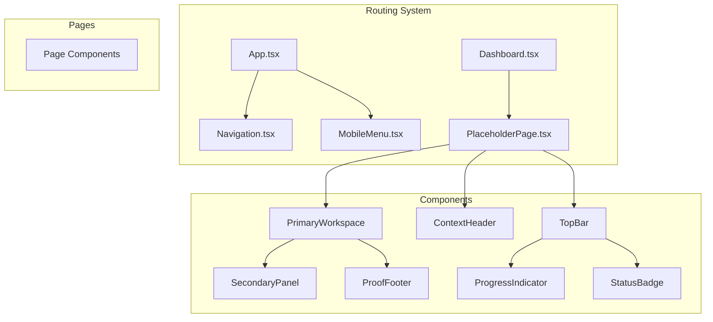
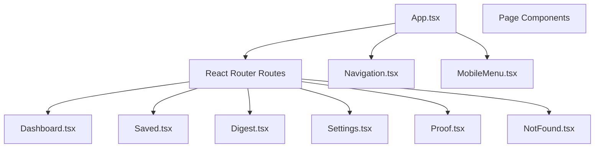
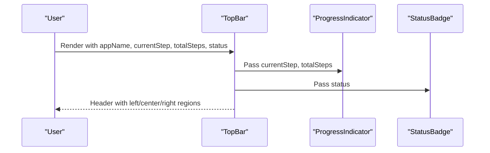
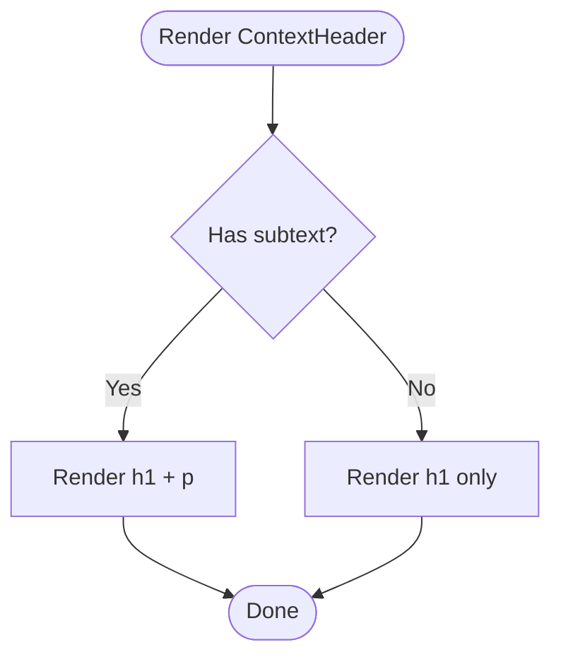
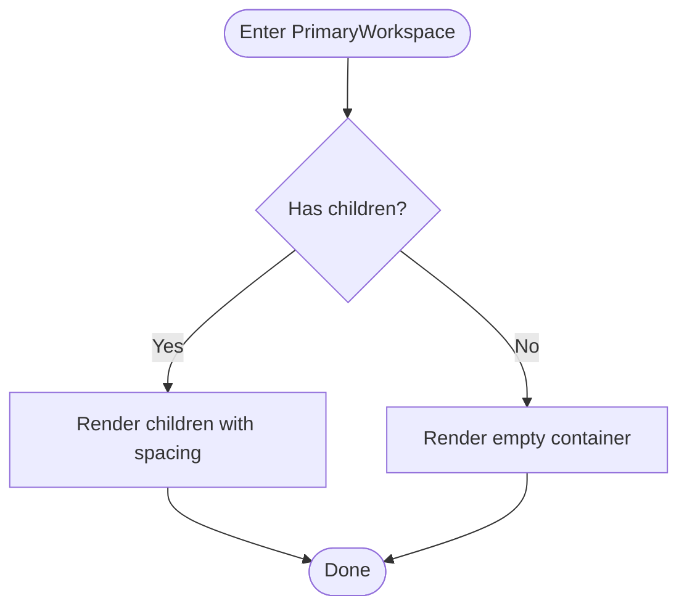
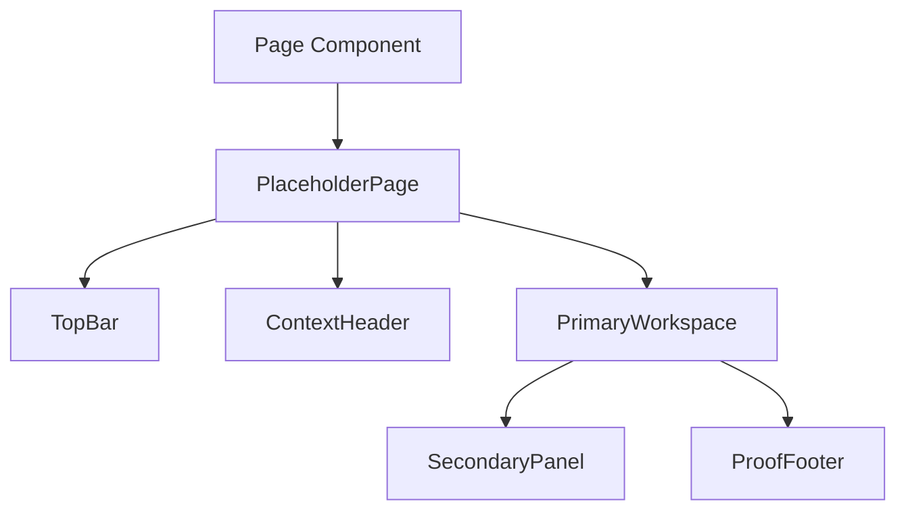
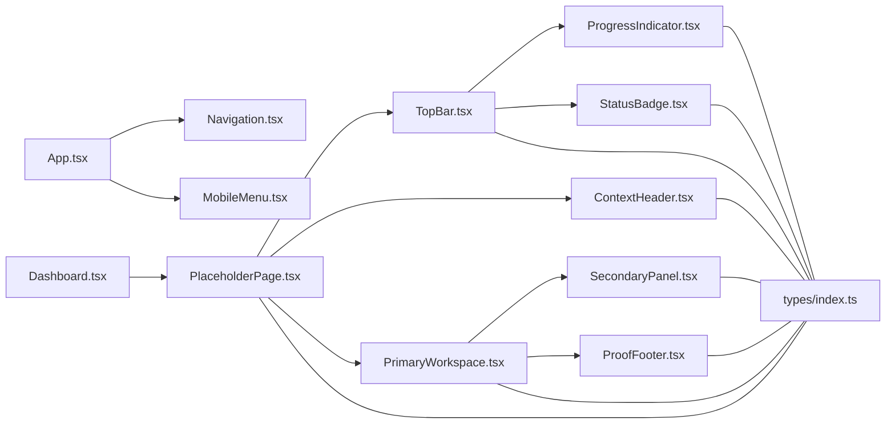

# Layout Components

<cite>
**Referenced Files in This Document**
- [TopBar.tsx](file://src/components/TopBar/TopBar.tsx)
- [TopBar.css](file://src/components/TopBar/TopBar.css)
- [ContextHeader.tsx](file://src/components/ContextHeader/ContextHeader.tsx)
- [ContextHeader.css](file://src/components/ContextHeader/ContextHeader.css)
- [PrimaryWorkspace.tsx](file://src/components/PrimaryWorkspace/PrimaryWorkspace.tsx)
- [PrimaryWorkspace.css](file://src/components/PrimaryWorkspace/PrimaryWorkspace.css)
- [DefaultLayout.tsx](file://src/layouts/DefaultLayout/DefaultLayout.tsx)
- [DefaultLayout.css](file://src/layouts/DefaultLayout/DefaultLayout.css)
- [ProgressIndicator.tsx](file://src/components/ProgressIndicator/ProgressIndicator.tsx)
- [StatusBadge.tsx](file://src/components/StatusBadge/StatusBadge.tsx)
- [SecondaryPanel.tsx](file://src/components/SecondaryPanel/SecondaryPanel.tsx)
- [ProofFooter.tsx](file://src/components/ProofFooter/ProofFooter.tsx)
- [index.ts (types)](file://src/types/index.ts)
- [App.tsx](file://src/App.tsx)
- [Navigation.tsx](file://src/components/Navigation/Navigation.tsx)
- [MobileMenu.tsx](file://src/components/MobileMenu/MobileMenu.tsx)
- [Dashboard.tsx](file://src/pages/Dashboard.tsx)
- [PlaceholderPage.tsx](file://src/pages/PlaceholderPage.tsx)
</cite>

## Update Summary
**Changes Made**
- Removed DefaultLayout system documentation as it has been deprecated
- Added routing-based navigation architecture documentation
- Updated component composition patterns to reflect page-based structure
- Added new section on routing integration and navigation components
- Updated architectural overview to show current routing-based approach

## Table of Contents
1. [Introduction](#introduction)
2. [Project Structure](#project-structure)
3. [Core Components](#core-components)
4. [Routing-Based Architecture](#routing-based-architecture)
5. [Detailed Component Analysis](#detailed-component-analysis)
6. [Dependency Analysis](#dependency-analysis)
7. [Performance Considerations](#performance-considerations)
8. [Troubleshooting Guide](#troubleshooting-guide)
9. [Conclusion](#conclusion)
10. [Appendices](#appendices)

## Introduction
This document explains the layout components that structure the application interface. The architecture has evolved from a DefaultLayout system to a routing-based navigation approach. The current system focuses on three primary layout components:
- TopBar: the header area containing branding, progress, and status
- ContextHeader: the content area for headline and subtext
- PrimaryWorkspace: the main content container for primary page content

The system now uses React Router for navigation with dedicated page components that implement the layout structure. This provides better separation of concerns and improved maintainability.

## Project Structure
The layout system is organized around focused components with routing-based navigation:
- TopBar lives under src/components/TopBar
- ContextHeader lives under src/components/ContextHeader
- PrimaryWorkspace lives under src/components/PrimaryWorkspace
- Page components live under src/pages
- Navigation components (Navigation, MobileMenu) live under src/components
- Shared types live under src/types/index.ts
- Supporting components used by TopBar: ProgressIndicator and StatusBadge live under src/components/ProgressIndicator and src/components/StatusBadge respectively

**Diagram sources**
- [App.tsx:1-45](file://src/App.tsx#L1-L45)
- [Navigation.tsx:1-34](file://src/components/Navigation/Navigation.tsx#L1-L34)
- [MobileMenu.tsx:1-66](file://src/components/MobileMenu/MobileMenu.tsx#L1-L66)
- [Dashboard.tsx:1-8](file://src/pages/Dashboard.tsx#L1-L8)
- [PlaceholderPage.tsx:1-21](file://src/pages/PlaceholderPage.tsx#L1-L21)
- [TopBar.tsx:1-30](file://src/components/TopBar/TopBar.tsx#L1-L30)
- [ProgressIndicator.tsx:1-22](file://src/components/ProgressIndicator/ProgressIndicator.tsx#L1-L22)
- [StatusBadge.tsx:1-18](file://src/components/StatusBadge/StatusBadge.tsx#L1-L18)
- [PrimaryWorkspace.tsx:1-17](file://src/components/PrimaryWorkspace/PrimaryWorkspace.tsx#L1-L17)
- [SecondaryPanel.tsx:1-39](file://src/components/SecondaryPanel/SecondaryPanel.tsx#L1-L39)
- [ProofFooter.tsx:1-28](file://src/components/ProofFooter/ProofFooter.tsx#L1-L28)

**Section sources**
- [App.tsx:1-45](file://src/App.tsx#L1-L45)
- [Navigation.tsx:1-34](file://src/components/Navigation/Navigation.tsx#L1-L34)
- [MobileMenu.tsx:1-66](file://src/components/MobileMenu/MobileMenu.tsx#L1-L66)
- [Dashboard.tsx:1-8](file://src/pages/Dashboard.tsx#L1-L8)
- [PlaceholderPage.tsx:1-21](file://src/pages/PlaceholderPage.tsx#L1-L21)
- [TopBar.tsx:1-30](file://src/components/TopBar/TopBar.tsx#L1-L30)
- [ContextHeader.tsx:1-19](file://src/components/ContextHeader/ContextHeader.tsx#L1-L19)
- [PrimaryWorkspace.tsx:1-17](file://src/components/PrimaryWorkspace/PrimaryWorkspace.tsx#L1-L17)
- [index.ts (types):1-102](file://src/types/index.ts#L1-L102)

## Core Components
This section describes each layout component's role, structure, and props in the current routing-based architecture.

- TopBar
  - Purpose: Header bar with branding, progress indicator, and status badge
  - Key props: appName, currentStep, totalSteps, status, className
  - Composition: Left slot for app name, center for progress, right for status
  - Accessibility: Uses semantic header element; ensure status and progress are announced by assistive technologies
  - Responsiveness: Horizontal flex layout; content remains aligned across breakpoints

- ContextHeader
  - Purpose: Content area for headline and subtext to establish context
  - Key props: headline, subtext, className
  - Composition: Single container with h1 and p elements
  - Accessibility: Uses heading level 1 for the headline; ensure subtext is concise and descriptive

- PrimaryWorkspace
  - Purpose: Main content container for primary page content
  - Key props: children, className
  - Composition: Renders children directly; applies spacing between child elements
  - Accessibility: Use focusable elements inside children; ensure keyboard navigation within children is supported

**Section sources**
- [TopBar.tsx:7-26](file://src/components/TopBar/TopBar.tsx#L7-L26)
- [ContextHeader.tsx:5-15](file://src/components/ContextHeader/ContextHeader.tsx#L5-L15)
- [PrimaryWorkspace.tsx:5-13](file://src/components/PrimaryWorkspace/PrimaryWorkspace.tsx#L5-L13)
- [index.ts (types):60-77](file://src/types/index.ts#L60-L77)

## Routing-Based Architecture
The application now uses React Router for navigation with page-based components. The routing system provides:
- Centralized route configuration in App.tsx
- Navigation components (Navigation and MobileMenu) for desktop and mobile experiences
- Page components that implement layout structure
- Automatic active state management through react-router-dom

**Diagram sources**
- [App.tsx:23-42](file://src/App.tsx#L23-L42)
- [Navigation.tsx:4-10](file://src/components/Navigation/Navigation.tsx#L4-L10)
- [MobileMenu.tsx:5-11](file://src/components/MobileMenu/MobileMenu.tsx#L5-L11)

**Section sources**
- [App.tsx:1-45](file://src/App.tsx#L1-L45)
- [Navigation.tsx:1-34](file://src/components/Navigation/Navigation.tsx#L1-L34)
- [MobileMenu.tsx:1-66](file://src/components/MobileMenu/MobileMenu.tsx#L1-L66)

## Detailed Component Analysis

### TopBar Component
TopBar renders a sticky header with three regions:
- Left: app name
- Center: progress indicator
- Right: status badge

**Diagram sources**
- [TopBar.tsx:14-25](file://src/components/TopBar/TopBar.tsx#L14-L25)
- [ProgressIndicator.tsx:10-21](file://src/components/ProgressIndicator/ProgressIndicator.tsx#L10-L21)
- [StatusBadge.tsx:15-18](file://src/components/StatusBadge/StatusBadge.tsx#L15-L18)

Key styling and behavior:
- Flex layout with equal-height alignment and horizontal distribution
- Sticky positioning ensures the bar stays visible while scrolling content below
- Uses design tokens for height, spacing, colors, and z-index

Customization tips:
- Adjust --topbar-height and --space-* tokens to change sizing
- Add className to target nested elements for fine-grained tweaks

Accessibility considerations:
- Keep appName concise and meaningful
- Ensure progress text and status semantics are conveyed to assistive technologies

**Section sources**
- [TopBar.tsx:7-26](file://src/components/TopBar/TopBar.tsx#L7-L26)
- [TopBar.css:3-14](file://src/components/TopBar/TopBar.css#L3-L14)
- [ProgressIndicator.tsx:5-22](file://src/components/ProgressIndicator/ProgressIndicator.tsx#L5-L22)
- [StatusBadge.tsx:11-18](file://src/components/StatusBadge/StatusBadge.tsx#L11-L18)
- [index.ts (types):60-66](file://src/types/index.ts#L60-L66)

### ContextHeader Component
ContextHeader displays a headline and optional subtext to set the page context.

**Diagram sources**
- [ContextHeader.tsx:10-15](file://src/components/ContextHeader/ContextHeader.tsx#L10-L15)

Styling highlights:
- Uses heading and body fonts with design tokens
- Applies max-width tokens for readability
- Subtext color and line-height are tuned for clarity

Customization tips:
- Override typography tokens for headline/subtext
- Use className to apply additional spacing or alignment

Accessibility considerations:
- Ensure the headline is a single, descriptive H1 per page
- Keep subtext short and complementary to the headline

**Section sources**
- [ContextHeader.tsx:5-15](file://src/components/ContextHeader/ContextHeader.tsx#L5-L15)
- [ContextHeader.css:3-27](file://src/components/ContextHeader/ContextHeader.css#L3-L27)
- [index.ts (types):68-72](file://src/types/index.ts#L68-L72)

### PrimaryWorkspace Component
PrimaryWorkspace is the main content container. It:
- Accepts arbitrary children
- Applies consistent vertical spacing between child elements
- Sets a minimum height and enables vertical scrolling

**Diagram sources**
- [PrimaryWorkspace.tsx:5-13](file://src/components/PrimaryWorkspace/PrimaryWorkspace.tsx#L5-L13)
- [PrimaryWorkspace.css:11-18](file://src/components/PrimaryWorkspace/PrimaryWorkspace.css#L11-L18)

Styling highlights:
- Fixed width via --primary-workspace-width token
- Vertical spacing between child elements using margin stacking
- Scroll container for long content

Customization tips:
- Adjust --primary-workspace-width to change content area width
- Use className to override margins or paddings

Accessibility considerations:
- Ensure focus order matches visual order
- Provide skip links if the workspace is large

**Section sources**
- [PrimaryWorkspace.tsx:5-13](file://src/components/PrimaryWorkspace/PrimaryWorkspace.tsx#L5-L13)
- [PrimaryWorkspace.css:3-18](file://src/components/PrimaryWorkspace/PrimaryWorkspace.css#L3-L18)
- [index.ts (types):74-77](file://src/types/index.ts#L74-L77)

### Page Components and Layout Implementation
Page components now implement the layout structure directly, replacing the DefaultLayout system. Each page component:
- Imports PlaceholderPage for demonstration purposes
- Implements the desired layout using TopBar, ContextHeader, and PrimaryWorkspace
- Can optionally include SecondaryPanel and ProofFooter

**Diagram sources**
- [Dashboard.tsx:1-8](file://src/pages/Dashboard.tsx#L1-L8)
- [PlaceholderPage.tsx:7-18](file://src/pages/PlaceholderPage.tsx#L7-L18)
- [TopBar.tsx:14-26](file://src/components/TopBar/TopBar.tsx#L14-L26)
- [ContextHeader.tsx:10-15](file://src/components/ContextHeader/ContextHeader.tsx#L10-L15)
- [PrimaryWorkspace.tsx:9-13](file://src/components/PrimaryWorkspace/PrimaryWorkspace.tsx#L9-L13)

**Section sources**
- [Dashboard.tsx:1-8](file://src/pages/Dashboard.tsx#L1-L8)
- [PlaceholderPage.tsx:1-21](file://src/pages/PlaceholderPage.tsx#L1-L21)

## Dependency Analysis
The layout components now depend on routing infrastructure and page-based architecture.

**Diagram sources**
- [App.tsx:1-45](file://src/App.tsx#L1-L45)
- [Navigation.tsx:1-34](file://src/components/Navigation/Navigation.tsx#L1-L34)
- [MobileMenu.tsx:1-66](file://src/components/MobileMenu/MobileMenu.tsx#L1-L66)
- [Dashboard.tsx:1-8](file://src/pages/Dashboard.tsx#L1-L8)
- [PlaceholderPage.tsx:1-21](file://src/pages/PlaceholderPage.tsx#L1-L21)
- [TopBar.tsx:1-30](file://src/components/TopBar/TopBar.tsx#L1-L30)
- [ProgressIndicator.tsx:1-22](file://src/components/ProgressIndicator/ProgressIndicator.tsx#L1-L22)
- [StatusBadge.tsx:1-18](file://src/components/StatusBadge/StatusBadge.tsx#L1-L18)
- [index.ts (types):1-102](file://src/types/index.ts#L1-L102)

Observations:
- Routing-based coupling: App.tsx manages navigation and routes
- Component coupling: Page components import and compose layout components
- Loose coupling: Components accept children and render their own internals
- Type safety: All props are strongly typed via index.ts

**Section sources**
- [index.ts (types):1-102](file://src/types/index.ts#L1-L102)
- [App.tsx:1-45](file://src/App.tsx#L1-L45)
- [Dashboard.tsx:1-8](file://src/pages/Dashboard.tsx#L1-L8)

## Performance Considerations
- Minimize heavy computations inside TopBar and ContextHeader; keep rendering lightweight
- Prefer memoization for frequently changing props (e.g., progress percentage)
- Avoid unnecessary re-renders by passing stable references for children in page components
- Keep PrimaryWorkspace scrollable to prevent layout thrashing during dynamic content updates
- Leverage React Router's built-in performance optimizations for route transitions

## Troubleshooting Guide
Common issues and resolutions:
- Progress bar not updating
  - Verify currentStep and totalSteps are numeric and totalSteps > 0
  - Confirm ProgressIndicator receives the props and CSS tokens are loaded

- Status badge not reflecting state
  - Ensure status is one of the allowed StatusType values
  - Confirm StatusBadge renders the mapped label

- Workspace content overlaps or is cut off
  - Check --primary-workspace-width and --topbar-height tokens
  - Ensure min-height calculation accounts for header and footer heights

- Navigation not working
  - Verify routes are properly defined in App.tsx
  - Check that Navigation and MobileMenu components are correctly imported
  - Ensure react-router-dom is properly installed and configured

- Page content not displaying
  - Confirm page component exports are correctly named
  - Verify PlaceholderPage is being rendered within page components
  - Check that layout components are properly imported in page components

**Section sources**
- [ProgressIndicator.tsx:5-22](file://src/components/ProgressIndicator/ProgressIndicator.tsx#L5-L22)
- [StatusBadge.tsx:11-18](file://src/components/StatusBadge/StatusBadge.tsx#L11-L18)
- [PrimaryWorkspace.css:7-18](file://src/components/PrimaryWorkspace/PrimaryWorkspace.css#L7-L18)
- [App.tsx:23-42](file://src/App.tsx#L23-L42)
- [Navigation.tsx:12-34](file://src/components/Navigation/Navigation.tsx#L12-L34)
- [MobileMenu.tsx:13-66](file://src/components/MobileMenu/MobileMenu.tsx#L13-L66)
- [Dashboard.tsx:3-8](file://src/pages/Dashboard.tsx#L3-L8)
- [PlaceholderPage.tsx:7-21](file://src/pages/PlaceholderPage.tsx#L7-L21)

## Conclusion
The layout system has evolved from a DefaultLayout orchestration pattern to a routing-based architecture. This new approach provides better separation of concerns, improved maintainability, and enhanced developer experience. Page components now directly implement layout structures, while React Router handles navigation and route management. The core layout components (TopBar, ContextHeader, PrimaryWorkspace) remain focused and reusable, but their composition is now determined by individual page implementations rather than a centralized layout system.

## Appendices

### Prop Interfaces Reference
- TopBarProps
  - appName: string
  - currentStep: number
  - totalSteps: number
  - status: StatusType
  - className?: string

- ContextHeaderProps
  - headline: string
  - subtext: string
  - className?: string

- PrimaryWorkspaceProps
  - children: React.ReactNode
  - className?: string

- DefaultLayoutProps (Deprecated)
  - topBar: React.ReactNode
  - contextHeader: React.ReactNode
  - primaryWorkspace: React.ReactNode
  - secondaryPanel: React.ReactNode
  - proofFooter: React.ReactNode
  - className?: string

**Section sources**
- [index.ts (types):60-102](file://src/types/index.ts#L60-L102)

### Routing Integration Examples
- Basic routing setup
  - Configure routes in App.tsx with React Router
  - Define navigation items in Navigation.tsx and MobileMenu.tsx
  - Create page components that implement layout structure

- Navigation components
  - Navigation.tsx provides desktop navigation with active state management
  - MobileMenu.tsx provides responsive mobile navigation with state management
  - Both components use react-router-dom's NavLink for automatic active state handling

**Section sources**
- [App.tsx:23-42](file://src/App.tsx#L23-L42)
- [Navigation.tsx:4-34](file://src/components/Navigation/Navigation.tsx#L4-L34)
- [MobileMenu.tsx:5-66](file://src/components/MobileMenu/MobileMenu.tsx#L5-L66)

### Customization Guidelines
- Spacing and alignment
  - Adjust --space-* tokens to change padding and gaps
  - Modify --primary-workspace-width to alter content area width

- Typography and colors
  - Override --font-* and --color-* tokens for brand consistency

- Responsive behavior
  - Navigation components automatically adapt to different screen sizes
  - MobileMenu provides hamburger menu for smaller screens

**Section sources**
- [PrimaryWorkspace.css:4-18](file://src/components/PrimaryWorkspace/PrimaryWorkspace.css#L4-L18)
- [TopBar.css:3-14](file://src/components/TopBar/TopBar.css#L3-L14)
- [ContextHeader.css:3-27](file://src/components/ContextHeader/ContextHeader.css#L3-L27)
- [Navigation.tsx:12-34](file://src/components/Navigation/Navigation.tsx#L12-L34)
- [MobileMenu.tsx:13-66](file://src/components/MobileMenu/MobileMenu.tsx#L13-L66)

### Accessibility Best Practices
- TopBar
  - Ensure appName is descriptive and concise
  - Use aria-live regions if progress or status updates dynamically

- ContextHeader
  - Keep headline unique and meaningful
  - Keep subtext brief and complementary

- PrimaryWorkspace
  - Provide keyboard navigation support for interactive children
  - Consider skip links for large content areas

- Navigation
  - Ensure proper ARIA labels for mobile menu button
  - Maintain keyboard navigation support for both desktop and mobile menus

**Section sources**
- [TopBar.tsx:16-26](file://src/components/TopBar/TopBar.tsx#L16-L26)
- [ContextHeader.tsx:10-15](file://src/components/ContextHeader/ContextHeader.tsx#L10-L15)
- [PrimaryWorkspace.tsx:5-13](file://src/components/PrimaryWorkspace/PrimaryWorkspace.tsx#L5-L13)
- [MobileMenu.tsx:26-38](file://src/components/MobileMenu/MobileMenu.tsx#L26-L38)