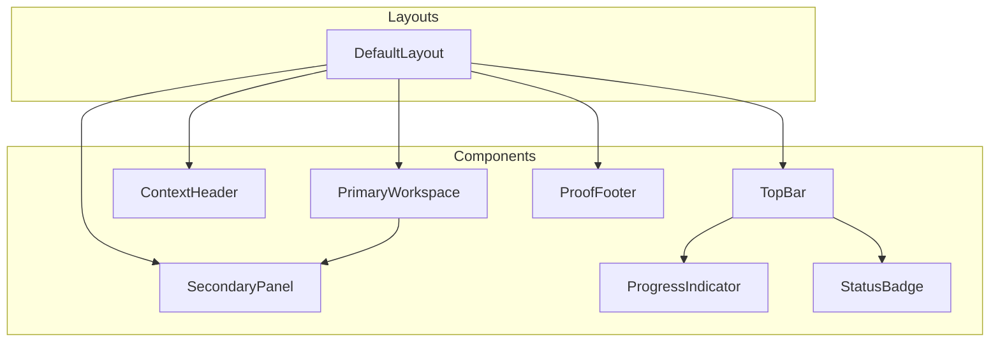
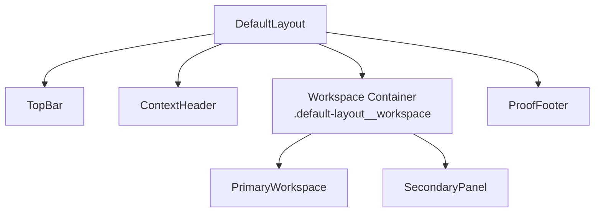
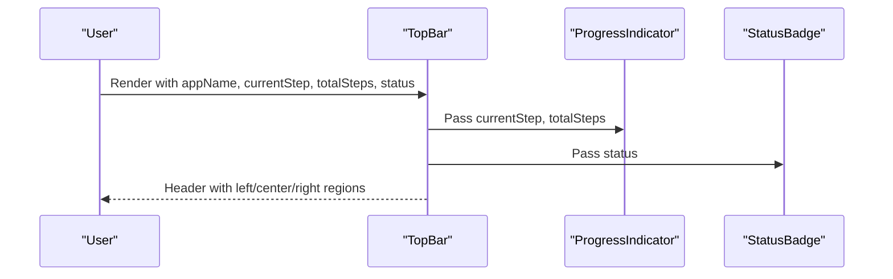
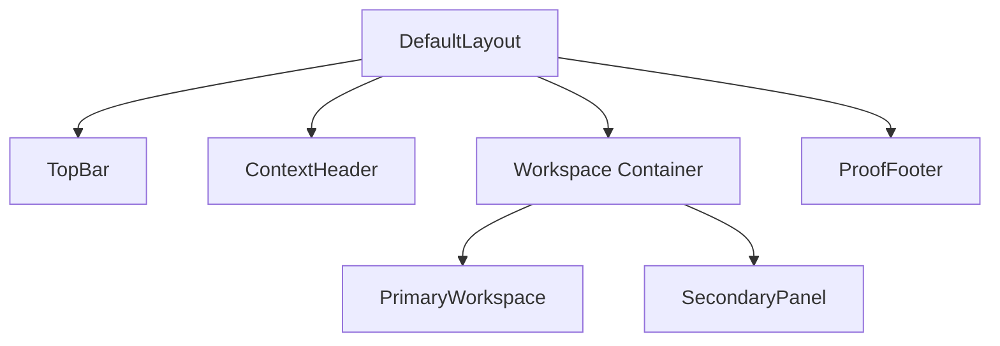
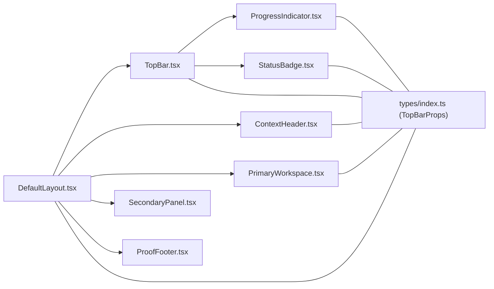

# Layout Components

<cite>
**Referenced Files in This Document**
- [TopBar.tsx](file://src/components/TopBar/TopBar.tsx)
- [TopBar.css](file://src/components/TopBar/TopBar.css)
- [ContextHeader.tsx](file://src/components/ContextHeader/ContextHeader.tsx)
- [ContextHeader.css](file://src/components/ContextHeader/ContextHeader.css)
- [PrimaryWorkspace.tsx](file://src/components/PrimaryWorkspace/PrimaryWorkspace.tsx)
- [PrimaryWorkspace.css](file://src/components/PrimaryWorkspace/PrimaryWorkspace.css)
- [DefaultLayout.tsx](file://src/layouts/DefaultLayout/DefaultLayout.tsx)
- [DefaultLayout.css](file://src/layouts/DefaultLayout/DefaultLayout.css)
- [ProgressIndicator.tsx](file://src/components/ProgressIndicator/ProgressIndicator.tsx)
- [StatusBadge.tsx](file://src/components/StatusBadge/StatusBadge.tsx)
- [SecondaryPanel.tsx](file://src/components/SecondaryPanel/SecondaryPanel.tsx)
- [ProofFooter.tsx](file://src/components/ProofFooter/ProofFooter.tsx)
- [index.ts (types)](file://src/types/index.ts)
</cite>

## Table of Contents
1. [Introduction](#introduction)
2. [Project Structure](#project-structure)
3. [Core Components](#core-components)
4. [Architecture Overview](#architecture-overview)
5. [Detailed Component Analysis](#detailed-component-analysis)
6. [Dependency Analysis](#dependency-analysis)
7. [Performance Considerations](#performance-considerations)
8. [Troubleshooting Guide](#troubleshooting-guide)
9. [Conclusion](#conclusion)
10. [Appendices](#appendices)

## Introduction
This document explains the layout components that structure the application interface. It focuses on three primary layout pieces:
- TopBar: the header area containing branding, progress, and status.
- ContextHeader: the content area for headline and subtext.
- PrimaryWorkspace: the main content container for primary page content.

It also documents how these components compose together via DefaultLayout, outlines prop interfaces, and provides guidance on customization, responsiveness, and accessibility.

## Project Structure
The layout system is organized around focused components and a single orchestrator layout:
- TopBar lives under src/components/TopBar
- ContextHeader lives under src/components/ContextHeader
- PrimaryWorkspace lives under src/components/PrimaryWorkspace
- DefaultLayout lives under src/layouts/DefaultLayout
- Shared types live under src/types/index.ts
- Supporting components used by TopBar: ProgressIndicator and StatusBadge live under src/components/ProgressIndicator and src/components/StatusBadge respectively

**Diagram sources**
- [DefaultLayout.tsx:5-23](file://src/layouts/DefaultLayout/DefaultLayout.tsx#L5-L23)
- [TopBar.tsx:7-26](file://src/components/TopBar/TopBar.tsx#L7-L26)
- [ProgressIndicator.tsx:5-22](file://src/components/ProgressIndicator/ProgressIndicator.tsx#L5-L22)
- [StatusBadge.tsx:11-18](file://src/components/StatusBadge/StatusBadge.tsx#L11-L18)
- [PrimaryWorkspace.tsx:5-13](file://src/components/PrimaryWorkspace/PrimaryWorkspace.tsx#L5-L13)
- [SecondaryPanel.tsx:6-39](file://src/components/SecondaryPanel/SecondaryPanel.tsx#L6-L39)
- [ProofFooter.tsx:5-28](file://src/components/ProofFooter/ProofFooter.tsx#L5-L28)

**Section sources**
- [DefaultLayout.tsx:1-27](file://src/layouts/DefaultLayout/DefaultLayout.tsx#L1-L27)
- [TopBar.tsx:1-30](file://src/components/TopBar/TopBar.tsx#L1-L30)
- [ContextHeader.tsx:1-19](file://src/components/ContextHeader/ContextHeader.tsx#L1-L19)
- [PrimaryWorkspace.tsx:1-17](file://src/components/PrimaryWorkspace/PrimaryWorkspace.tsx#L1-L17)
- [index.ts (types):58-99](file://src/types/index.ts#L58-L99)

## Core Components
This section describes each layout component’s role, structure, and props.

- TopBar
  - Purpose: Header bar with branding, progress indicator, and status badge.
  - Key props: appName, currentStep, totalSteps, status, className.
  - Composition: Left slot for app name, center for progress, right for status.
  - Accessibility: Uses semantic header element; ensure status and progress are announced by assistive technologies.
  - Responsiveness: Horizontal flex layout; content remains aligned across breakpoints.

- ContextHeader
  - Purpose: Content area for headline and subtext to establish context.
  - Key props: headline, subtext, className.
  - Composition: Single container with h1 and p elements.
  - Accessibility: Uses heading level 1 for the headline; ensure subtext is concise and descriptive.

- PrimaryWorkspace
  - Purpose: Main content container for primary page content.
  - Key props: children, className.
  - Composition: Renders children directly; applies spacing between child elements.
  - Accessibility: Use focusable elements inside children; ensure keyboard navigation within children is supported.

**Section sources**
- [TopBar.tsx:7-26](file://src/components/TopBar/TopBar.tsx#L7-L26)
- [ContextHeader.tsx:5-15](file://src/components/ContextHeader/ContextHeader.tsx#L5-L15)
- [PrimaryWorkspace.tsx:5-13](file://src/components/PrimaryWorkspace/PrimaryWorkspace.tsx#L5-L13)
- [index.ts (types):58-75](file://src/types/index.ts#L58-L75)

## Architecture Overview
DefaultLayout composes the three core layout components along with SecondaryPanel and ProofFooter into a cohesive page structure. It defines:
- A vertical flex container for the overall page.
- A workspace area that holds PrimaryWorkspace and SecondaryPanel side-by-side.
- A responsive breakpoint to stack panels on small screens.

**Diagram sources**
- [DefaultLayout.tsx:13-22](file://src/layouts/DefaultLayout/DefaultLayout.tsx#L13-L22)
- [DefaultLayout.css:15-26](file://src/layouts/DefaultLayout/DefaultLayout.css#L15-L26)

**Section sources**
- [DefaultLayout.tsx:5-23](file://src/layouts/DefaultLayout/DefaultLayout.tsx#L5-L23)
- [DefaultLayout.css:1-27](file://src/layouts/DefaultLayout/DefaultLayout.css#L1-L27)

## Detailed Component Analysis

### TopBar Component
TopBar renders a sticky header with three regions:
- Left: app name
- Center: progress indicator
- Right: status badge

**Diagram sources**
- [TopBar.tsx:14-25](file://src/components/TopBar/TopBar.tsx#L14-L25)
- [ProgressIndicator.tsx:10-21](file://src/components/ProgressIndicator/ProgressIndicator.tsx#L10-L21)
- [StatusBadge.tsx:15-18](file://src/components/StatusBadge/StatusBadge.tsx#L15-L18)

Key styling and behavior:
- Flex layout with equal-height alignment and horizontal distribution.
- Sticky positioning ensures the bar stays visible while scrolling content below.
- Uses design tokens for height, spacing, colors, and z-index.

Customization tips:
- Adjust --topbar-height and --space-* tokens to change sizing.
- Add className to target nested elements for fine-grained tweaks.

Accessibility considerations:
- Keep appName concise and meaningful.
- Ensure progress text and status semantics are conveyed to assistive technologies.

**Section sources**
- [TopBar.tsx:7-26](file://src/components/TopBar/TopBar.tsx#L7-L26)
- [TopBar.css:3-14](file://src/components/TopBar/TopBar.css#L3-L14)
- [ProgressIndicator.tsx:5-22](file://src/components/ProgressIndicator/ProgressIndicator.tsx#L5-L22)
- [StatusBadge.tsx:11-18](file://src/components/StatusBadge/StatusBadge.tsx#L11-L18)
- [index.ts (types):52-56](file://src/types/index.ts#L52-L56)
- [index.ts (types):47-50](file://src/types/index.ts#L47-L50)
- [index.ts (types):58-64](file://src/types/index.ts#L58-L64)

### ContextHeader Component
ContextHeader displays a headline and optional subtext to set the page context.

**Diagram sources**
- [ContextHeader.tsx:10-15](file://src/components/ContextHeader/ContextHeader.tsx#L10-L15)

Styling highlights:
- Uses heading and body fonts with design tokens.
- Applies max-width tokens for readability.
- Subtext color and line-height are tuned for clarity.

Customization tips:
- Override typography tokens for headline/subtext.
- Use className to apply additional spacing or alignment.

Accessibility considerations:
- Ensure the headline is a single, descriptive H1 per page.
- Keep subtext short and complementary to the headline.

**Section sources**
- [ContextHeader.tsx:5-15](file://src/components/ContextHeader/ContextHeader.tsx#L5-L15)
- [ContextHeader.css:3-27](file://src/components/ContextHeader/ContextHeader.css#L3-L27)
- [index.ts (types):66-70](file://src/types/index.ts#L66-L70)

### PrimaryWorkspace Component
PrimaryWorkspace is the main content container. It:
- Accepts arbitrary children.
- Applies consistent vertical spacing between child elements.
- Sets a minimum height and enables vertical scrolling.

**Diagram sources**
- [PrimaryWorkspace.tsx:5-13](file://src/components/PrimaryWorkspace/PrimaryWorkspace.tsx#L5-L13)
- [PrimaryWorkspace.css:11-18](file://src/components/PrimaryWorkspace/PrimaryWorkspace.css#L11-L18)

Styling highlights:
- Fixed width via --primary-workspace-width token.
- Vertical spacing between child elements using margin stacking.
- Scroll container for long content.

Customization tips:
- Adjust --primary-workspace-width to change content area width.
- Use className to override margins or paddings.

Accessibility considerations:
- Ensure focus order matches visual order.
- Provide skip links if the workspace is large.

**Section sources**
- [PrimaryWorkspace.tsx:5-13](file://src/components/PrimaryWorkspace/PrimaryWorkspace.tsx#L5-L13)
- [PrimaryWorkspace.css:3-18](file://src/components/PrimaryWorkspace/PrimaryWorkspace.css#L3-L18)
- [index.ts (types):72-75](file://src/types/index.ts#L72-L75)

### Composition Patterns with DefaultLayout
DefaultLayout arranges the three core components and two optional ones:
- topBar, contextHeader, primaryWorkspace, secondaryPanel, proofFooter
- Workspace area stacks PrimaryWorkspace and SecondaryPanel horizontally, then vertically on small screens.

**Diagram sources**
- [DefaultLayout.tsx:13-22](file://src/layouts/DefaultLayout/DefaultLayout.tsx#L13-L22)
- [DefaultLayout.css:15-26](file://src/layouts/DefaultLayout/DefaultLayout.css#L15-L26)

Composition notes:
- Use DefaultLayout to assemble pages consistently.
- Pass React nodes for each slot; this enables flexible composition.

**Section sources**
- [DefaultLayout.tsx:5-23](file://src/layouts/DefaultLayout/DefaultLayout.tsx#L5-L23)
- [DefaultLayout.css:1-27](file://src/layouts/DefaultLayout/DefaultLayout.css#L1-L27)
- [index.ts (types):92-99](file://src/types/index.ts#L92-L99)

## Dependency Analysis
The layout components depend on shared types and supporting UI elements.

**Diagram sources**
- [DefaultLayout.tsx:1-27](file://src/layouts/DefaultLayout/DefaultLayout.tsx#L1-L27)
- [TopBar.tsx:1-5](file://src/components/TopBar/TopBar.tsx#L1-L5)
- [ProgressIndicator.tsx:1-3](file://src/components/ProgressIndicator/ProgressIndicator.tsx#L1-L3)
- [StatusBadge.tsx:1-3](file://src/components/StatusBadge/StatusBadge.tsx#L1-L3)
- [index.ts (types):47-99](file://src/types/index.ts#L47-L99)

Observations:
- Cohesive coupling: DefaultLayout composes other components.
- Loose coupling: Components accept children and render their own internals.
- Type safety: All props are strongly typed via index.ts.

**Section sources**
- [index.ts (types):47-99](file://src/types/index.ts#L47-L99)
- [DefaultLayout.tsx:1-27](file://src/layouts/DefaultLayout/DefaultLayout.tsx#L1-L27)
- [TopBar.tsx:1-5](file://src/components/TopBar/TopBar.tsx#L1-L5)

## Performance Considerations
- Minimize heavy computations inside TopBar and ContextHeader; keep rendering lightweight.
- Prefer memoization for frequently changing props (e.g., progress percentage).
- Avoid unnecessary re-renders by passing stable references for children in DefaultLayout.
- Keep PrimaryWorkspace scrollable to prevent layout thrashing during dynamic content updates.

## Troubleshooting Guide
Common issues and resolutions:
- Progress bar not updating
  - Verify currentStep and totalSteps are numeric and totalSteps > 0.
  - Confirm ProgressIndicator receives the props and CSS tokens are loaded.
  - Section sources
    - [ProgressIndicator.tsx:5-22](file://src/components/ProgressIndicator/ProgressIndicator.tsx#L5-L22)
    - [TopBar.tsx:19-20](file://src/components/TopBar/TopBar.tsx#L19-L20)

- Status badge not reflecting state
  - Ensure status is one of the allowed StatusType values.
  - Confirm StatusBadge renders the mapped label.
  - Section sources
    - [StatusBadge.tsx:11-18](file://src/components/StatusBadge/StatusBadge.tsx#L11-L18)
    - [index.ts (types)](file://src/types/index.ts#L8)

- Workspace content overlaps or is cut off
  - Check --primary-workspace-width and --topbar-height tokens.
  - Ensure min-height calculation accounts for header and footer heights.
  - Section sources
    - [PrimaryWorkspace.css](file://src/components/PrimaryWorkspace/PrimaryWorkspace.css#L7)
    - [DefaultLayout.css:1-8](file://src/layouts/DefaultLayout/DefaultLayout.css#L1-L8)

- Panels stacked incorrectly on mobile
  - Confirm @media breakpoint and flex-direction column are applied.
  - Section sources
    - [DefaultLayout.css:21-26](file://src/layouts/DefaultLayout/DefaultLayout.css#L21-L26)

## Conclusion
The layout system centers on three core components—TopBar, ContextHeader, and PrimaryWorkspace—orchestrated by DefaultLayout. Together they provide a structured, responsive, and accessible foundation for page layouts. By leveraging shared types, design tokens, and composition patterns, teams can maintain consistency while customizing spacing, alignment, and behavior.

## Appendices

### Prop Interfaces Reference
- TopBarProps
  - appName: string
  - currentStep: number
  - totalSteps: number
  - status: StatusType
  - className?: string
  - Section sources
    - [index.ts (types):58-64](file://src/types/index.ts#L58-L64)

- ContextHeaderProps
  - headline: string
  - subtext: string
  - className?: string
  - Section sources
    - [index.ts (types):66-70](file://src/types/index.ts#L66-L70)

- PrimaryWorkspaceProps
  - children: React.ReactNode
  - className?: string
  - Section sources
    - [index.ts (types):72-75](file://src/types/index.ts#L72-L75)

- DefaultLayoutProps
  - topBar: React.ReactNode
  - contextHeader: React.ReactNode
  - primaryWorkspace: React.ReactNode
  - secondaryPanel: React.ReactNode
  - proofFooter: React.ReactNode
  - className?: string
  - Section sources
    - [index.ts (types):92-99](file://src/types/index.ts#L92-L99)

### Example Arrangements
- Minimal page
  - Use DefaultLayout with TopBar, ContextHeader, and PrimaryWorkspace only.
  - Section sources
    - [DefaultLayout.tsx:13-21](file://src/layouts/DefaultLayout/DefaultLayout.tsx#L13-L21)

- With secondary panel
  - Pass SecondaryPanel as secondaryPanel prop; it will appear beside PrimaryWorkspace on larger screens.
  - Section sources
    - [SecondaryPanel.tsx:6-39](file://src/components/SecondaryPanel/SecondaryPanel.tsx#L6-L39)
    - [DefaultLayout.tsx:17-19](file://src/layouts/DefaultLayout/DefaultLayout.tsx#L17-L19)

- With completion checklist
  - Pass ProofFooter as proofFooter prop; it appears at the bottom.
  - Section sources
    - [ProofFooter.tsx:5-28](file://src/components/ProofFooter/ProofFooter.tsx#L5-L28)
    - [DefaultLayout.tsx](file://src/layouts/DefaultLayout/DefaultLayout.tsx#L21)

### Customization Guidelines
- Spacing and alignment
  - Adjust --space-* tokens to change padding and gaps.
  - Modify --primary-workspace-width to alter content area width.
  - Section sources
    - [PrimaryWorkspace.css:4-5](file://src/components/PrimaryWorkspace/PrimaryWorkspace.css#L4-L5)
    - [TopBar.css](file://src/components/TopBar/TopBar.css#L8)
    - [ContextHeader.css](file://src/components/ContextHeader/ContextHeader.css#L4)

- Typography and colors
  - Override --font-* and --color-* tokens for brand consistency.
  - Section sources
    - [TopBar.css:22-28](file://src/components/TopBar/TopBar.css#L22-L28)
    - [ContextHeader.css:9-17](file://src/components/ContextHeader/ContextHeader.css#L9-L17)

- Responsive behavior
  - Workspace switches to vertical layout below 768px.
  - Section sources
    - [DefaultLayout.css:21-26](file://src/layouts/DefaultLayout/DefaultLayout.css#L21-L26)

### Accessibility Best Practices
- TopBar
  - Ensure appName is descriptive and concise.
  - Use aria-live regions if progress or status updates dynamically.
  - Section sources
    - [TopBar.tsx:16-24](file://src/components/TopBar/TopBar.tsx#L16-L24)

- ContextHeader
  - Keep headline unique and meaningful.
  - Keep subtext brief and complementary.
  - Section sources
    - [ContextHeader.tsx:10-14](file://src/components/ContextHeader/ContextHeader.tsx#L10-L14)

- PrimaryWorkspace
  - Provide keyboard navigation support for interactive children.
  - Consider skip links for large content areas.
  - Section sources
    - [PrimaryWorkspace.tsx:5-13](file://src/components/PrimaryWorkspace/PrimaryWorkspace.tsx#L5-L13)