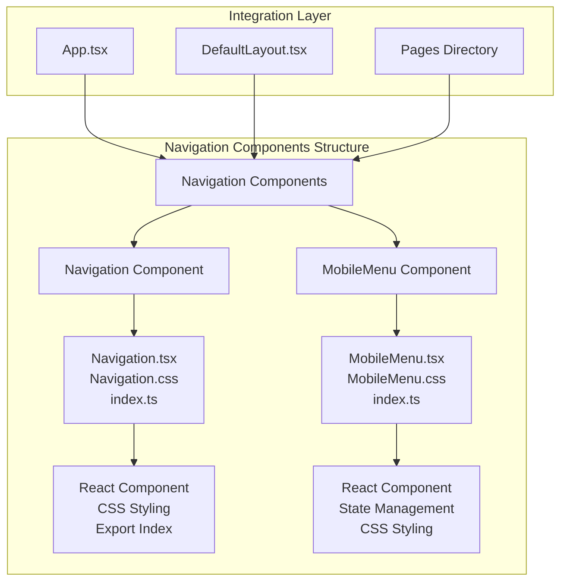
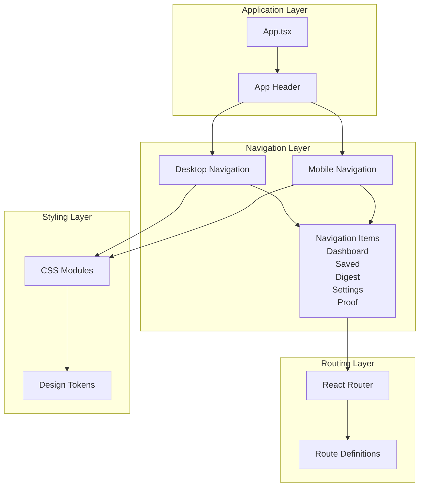
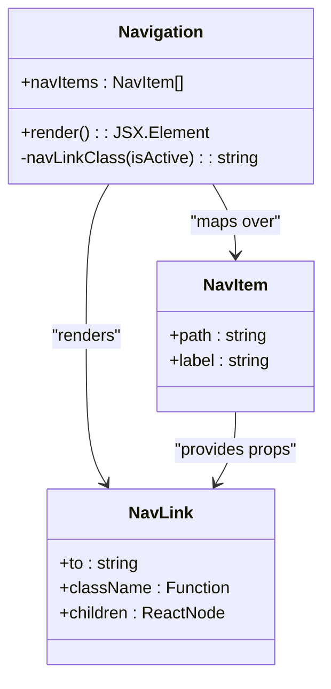
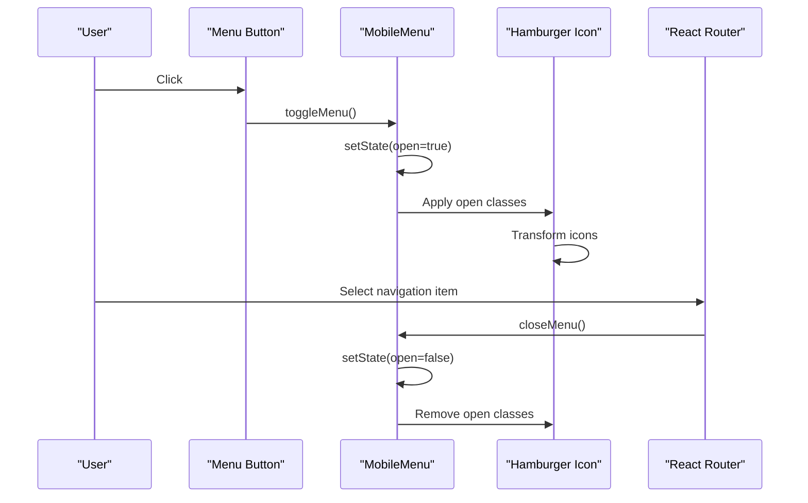
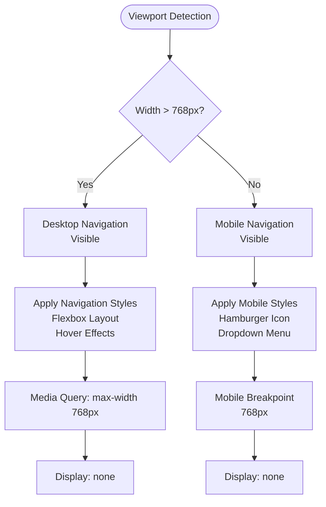
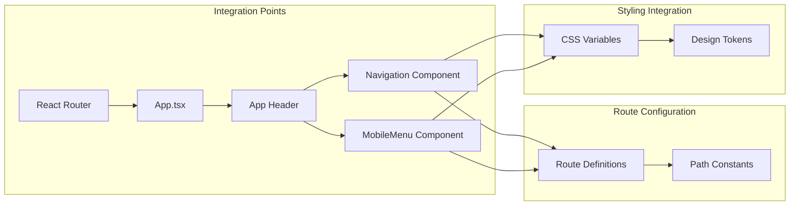

# Navigation Components

<cite>
**Referenced Files in This Document**
- [Navigation.tsx](file://src/components/Navigation/Navigation.tsx)
- [Navigation.css](file://src/components/Navigation/Navigation.css)
- [MobileMenu.tsx](file://src/components/MobileMenu/MobileMenu.tsx)
- [MobileMenu.css](file://src/components/MobileMenu/MobileMenu.css)
- [App.tsx](file://src/App.tsx)
- [tokens.css](file://src/styles/tokens.css)
- [index.ts](file://src/components/Navigation/index.ts)
- [index.ts](file://src/components/MobileMenu/index.ts)
- [index.ts](file://src/types/index.ts)
</cite>

## Table of Contents
1. [Introduction](#introduction)
2. [Project Structure](#project-structure)
3. [Core Components](#core-components)
4. [Architecture Overview](#architecture-overview)
5. [Detailed Component Analysis](#detailed-component-analysis)
6. [Responsive Design Implementation](#responsive-design-implementation)
7. [Integration Patterns](#integration-patterns)
8. [Design Token System](#design-token-system)
9. [Accessibility Features](#accessibility-features)
10. [Performance Considerations](#performance-considerations)
11. [Troubleshooting Guide](#troubleshooting-guide)
12. [Conclusion](#conclusion)

## Introduction

The Navigation Components system is a crucial part of the Job Notification App's design system, providing both desktop and mobile-friendly navigation experiences. This system consists of two primary navigation components: the standard Navigation component for desktop interfaces and the MobileMenu component for responsive mobile experiences. The implementation follows modern React patterns with TypeScript integration, CSS custom properties for design tokens, and comprehensive accessibility features.

The navigation system serves as the primary means of user interface traversal throughout the application, supporting six distinct routes: Dashboard, Saved, Digest, Settings, Proof, and a landing page. The components are designed with a clean, professional aesthetic that aligns with the app's "calm, intentional, coherent, confident" philosophy.

## Project Structure

The navigation components are organized within the components directory following a feature-based structure:

**Diagram sources**
- [Navigation.tsx:1-34](file://src/components/Navigation/Navigation.tsx#L1-L34)
- [MobileMenu.tsx:1-66](file://src/components/MobileMenu/MobileMenu.tsx#L1-L66)
- [App.tsx:1-45](file://src/App.tsx#L1-L45)

**Section sources**
- [Navigation.tsx:1-34](file://src/components/Navigation/Navigation.tsx#L1-L34)
- [MobileMenu.tsx:1-66](file://src/components/MobileMenu/MobileMenu.tsx#L1-L66)
- [App.tsx:1-45](file://src/App.tsx#L1-L45)

## Core Components

### Navigation Component

The Navigation component provides a desktop-friendly navigation bar featuring five primary navigation items with automatic active state detection and smooth transitions.

**Key Features:**
- Five navigation items: Dashboard, Saved, Digest, Settings, Proof
- Automatic active state highlighting using React Router's NavLink
- Smooth hover and active state transitions
- Responsive design with mobile-specific hiding
- Consistent styling with design tokens

**Implementation Pattern:**
The component uses a static array of navigation items with dynamic rendering through the map function. Each item receives an isActive class based on the current route, enabling visual feedback for the user's current location.

**Section sources**
- [Navigation.tsx:4-10](file://src/components/Navigation/Navigation.tsx#L4-L10)
- [Navigation.tsx:12-31](file://src/components/Navigation/Navigation.tsx#L12-L31)
- [Navigation.css:20-38](file://src/components/Navigation/Navigation.css#L20-L38)

### MobileMenu Component

The MobileMenu component delivers a hamburger-style navigation interface optimized for mobile devices, featuring state management for menu visibility and animated icon transitions.

**Key Features:**
- Hamburger icon with animated state changes
- Dropdown menu with overlay positioning
- Full-screen mobile navigation experience
- Keyboard accessibility support
- Focus management and ARIA attributes

**Implementation Pattern:**
The component utilizes React's useState hook for managing menu open/close states. The hamburger icon transforms into an X shape when the menu is open, providing clear visual feedback to users.

**Section sources**
- [MobileMenu.tsx:13-63](file://src/components/MobileMenu/MobileMenu.tsx#L13-L63)
- [MobileMenu.css:36-62](file://src/components/MobileMenu/MobileMenu.css#L36-L62)

## Architecture Overview

The navigation system follows a modular architecture pattern with clear separation of concerns between desktop and mobile navigation experiences:

**Diagram sources**
- [App.tsx:7-21](file://src/App.tsx#L7-L21)
- [Navigation.tsx:12-31](file://src/components/Navigation/Navigation.tsx#L12-L31)
- [MobileMenu.tsx:13-63](file://src/components/MobileMenu/MobileMenu.tsx#L13-L63)

The architecture ensures that navigation components remain decoupled from page content while maintaining consistent styling and behavior across different screen sizes.

**Section sources**
- [App.tsx:1-45](file://src/App.tsx#L1-L45)
- [Navigation.tsx:1-34](file://src/components/Navigation/Navigation.tsx#L1-L34)
- [MobileMenu.tsx:1-66](file://src/components/MobileMenu/MobileMenu.tsx#L1-L66)

## Detailed Component Analysis

### Navigation Component Deep Dive

The Navigation component demonstrates several key React patterns and best practices:

**Diagram sources**
- [Navigation.tsx:4-10](file://src/components/Navigation/Navigation.tsx#L4-L10)
- [Navigation.tsx:18-25](file://src/components/Navigation/Navigation.tsx#L18-L25)

**Component Lifecycle:**
1. Static navigation items array initialization
2. Dynamic rendering through React's map function
3. Conditional class application based on active state
4. Automatic cleanup through React Router's built-in mechanisms

**Styling Architecture:**
The component leverages CSS custom properties from the design token system, ensuring consistency across all navigation elements. The styling includes:
- Flexbox-based layout for horizontal navigation
- Transition effects for hover and active states
- Mobile-specific hiding via media queries
- Accessible color contrast ratios

**Section sources**
- [Navigation.tsx:12-31](file://src/components/Navigation/Navigation.tsx#L12-L31)
- [Navigation.css:1-46](file://src/components/Navigation/Navigation.css#L1-L46)

### MobileMenu Component Deep Dive

The MobileMenu component showcases advanced React patterns including state management and event handling:

**Diagram sources**
- [MobileMenu.tsx:14-22](file://src/components/MobileMenu/MobileMenu.tsx#L14-L22)
- [MobileMenu.tsx:40-60](file://src/components/MobileMenu/MobileMenu.tsx#L40-L60)

**State Management Pattern:**
The component uses React's useState hook to manage menu visibility with three key functions:
- `toggleMenu()`: Toggles between open and closed states
- `closeMenu()`: Forces menu closure after navigation selection
- State persistence during menu interactions

**Accessibility Implementation:**
- ARIA attributes for screen reader compatibility
- Keyboard navigation support
- Focus management for proper tab order
- Visual focus indicators

**Section sources**
- [MobileMenu.tsx:1-66](file://src/components/MobileMenu/MobileMenu.tsx#L1-L66)
- [MobileMenu.css:1-112](file://src/components/MobileMenu/MobileMenu.css#L1-L112)

## Responsive Design Implementation

The navigation system implements a sophisticated responsive design strategy that adapts seamlessly between desktop and mobile contexts:

**Diagram sources**
- [Navigation.css:40-45](file://src/components/Navigation/Navigation.css#L40-L45)
- [MobileMenu.css:7-12](file://src/components/MobileMenu/MobileMenu.css#L7-L12)

**Responsive Behavior:**
- Desktop (769px+): Full navigation bar with hover effects
- Mobile (≤768px): Hamburger menu with animated icon
- Automatic adaptation based on viewport width
- Consistent user experience across devices

**Section sources**
- [Navigation.css:40-46](file://src/components/Navigation/Navigation.css#L40-L46)
- [MobileMenu.css:7-12](file://src/components/MobileMenu/MobileMenu.css#L7-L12)

## Integration Patterns

The navigation components integrate deeply with the application's routing system and overall architecture:

**Diagram sources**
- [App.tsx:23-42](file://src/App.tsx#L23-L42)
- [Navigation.tsx:1-2](file://src/components/Navigation/Navigation.tsx#L1-L2)
- [MobileMenu.tsx:1-3](file://src/components/MobileMenu/MobileMenu.tsx#L1-L3)

**Integration Benefits:**
- Seamless route transitions without page reloads
- Consistent navigation experience across all application pages
- Automatic active state management based on current route
- Shared styling system through design tokens

**Section sources**
- [App.tsx:1-45](file://src/App.tsx#L1-L45)
- [Navigation.tsx:1-34](file://src/components/Navigation/Navigation.tsx#L1-L34)
- [MobileMenu.tsx:1-66](file://src/components/MobileMenu/MobileMenu.tsx#L1-L66)

## Design Token System

The navigation components leverage a comprehensive design token system that ensures consistency and maintainability across all interface elements:

**Color System Integration:**
The navigation components utilize the established color palette with specific tokens for different states and contexts. The design system maintains a maximum of four colors across the entire UI, emphasizing professionalism and clarity.

**Typography Consistency:**
All navigation text elements use the established typography scale, ensuring readability and visual hierarchy. The font system supports both body and heading treatments appropriate for navigation contexts.

**Spacing and Layout:**
The navigation components implement consistent spacing patterns using the design token spacing scale. This ensures proper visual rhythm and alignment across different screen sizes.

**Section sources**
- [tokens.css:14-33](file://src/styles/tokens.css#L14-L33)
- [Navigation.css:20-28](file://src/components/Navigation/Navigation.css#L20-L28)
- [MobileMenu.css:90-99](file://src/components/MobileMenu/MobileMenu.css#L90-L99)

## Accessibility Features

Both navigation components implement comprehensive accessibility features to ensure inclusive user experiences:

**Keyboard Navigation:**
- Full keyboard support for menu interactions
- Tab order maintained for logical navigation flow
- Focus indicators for interactive elements

**Screen Reader Support:**
- ARIA attributes for menu state management
- Descriptive labels for navigation elements
- Proper semantic markup for assistive technologies

**Visual Accessibility:**
- Sufficient color contrast ratios for text elements
- Focus visible states for keyboard navigation
- Clear visual feedback for interactive states

**Section sources**
- [MobileMenu.tsx:26-31](file://src/components/MobileMenu/MobileMenu.tsx#L26-L31)
- [MobileMenu.css:31-34](file://src/components/MobileMenu/MobileMenu.css#L31-L34)

## Performance Considerations

The navigation components are optimized for performance through several implementation strategies:

**Efficient Rendering:**
- Minimal re-renders through proper state management
- Static navigation items array prevents unnecessary computations
- CSS transitions handled by GPU for smooth animations

**Bundle Size Optimization:**
- Lightweight implementation with minimal dependencies
- CSS-in-JS approach through CSS custom properties
- No external dependencies for core functionality

**Memory Management:**
- Automatic cleanup through React lifecycle
- Event listeners properly managed
- No memory leaks in component instances

## Troubleshooting Guide

Common issues and solutions for the navigation components:

**Navigation Links Not Working:**
- Verify React Router is properly configured
- Check that route paths match navigation item paths
- Ensure BrowserRouter wraps the application

**Mobile Menu Not Responding:**
- Confirm state management is functioning correctly
- Check for console errors in component methods
- Verify CSS class names match expected patterns

**Styling Issues:**
- Validate design token imports are working
- Check CSS specificity conflicts
- Ensure media queries are properly formatted

**Accessibility Problems:**
- Verify ARIA attributes are present
- Test keyboard navigation thoroughly
- Check color contrast ratios meet standards

**Section sources**
- [Navigation.tsx:1-34](file://src/components/Navigation/Navigation.tsx#L1-L34)
- [MobileMenu.tsx:1-66](file://src/components/MobileMenu/MobileMenu.tsx#L1-L66)

## Conclusion

The Navigation Components system represents a well-architected solution for multi-device navigation in the Job Notification App. The implementation successfully balances functionality, aesthetics, and accessibility while maintaining excellent performance characteristics.

Key strengths of the implementation include:
- Clean separation of desktop and mobile navigation concerns
- Comprehensive accessibility support
- Consistent styling through the design token system
- Efficient state management and rendering
- Responsive design that adapts to various screen sizes

The modular architecture ensures maintainability and extensibility, allowing for easy addition of new navigation items or modification of existing behaviors. The system serves as a foundation for future enhancements while providing a solid user experience across all supported devices.