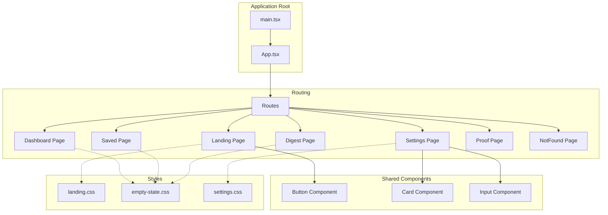
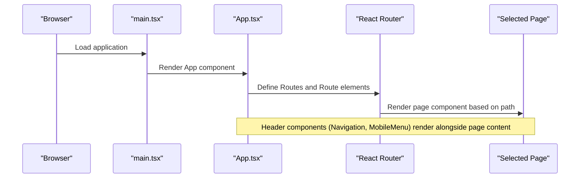
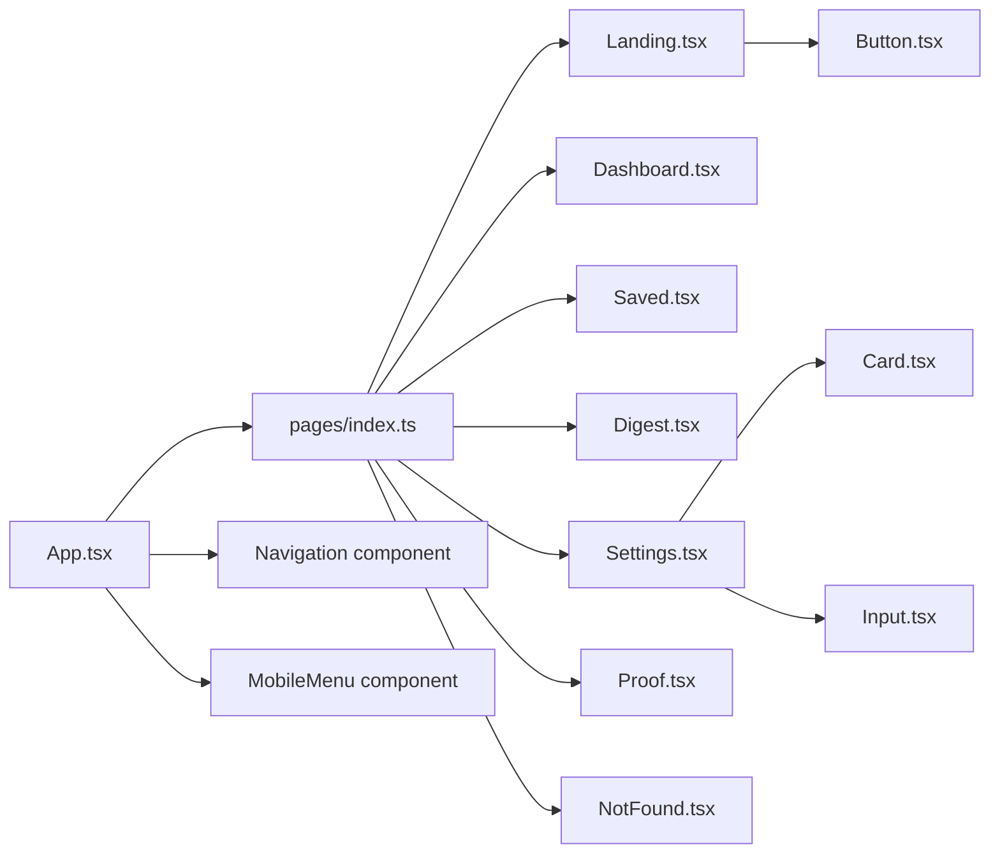

# Page Components

<cite>
**Referenced Files in This Document**
- [App.tsx](file://src/App.tsx)
- [main.tsx](file://src/main.tsx)
- [pages/index.ts](file://src/pages/index.ts)
- [Landing.tsx](file://src/pages/Landing.tsx)
- [Dashboard.tsx](file://src/pages/Dashboard.tsx)
- [Saved.tsx](file://src/pages/Saved.tsx)
- [Digest.tsx](file://src/pages/Digest.tsx)
- [Settings.tsx](file://src/pages/Settings.tsx)
- [Proof.tsx](file://src/pages/Proof.tsx)
- [NotFound.tsx](file://src/pages/NotFound.tsx)
- [Button.tsx](file://src/components/Button/Button.tsx)
- [Card.tsx](file://src/components/Card/Card.tsx)
- [Input.tsx](file://src/components/Input/Input.tsx)
- [landing.css](file://src/styles/landing.css)
- [empty-state.css](file://src/styles/empty-state.css)
- [settings.css](file://src/styles/settings.css)
- [package.json](file://package.json)
- [vite.config.ts](file://vite.config.ts)
</cite>

## Table of Contents
1. [Introduction](#introduction)
2. [Project Structure](#project-structure)
3. [Core Components](#core-components)
4. [Architecture Overview](#architecture-overview)
5. [Detailed Component Analysis](#detailed-component-analysis)
6. [Dependency Analysis](#dependency-analysis)
7. [Performance Considerations](#performance-considerations)
8. [Troubleshooting Guide](#troubleshooting-guide)
9. [Conclusion](#conclusion)

## Introduction
This document describes the page components of the Job Notification App, focusing on the routing structure, page composition, and reusable component integration. The application uses React with TypeScript and React Router for navigation, and follows a component-driven architecture where pages are composed from shared UI components and styled with CSS modules leveraging design tokens.

## Project Structure
The application is organized into distinct areas:
- Pages: Route-specific screens such as Landing, Dashboard, Saved, Digest, Settings, Proof, and NotFound
- Components: Reusable UI elements like Button, Card, and Input
- Styles: CSS files for each page and shared design tokens
- Routing: Centralized in App.tsx with route definitions and navigation components

**Diagram sources**
- [main.tsx:1-11](file://src/main.tsx#L1-L11)
- [App.tsx:1-45](file://src/App.tsx#L1-L45)
- [pages/index.ts:1-8](file://src/pages/index.ts#L1-L8)
- [Landing.tsx:1-30](file://src/pages/Landing.tsx#L1-L30)
- [Dashboard.tsx:1-17](file://src/pages/Dashboard.tsx#L1-L17)
- [Saved.tsx:1-20](file://src/pages/Saved.tsx#L1-L20)
- [Digest.tsx:1-20](file://src/pages/Digest.tsx#L1-L20)
- [Settings.tsx:1-85](file://src/pages/Settings.tsx#L1-L85)
- [Proof.tsx:1-17](file://src/pages/Proof.tsx#L1-L17)
- [NotFound.tsx:1-17](file://src/pages/NotFound.tsx#L1-L17)
- [Button.tsx:1-34](file://src/components/Button/Button.tsx#L1-L34)
- [Card.tsx:1-17](file://src/components/Card/Card.tsx#L1-L17)
- [Input.tsx:1-50](file://src/components/Input/Input.tsx#L1-L50)
- [landing.css:1-38](file://src/styles/landing.css#L1-L38)
- [empty-state.css:1-45](file://src/styles/empty-state.css#L1-L45)
- [settings.css:1-81](file://src/styles/settings.css#L1-L81)

**Section sources**
- [main.tsx:1-11](file://src/main.tsx#L1-L11)
- [App.tsx:1-45](file://src/App.tsx#L1-L45)
- [pages/index.ts:1-8](file://src/pages/index.ts#L1-L8)

## Core Components
This section outlines the primary page components and their responsibilities within the routing system.

- Landing: Entry screen with a primary call-to-action button that navigates to Settings.
- Dashboard: Empty state page indicating no jobs yet.
- Saved: Empty state page explaining the purpose of saved jobs.
- Digest: Empty state page describing the daily digest feature.
- Settings: Preference configuration page using Card and Input components for structured form sections.
- Proof: Placeholder page for artifact collection and verification.
- NotFound: Standard 404 page for unmatched routes.

Key integration points:
- App.tsx defines all routes and renders the selected page component.
- Shared components (Button, Card, Input) are imported and used within pages.
- Each page imports its specific stylesheet for consistent presentation.

**Section sources**
- [App.tsx:23-42](file://src/App.tsx#L23-L42)
- [Landing.tsx:5-27](file://src/pages/Landing.tsx#L5-L27)
- [Dashboard.tsx:3-14](file://src/pages/Dashboard.tsx#L3-L14)
- [Saved.tsx:3-17](file://src/pages/Saved.tsx#L3-L17)
- [Digest.tsx:3-17](file://src/pages/Digest.tsx#L3-L17)
- [Settings.tsx:5-82](file://src/pages/Settings.tsx#L5-L82)
- [Proof.tsx:3-14](file://src/pages/Proof.tsx#L3-L14)
- [NotFound.tsx:3-14](file://src/pages/NotFound.tsx#L3-L14)

## Architecture Overview
The routing architecture is centralized in App.tsx, which:
- Wraps the application with BrowserRouter
- Renders Navigation and MobileMenu components in the header
- Defines routes for each page component
- Uses a catch-all route (*) for NotFound

**Diagram sources**
- [main.tsx:6-10](file://src/main.tsx#L6-L10)
- [App.tsx:25-41](file://src/App.tsx#L25-L41)

**Section sources**
- [main.tsx:1-11](file://src/main.tsx#L1-L11)
- [App.tsx:1-45](file://src/App.tsx#L1-L45)

## Detailed Component Analysis

### Landing Page
Purpose:
- Introduces the app's value proposition and drives users to configure preferences.

Key behaviors:
- Uses Button component with primary variant and large size.
- Navigates to Settings when the CTA is clicked.

Styling:
- Uses landing.css for centered layout, typography, and spacing.

Integration:
- Imports Button and styles/landing.css.
- Uses react-router-dom's useNavigate hook for programmatic navigation.

**Section sources**
- [Landing.tsx:1-30](file://src/pages/Landing.tsx#L1-L30)
- [Button.tsx:1-34](file://src/components/Button/Button.tsx#L1-L34)
- [landing.css:1-38](file://src/styles/landing.css#L1-L38)

### Dashboard Page
Purpose:
- Provides an initial dashboard view indicating no jobs are present yet.

Structure:
- Renders an empty-state layout with title and message.

Styling:
- Uses empty-state.css for consistent empty state presentation.

**Section sources**
- [Dashboard.tsx:1-17](file://src/pages/Dashboard.tsx#L1-L17)
- [empty-state.css:1-45](file://src/styles/empty-state.css#L1-L45)

### Saved Page
Purpose:
- Explains the concept and benefits of saving jobs.

Structure:
- Includes title, message, and explanatory paragraph.

Styling:
- Uses empty-state.css for consistent empty state presentation.

**Section sources**
- [Saved.tsx:1-20](file://src/pages/Saved.tsx#L1-L20)
- [empty-state.css:1-45](file://src/styles/empty-state.css#L1-L45)

### Digest Page
Purpose:
- Describes the daily digest feature and what users can expect.

Structure:
- Includes title, message, and detailed explanation.

Styling:
- Uses empty-state.css for consistent empty state presentation.

**Section sources**
- [Digest.tsx:1-20](file://src/pages/Digest.tsx#L1-L20)
- [empty-state.css:1-45](file://src/styles/empty-state.css#L1-L45)

### Settings Page
Purpose:
- Allows users to configure job search preferences.

Structure:
- Grid layout of preference sections using Card components.
- Each section includes a title, description, and Input component for keywords/locations.
- Radio button groups for Work Mode and Experience Level.

Integration:
- Uses Card and Input components for consistent UI.
- Imports settings.css for layout and typography.

**Section sources**
- [Settings.tsx:1-85](file://src/pages/Settings.tsx#L1-L85)
- [Card.tsx:1-17](file://src/components/Card/Card.tsx#L1-L17)
- [Input.tsx:1-50](file://src/components/Input/Input.tsx#L1-L50)
- [settings.css:1-81](file://src/styles/settings.css#L1-L81)

### Proof Page
Purpose:
- Placeholder for future artifact collection and verification functionality.

Structure:
- Simple placeholder layout with title and explanatory text.

Styling:
- Uses placeholder.css for consistent placeholder page presentation.

**Section sources**
- [Proof.tsx:1-17](file://src/pages/Proof.tsx#L1-L17)

### NotFound Page
Purpose:
- Handles unmatched routes gracefully.

Structure:
- Standard placeholder layout with title and message.

Styling:
- Uses placeholder.css for consistent placeholder page presentation.

**Section sources**
- [NotFound.tsx:1-17](file://src/pages/NotFound.tsx#L1-L17)

### Shared Components Used by Pages
- Button: Generic button with variant and size props, supports disabled state and click handlers.
- Card: Container component for grouping related settings.
- Input: Form input with label, placeholder, optional error messaging, and accessibility attributes.

**Section sources**
- [Button.tsx:1-34](file://src/components/Button/Button.tsx#L1-L34)
- [Card.tsx:1-17](file://src/components/Card/Card.tsx#L1-L17)
- [Input.tsx:1-50](file://src/components/Input/Input.tsx#L1-L50)

## Dependency Analysis
The routing and component dependencies are straightforward and intentionally decoupled:

**Diagram sources**
- [pages/index.ts:1-8](file://src/pages/index.ts#L1-L8)
- [App.tsx:2-4](file://src/App.tsx#L2-L4)
- [Landing.tsx:2](file://src/pages/Landing.tsx#L2)
- [Settings.tsx:1-3](file://src/pages/Settings.tsx#L1-L3)

**Section sources**
- [pages/index.ts:1-8](file://src/pages/index.ts#L1-L8)
- [App.tsx:1-45](file://src/App.tsx#L1-L45)

## Performance Considerations
- Route-based code splitting: Consider lazy-loading page components to reduce initial bundle size.
- Component memoization: Use React.memo for static page components to prevent unnecessary re-renders.
- CSS-in-JS alternatives: Keep styles modular and scoped to avoid cascade-related performance issues.
- Bundle analysis: Use Vite's built-in analyzer to identify large dependencies.

## Troubleshooting Guide
Common issues and resolutions:
- Route not rendering: Verify the route path matches the intended URL and that the component is exported via pages/index.ts.
- Styles not applied: Ensure the page imports its specific stylesheet and that CSS variable tokens are defined.
- Button click not working: Confirm the onClick handler is passed correctly to the Button component and that useNavigate is used appropriately in Landing.
- Form controls not accessible: Ensure Input components include proper labels and aria attributes.

**Section sources**
- [App.tsx:29-37](file://src/App.tsx#L29-L37)
- [Landing.tsx:8-10](file://src/pages/Landing.tsx#L8-L10)
- [Input.tsx:24-44](file://src/components/Input/Input.tsx#L24-L44)

## Conclusion
The page components are designed around a clean separation of concerns: routing is centralized, pages are self-contained with minimal logic, and shared components provide consistent UI patterns. This structure supports maintainability, testability, and scalability as new pages and features are introduced.