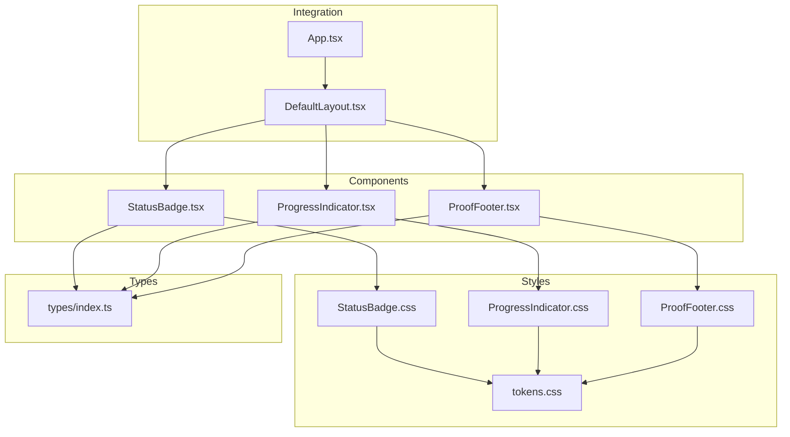
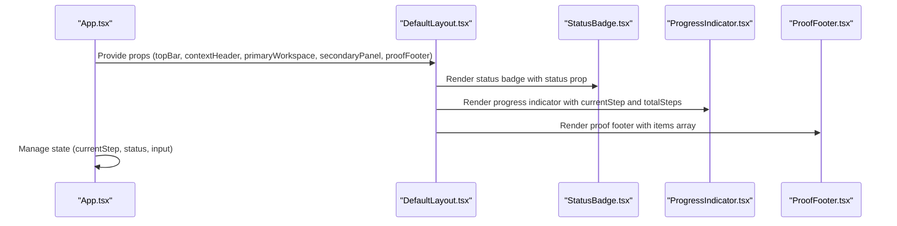
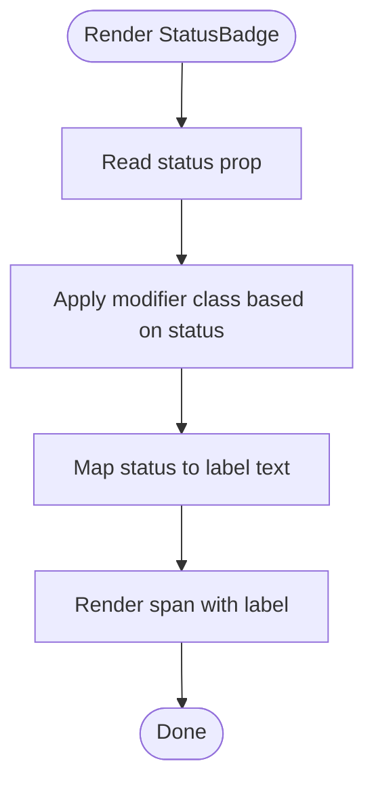
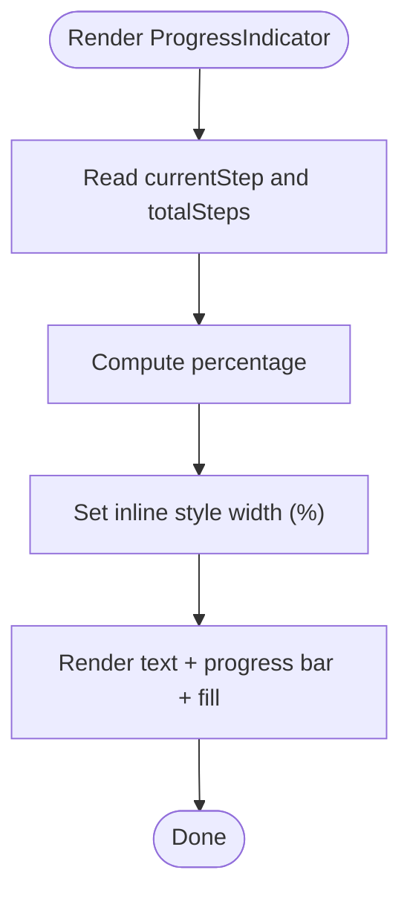
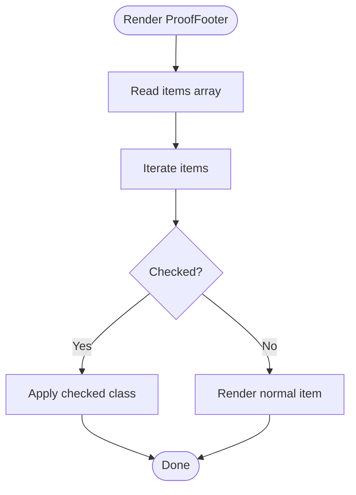
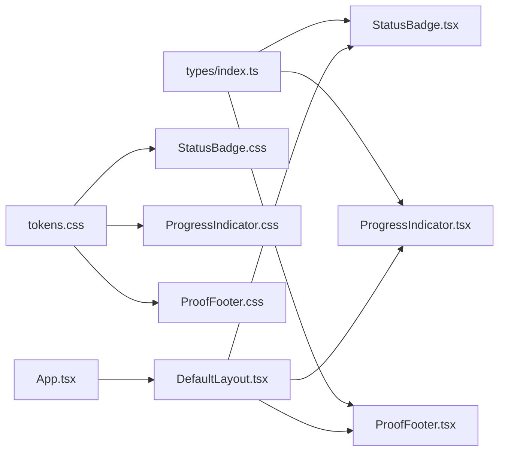

# Utility Components

<cite>
**Referenced Files in This Document**
- [StatusBadge.tsx](file://src/components/StatusBadge/StatusBadge.tsx)
- [StatusBadge.css](file://src/components/StatusBadge/StatusBadge.css)
- [ProgressIndicator.tsx](file://src/components/ProgressIndicator/ProgressIndicator.tsx)
- [ProgressIndicator.css](file://src/components/ProgressIndicator/ProgressIndicator.css)
- [ProofFooter.tsx](file://src/components/ProofFooter/ProofFooter.tsx)
- [ProofFooter.css](file://src/components/ProofFooter/ProofFooter.css)
- [tokens.css](file://src/styles/tokens.css)
- [index.ts](file://src/types/index.ts)
- [App.tsx](file://src/App.tsx)
- [DefaultLayout.tsx](file://src/layouts/DefaultLayout/DefaultLayout.tsx)
- [Input.tsx](file://src/components/Input/Input.tsx)
</cite>

## Table of Contents
1. [Introduction](#introduction)
2. [Project Structure](#project-structure)
3. [Core Components](#core-components)
4. [Architecture Overview](#architecture-overview)
5. [Detailed Component Analysis](#detailed-component-analysis)
6. [Dependency Analysis](#dependency-analysis)
7. [Performance Considerations](#performance-considerations)
8. [Accessibility Compliance](#accessibility-compliance)
9. [Usage Scenarios and Examples](#usage-scenarios-and-examples)
10. [Conclusion](#conclusion)

## Introduction
This document provides comprehensive documentation for three utility components that deliver visual feedback and enhance user experience: StatusBadge, ProgressIndicator, and ProofFooter. It explains component responsibilities, prop interfaces, state management patterns, visual design semantics, animations, transitions, and integration with form workflows. Accessibility considerations are included to support screen readers, keyboard navigation, and focus management.

## Project Structure
The utility components are organized under the components directory with dedicated TypeScript and CSS files. Shared design tokens define color, spacing, typography, and transition behaviors. The types module centralizes prop interfaces for all components. The application demonstrates integration via a layout wrapper and showcases usage in a multi-step form context.

**Diagram sources**
- [StatusBadge.tsx:1-23](file://src/components/StatusBadge/StatusBadge.tsx#L1-L23)
- [ProgressIndicator.tsx:1-26](file://src/components/ProgressIndicator/ProgressIndicator.tsx#L1-L26)
- [ProofFooter.tsx:1-32](file://src/components/ProofFooter/ProofFooter.tsx#L1-L32)
- [StatusBadge.css:1-33](file://src/components/StatusBadge/StatusBadge.css#L1-L33)
- [ProgressIndicator.css:1-30](file://src/components/ProgressIndicator/ProgressIndicator.css#L1-L30)
- [ProofFooter.css:1-52](file://src/components/ProofFooter/ProofFooter.css#L1-L52)
- [tokens.css:1-108](file://src/styles/tokens.css#L1-L108)
- [index.ts:1-100](file://src/types/index.ts#L1-L100)
- [App.tsx:1-148](file://src/App.tsx#L1-L148)
- [DefaultLayout.tsx:1-27](file://src/layouts/DefaultLayout/DefaultLayout.tsx#L1-L27)

**Section sources**
- [StatusBadge.tsx:1-23](file://src/components/StatusBadge/StatusBadge.tsx#L1-L23)
- [ProgressIndicator.tsx:1-26](file://src/components/ProgressIndicator/ProgressIndicator.tsx#L1-L26)
- [ProofFooter.tsx:1-32](file://src/components/ProofFooter/ProofFooter.tsx#L1-L32)
- [StatusBadge.css:1-33](file://src/components/StatusBadge/StatusBadge.css#L1-L33)
- [ProgressIndicator.css:1-30](file://src/components/ProgressIndicator/ProgressIndicator.css#L1-L30)
- [ProofFooter.css:1-52](file://src/components/ProofFooter/ProofFooter.css#L1-L52)
- [tokens.css:1-108](file://src/styles/tokens.css#L1-L108)
- [index.ts:1-100](file://src/types/index.ts#L1-L100)
- [App.tsx:1-148](file://src/App.tsx#L1-L148)
- [DefaultLayout.tsx:1-27](file://src/layouts/DefaultLayout/DefaultLayout.tsx#L1-L27)

## Core Components
This section outlines the responsibilities and interfaces of each utility component.

- StatusBadge
  - Purpose: Render a semantic status indicator with muted color semantics for “not-started”, “in-progress”, and “shipped”.
  - Props: status (StatusType), className (optional).
  - Rendering: A span element with a status-specific modifier class and localized label text.
  - Visual Semantics: Uses design tokens for background, color, and border to communicate meaning.

- ProgressIndicator
  - Purpose: Display current step and total steps with a progress bar and percentage fill.
  - Props: currentStep (number), totalSteps (number), className (optional).
  - Rendering: A container with a textual step count and a horizontal progress bar whose width reflects completion percentage.
  - Animation: Smooth width transition using a predefined transition duration.

- ProofFooter
  - Purpose: Present a completion checklist with labeled items and checked states.
  - Props: items (array of { label: string; checked: boolean }), className (optional).
  - Rendering: A footer with a title and a list of items; each item shows a checkbox symbol and label, styled differently when checked.
  - Visual Semantics: Uses success color for checked items to reinforce completion.

**Section sources**
- [StatusBadge.tsx:1-23](file://src/components/StatusBadge/StatusBadge.tsx#L1-L23)
- [StatusBadge.css:1-33](file://src/components/StatusBadge/StatusBadge.css#L1-L33)
- [ProgressIndicator.tsx:1-26](file://src/components/ProgressIndicator/ProgressIndicator.tsx#L1-L26)
- [ProgressIndicator.css:1-30](file://src/components/ProgressIndicator/ProgressIndicator.css#L1-L30)
- [ProofFooter.tsx:1-32](file://src/components/ProofFooter/ProofFooter.tsx#L1-L32)
- [ProofFooter.css:1-52](file://src/components/ProofFooter/ProofFooter.css#L1-L52)
- [index.ts:47-90](file://src/types/index.ts#L47-L90)

## Architecture Overview
The components integrate with the application through a layout wrapper. The application manages state for current step and status, passing them down to child components. The layout composes the top bar, context header, primary workspace, secondary panel, and proof footer.

**Diagram sources**
- [App.tsx:14-144](file://src/App.tsx#L14-L144)
- [DefaultLayout.tsx:5-23](file://src/layouts/DefaultLayout/DefaultLayout.tsx#L5-L23)
- [StatusBadge.tsx:11-20](file://src/components/StatusBadge/StatusBadge.tsx#L11-L20)
- [ProgressIndicator.tsx:5-23](file://src/components/ProgressIndicator/ProgressIndicator.tsx#L5-L23)
- [ProofFooter.tsx:5-29](file://src/components/ProofFooter/ProofFooter.tsx#L5-L29)

## Detailed Component Analysis

### StatusBadge
- Implementation pattern: Stateless functional component with a mapping of status to label text and a modifier class for styling.
- Data structures: A record mapping StatusType to human-readable labels.
- Color semantics:
  - Not started: Muted background and secondary text with a subtle border.
  - In progress: Muted warning color scheme.
  - Shipped: Muted success color scheme.
- Accessibility: Renders as a span with no interactive roles; suitable for static status display.

**Diagram sources**
- [StatusBadge.tsx:5-19](file://src/components/StatusBadge/StatusBadge.tsx#L5-L19)
- [StatusBadge.css:13-32](file://src/components/StatusBadge/StatusBadge.css#L13-L32)

**Section sources**
- [StatusBadge.tsx:1-23](file://src/components/StatusBadge/StatusBadge.tsx#L1-L23)
- [StatusBadge.css:1-33](file://src/components/StatusBadge/StatusBadge.css#L1-L33)
- [index.ts:47-50](file://src/types/index.ts#L47-L50)

### ProgressIndicator
- Implementation pattern: Stateless functional component computing width percentage from currentStep and totalSteps.
- Data structures: Receives two numeric props; computes a percentage for the fill width.
- Animation and transitions: Progress bar fill animates width changes using a transition duration defined in design tokens.
- User guidance: Displays current step and total steps text alongside the visual indicator.

**Diagram sources**
- [ProgressIndicator.tsx:10-22](file://src/components/ProgressIndicator/ProgressIndicator.tsx#L10-L22)
- [ProgressIndicator.css:25-29](file://src/components/ProgressIndicator/ProgressIndicator.css#L25-L29)

**Section sources**
- [ProgressIndicator.tsx:1-26](file://src/components/ProgressIndicator/ProgressIndicator.tsx#L1-L26)
- [ProgressIndicator.css:1-30](file://src/components/ProgressIndicator/ProgressIndicator.css#L1-L30)
- [index.ts:52-56](file://src/types/index.ts#L52-L56)
- [tokens.css:96-97](file://src/styles/tokens.css#L96-L97)

### ProofFooter
- Implementation pattern: Stateless functional component rendering a list of items with conditional checked styling.
- Data structures: Accepts an array of objects with label and checked fields.
- Visual design: Uses elevated background and subtle borders; checked items adopt success color.
- Completion verification: Checkbox-like symbols indicate completion state.

**Diagram sources**
- [ProofFooter.tsx:13-25](file://src/components/ProofFooter/ProofFooter.tsx#L13-L25)
- [ProofFooter.css:40-42](file://src/components/ProofFooter/ProofFooter.css#L40-L42)

**Section sources**
- [ProofFooter.tsx:1-32](file://src/components/ProofFooter/ProofFooter.tsx#L1-L32)
- [ProofFooter.css:1-52](file://src/components/ProofFooter/ProofFooter.css#L1-L52)
- [index.ts:84-90](file://src/types/index.ts#L84-L90)

## Dependency Analysis
- Component dependencies:
  - StatusBadge depends on StatusType and design tokens for styling.
  - ProgressIndicator depends on numeric step props and design tokens for transitions.
  - ProofFooter depends on an array of item objects and design tokens for colors and spacing.
- Integration points:
  - App.tsx manages state and passes props to DefaultLayout, which composes child components.
  - The types module defines shared interfaces used across components.

**Diagram sources**
- [index.ts:1-100](file://src/types/index.ts#L1-L100)
- [StatusBadge.tsx:1-3](file://src/components/StatusBadge/StatusBadge.tsx#L1-L3)
- [ProgressIndicator.tsx:1-3](file://src/components/ProgressIndicator/ProgressIndicator.tsx#L1-L3)
- [ProofFooter.tsx:1-3](file://src/components/ProofFooter/ProofFooter.tsx#L1-L3)
- [StatusBadge.css](file://src/components/StatusBadge/StatusBadge.css#L1)
- [ProgressIndicator.css](file://src/components/ProgressIndicator/ProgressIndicator.css#L1)
- [ProofFooter.css](file://src/components/ProofFooter/ProofFooter.css#L1)
- [App.tsx:1-148](file://src/App.tsx#L1-L148)
- [DefaultLayout.tsx:1-27](file://src/layouts/DefaultLayout/DefaultLayout.tsx#L1-L27)

**Section sources**
- [index.ts:1-100](file://src/types/index.ts#L1-L100)
- [App.tsx:1-148](file://src/App.tsx#L1-L148)
- [DefaultLayout.tsx:1-27](file://src/layouts/DefaultLayout/DefaultLayout.tsx#L1-L27)

## Performance Considerations
- StatusBadge: Stateless and lightweight; minimal DOM nodes and no reflows.
- ProgressIndicator: Computes a single percentage and applies inline style; efficient for frequent updates.
- ProofFooter: Iterates over a small items array; keep the list size reasonable to avoid layout thrashing.
- Transitions: CSS transitions are GPU-friendly and optimized for smoothness via design tokens.

[No sources needed since this section provides general guidance]

## Accessibility Compliance
- Current component state:
  - StatusBadge renders a non-interactive span; suitable for static status display.
  - ProgressIndicator renders a non-interactive bar and text; no ARIA roles are required.
  - ProofFooter renders a list of items; no interactive controls are present.
- Recommended enhancements (to improve accessibility):
  - Add ARIA live regions to announce dynamic progress updates for screen readers.
  - Provide explicit ARIA labels for the progress bar to describe current step and total steps.
  - Ensure keyboard focus is managed when integrating these components into interactive forms.
- Reference implementation pattern:
  - The Input component demonstrates ARIA attributes for error announcements and assistive technologies.

**Section sources**
- [Input.tsx:36-44](file://src/components/Input/Input.tsx#L36-L44)

## Usage Scenarios and Examples
- Multi-step forms
  - Use ProgressIndicator to show current step and completion percentage.
  - Use StatusBadge to reflect the overall job or task status.
  - Use ProofFooter to present a completion checklist after submission.
- Status tracking dashboards
  - Render StatusBadge per row to indicate task state.
  - Combine with ProgressIndicator to show partial progress within tasks.
- Completion screens
  - Display ProofFooter with checked items to confirm successful actions.
  - Use StatusBadge to summarize final state (e.g., shipped).

Integration example highlights:
- App.tsx manages currentStep and status, passing them to TopBar and SecondaryPanel, while rendering ProofFooter with items.
- DefaultLayout.tsx composes the top bar, context header, primary workspace, secondary panel, and proof footer.

**Section sources**
- [App.tsx:14-144](file://src/App.tsx#L14-L144)
- [DefaultLayout.tsx:5-23](file://src/layouts/DefaultLayout/DefaultLayout.tsx#L5-L23)

## Conclusion
The StatusBadge, ProgressIndicator, and ProofFooter components provide clear visual feedback and enhance user comprehension across workflows. Their simple, stateless designs integrate seamlessly with form state management and layout composition. By leveraging design tokens, they maintain consistent semantics and transitions. Extending accessibility through ARIA attributes would further improve screen reader support and inclusive experiences.