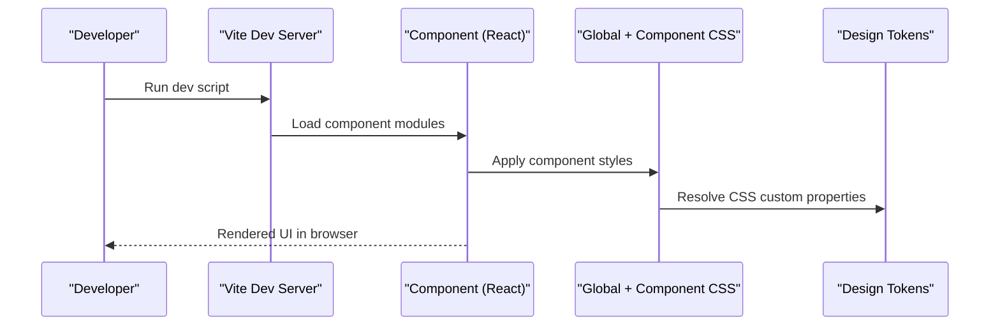
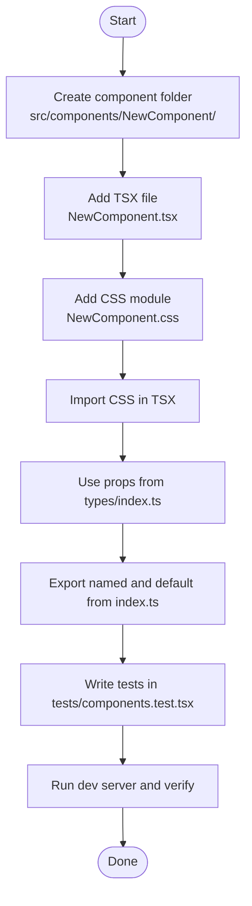
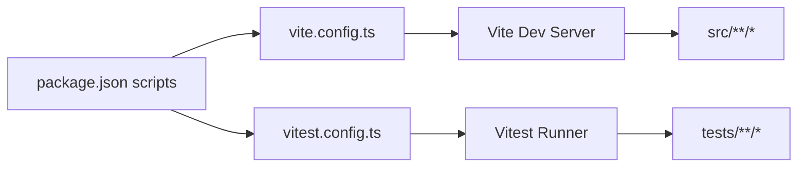

# Contributing & Development Guidelines

<cite>
**Referenced Files in This Document**
- [package.json](file://package.json)
- [vite.config.ts](file://vite.config.ts)
- [vitest.config.ts](file://vitest.config.ts)
- [tsconfig.json](file://tsconfig.json)
- [src/styles/tokens.css](file://src/styles/tokens.css)
- [src/styles/global.css](file://src/styles/global.css)
- [src/types/index.ts](file://src/types/index.ts)
- [src/components/Button/Button.tsx](file://src/components/Button/Button.tsx)
- [src/components/Button/index.ts](file://src/components/Button/index.ts)
- [src/components/Input/Input.tsx](file://src/components/Input/Input.tsx)
- [src/components/Card/Card.tsx](file://src/components/Card/Card.tsx)
- [src/components/StatusBadge/StatusBadge.tsx](file://src/components/StatusBadge/StatusBadge.tsx)
- [src/components/ProgressIndicator/ProgressIndicator.tsx](file://src/components/ProgressIndicator/ProgressIndicator.tsx)
- [src/layouts/DefaultLayout/DefaultLayout.tsx](file://src/layouts/DefaultLayout/DefaultLayout.tsx)
- [tests/design-tokens.test.ts](file://tests/design-tokens.test.ts)
- [tests/components.test.tsx](file://tests/components.test.tsx)
- [tests/setup.ts](file://tests/setup.ts)
</cite>

## Table of Contents
1. [Introduction](#introduction)
2. [Project Structure](#project-structure)
3. [Core Components](#core-components)
4. [Architecture Overview](#architecture-overview)
5. [Detailed Component Analysis](#detailed-component-analysis)
6. [Dependency Analysis](#dependency-analysis)
7. [Performance Considerations](#performance-considerations)
8. [Troubleshooting Guide](#troubleshooting-guide)
9. [Conclusion](#conclusion)
10. [Appendices](#appendices)

## Introduction
This document provides comprehensive contributing and development guidelines for the design system project. It covers environment setup, development workflow, component creation patterns, design token maintenance, testing and documentation requirements, pull request and review expectations, release and versioning strategy, coding standards, and troubleshooting tips. The goal is to ensure consistent, maintainable, and accessible contributions across the team.

## Project Structure
The project is a React + TypeScript design system built with Vite and Vitest. Styles are centralized via CSS custom properties (design tokens) imported globally. Components are organized per-feature under src/components with a shared types module. Tests are colocated alongside components and grouped by concern.

```mermaid
graph TB
subgraph "Build & Test"
Vite["Vite Dev Server"]
Vitest["Vitest Runner"]
end
subgraph "Source"
Types["Types Module<br/>src/types/index.ts"]
Tokens["Design Tokens<br/>src/styles/tokens.css"]
GlobalCSS["Global Styles<br/>src/styles/global.css"]
Button["Button Component<br/>src/components/Button/Button.tsx"]
Input["Input Component<br/>src/components/Input/Input.tsx"]
Card["Card Component<br/>src/components/Card/Card.tsx"]
StatusBadge["StatusBadge Component<br/>src/components/StatusBadge/StatusBadge.tsx"]
Progress["ProgressIndicator Component<br/>src/components/ProgressIndicator/ProgressIndicator.tsx"]
Layout["DefaultLayout Component<br/>src/layouts/DefaultLayout/DefaultLayout.tsx"]
end
subgraph "Tests"
TokensTest["Design Tokens Tests<br/>tests/design-tokens.test.ts"]
ComponentsTest["Components Tests<br/>tests/components.test.tsx"]
Setup["Test Setup<br/>tests/setup.ts"]
end
Vite --> Types
Vite --> Tokens
Vite --> GlobalCSS
Vite --> Button
Vite --> Input
Vite --> Card
Vite --> StatusBadge
Vite --> Progress
Vite --> Layout
Vitest --> TokensTest
Vitest --> ComponentsTest
Vitest --> Setup
```

**Diagram sources**
- [vite.config.ts:1-8](file://vite.config.ts#L1-L8)
- [vitest.config.ts:1-10](file://vitest.config.ts#L1-L10)
- [src/types/index.ts:1-100](file://src/types/index.ts#L1-L100)
- [src/styles/tokens.css:1-108](file://src/styles/tokens.css#L1-L108)
- [src/styles/global.css:1-157](file://src/styles/global.css#L1-L157)
- [src/components/Button/Button.tsx:1-34](file://src/components/Button/Button.tsx#L1-L34)
- [src/components/Input/Input.tsx:1-50](file://src/components/Input/Input.tsx#L1-L50)
- [src/components/Card/Card.tsx:1-17](file://src/components/Card/Card.tsx#L1-L17)
- [src/components/StatusBadge/StatusBadge.tsx:1-23](file://src/components/StatusBadge/StatusBadge.tsx#L1-L23)
- [src/components/ProgressIndicator/ProgressIndicator.tsx:1-26](file://src/components/ProgressIndicator/ProgressIndicator.tsx#L1-L26)
- [src/layouts/DefaultLayout/DefaultLayout.tsx:1-27](file://src/layouts/DefaultLayout/DefaultLayout.tsx#L1-L27)
- [tests/design-tokens.test.ts:1-106](file://tests/design-tokens.test.ts#L1-L106)
- [tests/components.test.tsx:1-214](file://tests/components.test.tsx#L1-L214)
- [tests/setup.ts:1-2](file://tests/setup.ts#L1-L2)

**Section sources**
- [package.json:1-22](file://package.json#L1-L22)
- [vite.config.ts:1-8](file://vite.config.ts#L1-L8)
- [vitest.config.ts:1-10](file://vitest.config.ts#L1-L10)
- [tsconfig.json:1-27](file://tsconfig.json#L1-L27)
- [src/styles/tokens.css:1-108](file://src/styles/tokens.css#L1-L108)
- [src/styles/global.css:1-157](file://src/styles/global.css#L1-L157)
- [src/types/index.ts:1-100](file://src/types/index.ts#L1-L100)

## Core Components
- Build and dev server: Vite with React plugin.
- Type system: Centralized props and enums in a single types module.
- Styles: Design tokens in CSS custom properties, imported globally.
- Components: Feature-based folders with index exports and CSS modules.
- Testing: Vitest with JSDOM environment and React Testing Library.

Key scripts and tooling:
- Scripts: dev, build, preview, test.
- TypeScript strictness and bundler-mode resolution.
- Vitest configured with jsdom, globals, and setup file.

**Section sources**
- [package.json:6-11](file://package.json#L6-L11)
- [vite.config.ts:5-7](file://vite.config.ts#L5-L7)
- [vitest.config.ts:3-9](file://vitest.config.ts#L3-L9)
- [tsconfig.json:18-24](file://tsconfig.json#L18-L24)

## Architecture Overview
The design system follows a unidirectional data flow pattern typical of React applications:
- Components receive typed props from parent containers.
- Components apply design tokens via CSS custom properties.
- Tests validate component behavior and design token adherence.

**Diagram sources**
- [vite.config.ts:5-7](file://vite.config.ts#L5-L7)
- [src/styles/global.css:5](file://src/styles/global.css#L5)
- [src/styles/tokens.css:8-107](file://src/styles/tokens.css#L8-L107)
- [src/components/Button/Button.tsx:1-34](file://src/components/Button/Button.tsx#L1-L34)

## Detailed Component Analysis

### Component Creation Process
Follow this pattern for adding a new component:
- Create a new folder under src/components/<ComponentName>.
- Add a TypeScript file implementing the component with typed props from the shared types module.
- Add a CSS module for styling and import it inside the component file.
- Export the component and default export from an index.ts file in the component’s folder.
- Keep presentational components pure and avoid side effects; delegate state to parent containers.
- Ensure accessibility: use proper labels, roles, and ARIA attributes where applicable.
- Write unit tests covering rendering, interaction, and behavior.

Example reference paths:
- Component implementation: [src/components/Button/Button.tsx:1-34](file://src/components/Button/Button.tsx#L1-L34)
- Component index export: [src/components/Button/index.ts:1-3](file://src/components/Button/index.ts#L1-L3)
- Shared types: [src/types/index.ts:1-100](file://src/types/index.ts#L1-L100)

**Diagram sources**
- [src/components/Button/Button.tsx:1-34](file://src/components/Button/Button.tsx#L1-L34)
- [src/components/Button/index.ts:1-3](file://src/components/Button/index.ts#L1-L3)
- [src/types/index.ts:1-100](file://src/types/index.ts#L1-L100)
- [tests/components.test.tsx:1-214](file://tests/components.test.tsx#L1-L214)

**Section sources**
- [src/components/Button/Button.tsx:1-34](file://src/components/Button/Button.tsx#L1-L34)
- [src/components/Button/index.ts:1-3](file://src/components/Button/index.ts#L1-L3)
- [src/types/index.ts:1-100](file://src/types/index.ts#L1-L100)
- [tests/components.test.tsx:1-214](file://tests/components.test.tsx#L1-L214)

### Component Props and Types
- Centralized props and enums in src/types/index.ts.
- Example types: ButtonProps, InputProps, CardProps, StatusBadgeProps, ProgressIndicatorProps, TopBarProps, ContextHeaderProps, PrimaryWorkspaceProps, SecondaryPanelProps, ProofFooterProps, DefaultLayoutProps.
- Use union types for discrete values (e.g., StatusType, ButtonVariant, ButtonSize).

Reference:
- [src/types/index.ts:1-100](file://src/types/index.ts#L1-L100)

**Section sources**
- [src/types/index.ts:1-100](file://src/types/index.ts#L1-L100)

### Component Examples
- Button: renders with variants, sizes, disabled state, and click handler.
- Input: supports label, placeholder, value, onChange, error messaging, disabled state, and ARIA attributes.
- Card: minimal wrapper for content.
- StatusBadge: maps status enum to localized labels.
- ProgressIndicator: computes percentage width dynamically.
- DefaultLayout: composes layout sections.

References:
- [src/components/Button/Button.tsx:1-34](file://src/components/Button/Button.tsx#L1-L34)
- [src/components/Input/Input.tsx:1-50](file://src/components/Input/Input.tsx#L1-L50)
- [src/components/Card/Card.tsx:1-17](file://src/components/Card/Card.tsx#L1-L17)
- [src/components/StatusBadge/StatusBadge.tsx:1-23](file://src/components/StatusBadge/StatusBadge.tsx#L1-L23)
- [src/components/ProgressIndicator/ProgressIndicator.tsx:1-26](file://src/components/ProgressIndicator/ProgressIndicator.tsx#L1-L26)
- [src/layouts/DefaultLayout/DefaultLayout.tsx:1-27](file://src/layouts/DefaultLayout/DefaultLayout.tsx#L1-L27)

**Section sources**
- [src/components/Button/Button.tsx:1-34](file://src/components/Button/Button.tsx#L1-L34)
- [src/components/Input/Input.tsx:1-50](file://src/components/Input/Input.tsx#L1-L50)
- [src/components/Card/Card.tsx:1-17](file://src/components/Card/Card.tsx#L1-L17)
- [src/components/StatusBadge/StatusBadge.tsx:1-23](file://src/components/StatusBadge/StatusBadge.tsx#L1-L23)
- [src/components/ProgressIndicator/ProgressIndicator.tsx:1-26](file://src/components/ProgressIndicator/ProgressIndicator.tsx#L1-L26)
- [src/layouts/DefaultLayout/DefaultLayout.tsx:1-27](file://src/layouts/DefaultLayout/DefaultLayout.tsx#L1-L27)

### Testing Obligations
- Unit tests for components: render, interaction, and behavior verification.
- Design token tests: enforce color palette, spacing, typography, transitions, and layout constraints.
- Test setup: globals enabled, jsdom environment, setup file importing jest-dom.

References:
- [tests/components.test.tsx:1-214](file://tests/components.test.tsx#L1-L214)
- [tests/design-tokens.test.ts:1-106](file://tests/design-tokens.test.ts#L1-L106)
- [vitest.config.ts:3-9](file://vitest.config.ts#L3-L9)
- [tests/setup.ts:1-2](file://tests/setup.ts#L1-L2)

**Section sources**
- [tests/components.test.tsx:1-214](file://tests/components.test.tsx#L1-L214)
- [tests/design-tokens.test.ts:1-106](file://tests/design-tokens.test.ts#L1-L106)
- [vitest.config.ts:3-9](file://vitest.config.ts#L3-L9)
- [tests/setup.ts:1-2](file://tests/setup.ts#L1-L2)

### Design Token Maintenance
- Tokens are defined as CSS custom properties in src/styles/tokens.css.
- Global styles import tokens.css and compose semantic classes.
- Tests assert token values and constraints to maintain design consistency.

References:
- [src/styles/tokens.css:1-108](file://src/styles/tokens.css#L1-L108)
- [src/styles/global.css:1-157](file://src/styles/global.css#L1-L157)
- [tests/design-tokens.test.ts:1-106](file://tests/design-tokens.test.ts#L1-L106)

**Section sources**
- [src/styles/tokens.css:1-108](file://src/styles/tokens.css#L1-L108)
- [src/styles/global.css:1-157](file://src/styles/global.css#L1-L157)
- [tests/design-tokens.test.ts:1-106](file://tests/design-tokens.test.ts#L1-L106)

## Dependency Analysis
- Build toolchain: Vite for dev/build, React plugin.
- Testing: Vitest with jsdom, React Testing Library.
- Language/runtime: TypeScript with ES2023 target and bundler module resolution.
- Styles: CSS custom properties for tokens, imported globally.

**Diagram sources**
- [package.json:6-11](file://package.json#L6-L11)
- [vite.config.ts:1-8](file://vite.config.ts#L1-L8)
- [vitest.config.ts:1-10](file://vitest.config.ts#L1-L10)

**Section sources**
- [package.json:1-22](file://package.json#L1-L22)
- [vite.config.ts:1-8](file://vite.config.ts#L1-L8)
- [vitest.config.ts:1-10](file://vitest.config.ts#L1-L10)
- [tsconfig.json:1-27](file://tsconfig.json#L1-L27)

## Performance Considerations
- Prefer CSS custom properties for theme tokens to minimize re-renders.
- Keep components small and focused; avoid unnecessary re-computation in render.
- Use React.memo or equivalent strategies when composing many child components.
- Avoid heavy animations or shadows; follow existing design token constraints.
- Keep spacing and typography scales constrained to reduce layout thrashing.

[No sources needed since this section provides general guidance]

## Troubleshooting Guide
Common issues and resolutions:
- TypeScript errors or missing types:
  - Verify bundler module resolution and verbatim module syntax in tsconfig.
  - Ensure all component props align with src/types/index.ts.
- Vite dev server not starting:
  - Confirm Vite config includes the React plugin and scripts are correct.
- Tests failing in jsdom:
  - Ensure Vitest environment is jsdom and setup file imports jest-dom.
- Design token mismatches:
  - Validate CSS custom properties in tokens.css and global.css usage.
- Component styles not applied:
  - Confirm component CSS import and class names match component selectors.

**Section sources**
- [tsconfig.json:10-24](file://tsconfig.json#L10-L24)
- [vite.config.ts:5-7](file://vite.config.ts#L5-L7)
- [vitest.config.ts:3-9](file://vitest.config.ts#L3-L9)
- [tests/setup.ts:1-2](file://tests/setup.ts#L1-L2)
- [src/styles/tokens.css:1-108](file://src/styles/tokens.css#L1-L108)
- [src/styles/global.css:1-157](file://src/styles/global.css#L1-L157)

## Conclusion
By following these guidelines—environment setup, component creation patterns, design token discipline, testing rigor, and review standards—you contribute effectively to a consistent, accessible, and maintainable design system. Adhering to the established conventions ensures predictable builds, reliable tests, and scalable component development.

[No sources needed since this section summarizes without analyzing specific files]

## Appendices

### Development Environment Setup
- Node.js: Use LTS recommended by the project’s toolchain.
- Install dependencies: run the standard install command for your package manager.
- Start dev server: run the dev script to launch Vite.
- Build: run the build script to compile TypeScript and bundle assets.
- Preview: run the preview script to serve the production build locally.
- Test: run the test script to execute Vitest suite.

**Section sources**
- [package.json:6-11](file://package.json#L6-L11)

### Pull Request and Code Review Guidelines
- Branch naming: use descriptive names aligned with the feature or fix.
- Commit hygiene: keep commits focused and include meaningful messages.
- PR checklist:
  - All tests pass locally.
  - New or modified components include tests.
  - Design tokens are validated by tests.
  - Types are updated if props change.
  - Accessibility reviewed (labels, roles, focus states).
- Review feedback: address comments promptly and update tests as needed.

[No sources needed since this section provides general guidance]

### Quality Standards
- Code quality:
  - Strict TypeScript compiler options enabled.
  - No unused locals or parameters.
  - No fallthrough switches and erasable syntax only.
- Component quality:
  - Pure components with typed props.
  - Clear separation of concerns.
  - Consistent class naming and CSS modules.
- Style quality:
  - Use design tokens exclusively.
  - Avoid ad-hoc values outside approved scales.

**Section sources**
- [tsconfig.json:18-24](file://tsconfig.json#L18-L24)

### Release and Versioning Strategy
- Versioning: follow semantic versioning semantics (patch/minor/major).
- Release process:
  - Update version in package.json.
  - Build and preview to confirm production readiness.
  - Commit and tag the release.
  - Publish artifacts as appropriate for distribution.

[No sources needed since this section provides general guidance]

### Coding Standards, Naming Conventions, and Architectural Principles
- Naming:
  - Component folders PascalCase.
  - Files: ComponentName.tsx and ComponentName.css.
  - Exports: named export and default export from index.ts.
- Architecture:
  - Presentational components only; state in containers.
  - Single source of truth for design tokens.
  - Centralized types for props and enums.
- Accessibility:
  - Use labels, roles, and ARIA attributes.
  - Ensure focus management and keyboard navigation.

**Section sources**
- [src/components/Button/index.ts:1-3](file://src/components/Button/index.ts#L1-L3)
- [src/types/index.ts:1-100](file://src/types/index.ts#L1-L100)
- [src/styles/tokens.css:1-108](file://src/styles/tokens.css#L1-L108)