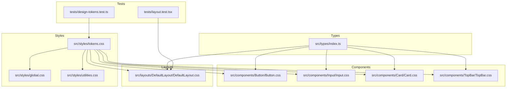
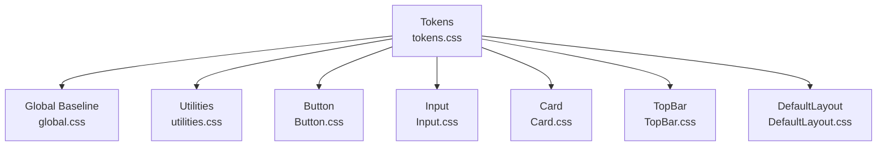
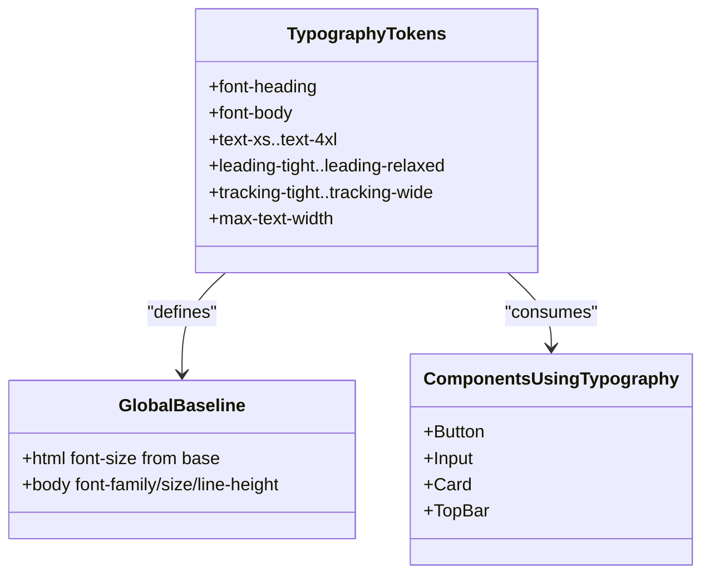
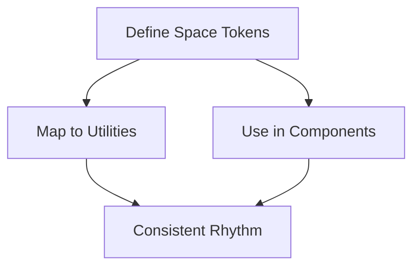
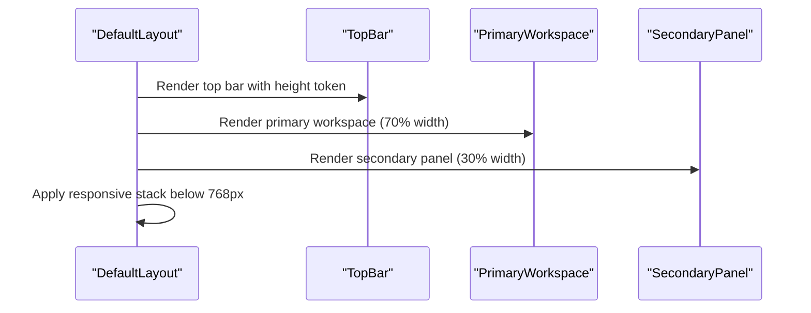
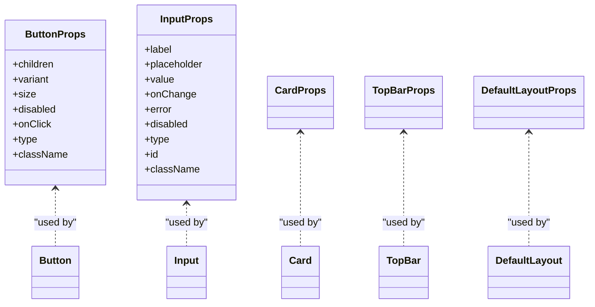
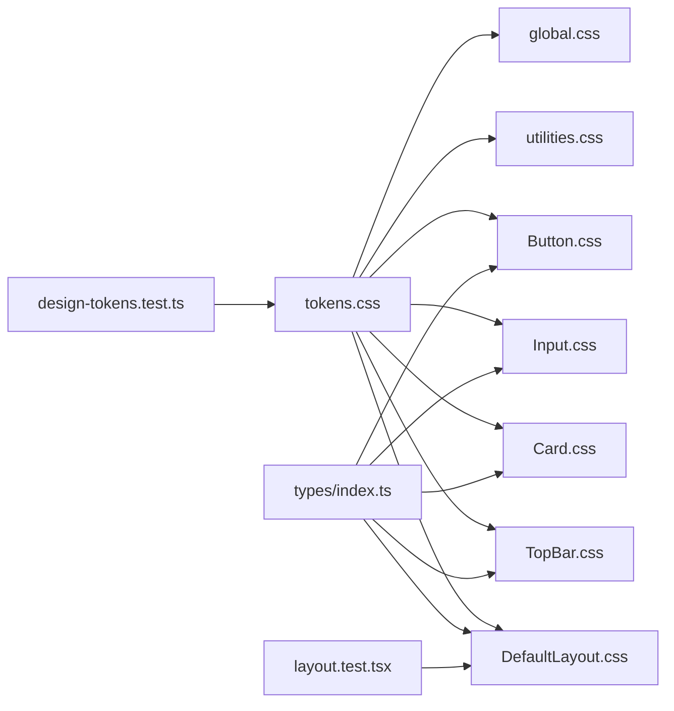
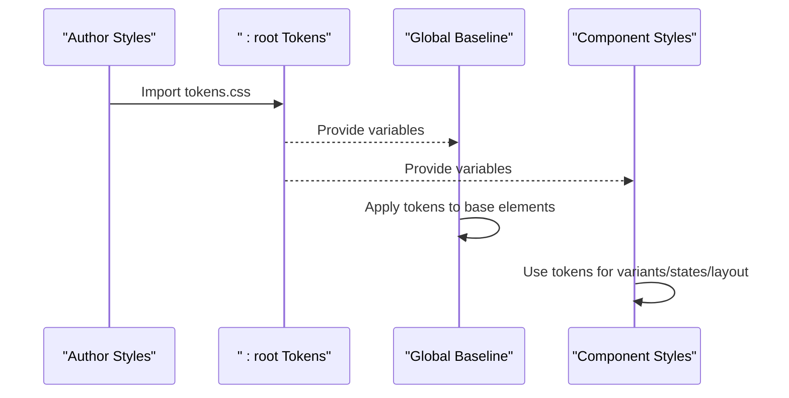

# Design System Foundation

<cite>
**Referenced Files in This Document**
- [tokens.css](file://src/styles/tokens.css)
- [global.css](file://src/styles/global.css)
- [utilities.css](file://src/styles/utilities.css)
- [index.ts](file://src/types/index.ts)
- [Button.css](file://src/components/Button/Button.css)
- [Button.tsx](file://src/components/Button/Button.tsx)
- [Input.css](file://src/components/Input/Input.css)
- [Card.css](file://src/components/Card/Card.css)
- [TopBar.css](file://src/components/TopBar/TopBar.css)
- [DefaultLayout.css](file://src/layouts/DefaultLayout/DefaultLayout.css)
- [design-tokens.test.ts](file://tests/design-tokens.test.ts)
- [layout.test.tsx](file://tests/layout.test.tsx)
</cite>

## Table of Contents
1. [Introduction](#introduction)
2. [Project Structure](#project-structure)
3. [Core Components](#core-components)
4. [Architecture Overview](#architecture-overview)
5. [Detailed Component Analysis](#detailed-component-analysis)
6. [Dependency Analysis](#dependency-analysis)
7. [Performance Considerations](#performance-considerations)
8. [Troubleshooting Guide](#troubleshooting-guide)
9. [Conclusion](#conclusion)
10. [Appendices](#appendices)

## Introduction
This document describes the design system foundation of the project, focusing on design tokens, color palettes, typography, spacing, and layout constraints. It explains how CSS custom properties are structured and cascaded through components, how semantic colors and accessibility are addressed, and how TypeScript interfaces enforce type safety across the system. It also documents the spacing and grid relationships used for consistent layout, and provides guidelines for maintaining token consistency and extending the system.

## Project Structure
The design system is organized around a central token definition, global baseline styles, utility classes, and typed component props. Components consume tokens via CSS custom properties and adhere to shared type definitions.

**Diagram sources**
- [tokens.css:1-108](file://src/styles/tokens.css#L1-L108)
- [global.css:1-157](file://src/styles/global.css#L1-L157)
- [utilities.css:1-162](file://src/styles/utilities.css#L1-L162)
- [Button.css:1-65](file://src/components/Button/Button.css#L1-L65)
- [Input.css:1-59](file://src/components/Input/Input.css#L1-L59)
- [Card.css:1-10](file://src/components/Card/Card.css#L1-L10)
- [TopBar.css:1-43](file://src/components/TopBar/TopBar.css#L1-L43)
- [DefaultLayout.css:1-27](file://src/layouts/DefaultLayout/DefaultLayout.css#L1-L27)
- [index.ts:1-100](file://src/types/index.ts#L1-L100)
- [design-tokens.test.ts:1-106](file://tests/design-tokens.test.ts#L1-L106)
- [layout.test.tsx:1-71](file://tests/layout.test.tsx#L1-L71)

**Section sources**
- [tokens.css:1-108](file://src/styles/tokens.css#L1-L108)
- [global.css:1-157](file://src/styles/global.css#L1-L157)
- [utilities.css:1-162](file://src/styles/utilities.css#L1-L162)
- [index.ts:1-100](file://src/types/index.ts#L1-L100)

## Core Components
- Design tokens: Centralized CSS custom properties defining color, spacing, typography, layout, borders/shadows, transitions, and z-index scale.
- Global baseline: Resets, base font sizing, and foundational typographic rules that cascade from tokens.
- Utilities: Combinatorial spacing and layout utilities that consistently map to tokens.
- Components: Buttons, inputs, cards, top bar, and layout containers that import tokens and apply them via custom properties.
- Types: Strict TypeScript interfaces for component props ensuring consistent usage and safe overrides.

Key token categories and their roles:
- Color system: Backgrounds, text, accents, semantic colors, borders, and focus states.
- Spacing: A discrete set of increments mapped to consistent scale variables.
- Typography: Families, sizes, line heights, and letter spacing.
- Layout: Container widths, top bar height, and workspace proportions.
- Interactions: Transition durations and easing.
- Z-index: Ordered stacking contexts.

**Section sources**
- [tokens.css:8-107](file://src/styles/tokens.css#L8-L107)
- [global.css:18-31](file://src/styles/global.css#L18-L31)
- [utilities.css:11-132](file://src/styles/utilities.css#L11-L132)
- [index.ts:13-28](file://src/types/index.ts#L13-L28)

## Architecture Overview
The design system follows a unidirectional data flow of tokens into styles and components:
- Tokens define the canonical values.
- Global styles consume tokens for base elements.
- Component styles import tokens and apply them to variants and states.
- Utilities provide shorthand classes backed by tokens.
- TypeScript types constrain component APIs and prop combinations.

**Diagram sources**
- [tokens.css:1-108](file://src/styles/tokens.css#L1-L108)
- [global.css:1-157](file://src/styles/global.css#L1-L157)
- [utilities.css:1-162](file://src/styles/utilities.css#L1-L162)
- [Button.css:1-65](file://src/components/Button/Button.css#L1-L65)
- [Input.css:1-59](file://src/components/Input/Input.css#L1-L59)
- [Card.css:1-10](file://src/components/Card/Card.css#L1-L10)
- [TopBar.css:1-43](file://src/components/TopBar/TopBar.css#L1-L43)
- [DefaultLayout.css:1-27](file://src/layouts/DefaultLayout/DefaultLayout.css#L1-L27)

## Detailed Component Analysis

### Color System and Semantics
- Palette philosophy: Limited to four colors across the UI, emphasizing calmness and professionalism.
- Semantic meanings:
  - Accent: Deep red used sparingly for primary actions and interactive states.
  - Success: Muted green for confirmatory feedback.
  - Warning: Muted amber for cautionary states.
- Accessibility:
  - Strong contrast for primary text against backgrounds.
  - Focus outlines use accent-derived colors for keyboard navigation.
- Brand customization:
  - Replace accent and semantic hues while preserving token names to maintain component compatibility.

**Diagram sources**
- [tokens.css:14-33](file://src/styles/tokens.css#L14-L33)
- [Button.css:26-48](file://src/components/Button/Button.css#L26-L48)
- [Input.css:46-52](file://src/components/Input/Input.css#L46-L52)
- [StatusBadge.css:13-32](file://src/components/StatusBadge/StatusBadge.css#L13-L32)

**Section sources**
- [tokens.css:14-33](file://src/styles/tokens.css#L14-L33)
- [Button.css:26-48](file://src/components/Button/Button.css#L26-L48)
- [Input.css:46-52](file://src/components/Input/Input.css#L46-L52)
- [StatusBadge.css:13-32](file://src/components/StatusBadge/StatusBadge.css#L13-L32)

### Typography Scale and Usage
- Families: Serif headings and sans-serif body.
- Sizes: A defined scale from extra-small to extra-extra-large.
- Rhythm: Tight headings with generous body line heights and letter spacing adjustments.
- Global baseline: Sets base font family, size, and line height from tokens.
- Component usage: Components reference tokens for consistent sizing and rhythm.

**Diagram sources**
- [tokens.css:47-72](file://src/styles/tokens.css#L47-L72)
- [global.css:18-31](file://src/styles/global.css#L18-L31)
- [Button.css:7-12](file://src/components/Button/Button.css#L7-L12)
- [Input.css:16-25](file://src/components/Input/Input.css#L16-L25)
- [TopBar.css:22-28](file://src/components/TopBar/TopBar.css#L22-L28)

**Section sources**
- [tokens.css:47-72](file://src/styles/tokens.css#L47-L72)
- [global.css:18-31](file://src/styles/global.css#L18-L31)
- [Button.css:7-12](file://src/components/Button/Button.css#L7-L12)
- [Input.css:16-25](file://src/components/Input/Input.css#L16-L25)
- [TopBar.css:22-28](file://src/components/TopBar/TopBar.css#L22-L28)

### Spacing System and Grid Relationships
- Discrete increments: 8px, 16px, 24px, 40px, 64px mapped to named variables.
- Utilities: Full margin/padding and gap sets aligned to the spacing scale.
- Component padding and gaps: Consistently use spacing tokens for rhythm and alignment.
- Layout: Container max-width and responsive stacking for small screens.

**Diagram sources**
- [tokens.css:38-42](file://src/styles/tokens.css#L38-L42)
- [utilities.css:13-96](file://src/styles/utilities.css#L13-L96)
- [Card.css](file://src/components/Card/Card.css#L7)
- [Button.css:51-64](file://src/components/Button/Button.css#L51-L64)
- [DefaultLayout.css:22-26](file://src/layouts/DefaultLayout/DefaultLayout.css#L22-L26)

**Section sources**
- [tokens.css:38-42](file://src/styles/tokens.css#L38-L42)
- [utilities.css:13-96](file://src/styles/utilities.css#L13-L96)
- [Card.css](file://src/components/Card/Card.css#L7)
- [Button.css:51-64](file://src/components/Button/Button.css#L51-L64)
- [DefaultLayout.css:22-26](file://src/layouts/DefaultLayout/DefaultLayout.css#L22-L26)

### Layout Constraints and Proportions
- Top bar height and sticky behavior are token-driven.
- Workspace split: Primary workspace occupies 70%, secondary panel 30%.
- Responsive behavior stacks panels on small screens.

**Diagram sources**
- [TopBar.css:7-13](file://src/components/TopBar/TopBar.css#L7-L13)
- [DefaultLayout.css:15-26](file://src/layouts/DefaultLayout/DefaultLayout.css#L15-L26)
- [design-tokens.test.ts:96-104](file://tests/design-tokens.test.ts#L96-L104)

**Section sources**
- [TopBar.css:7-13](file://src/components/TopBar/TopBar.css#L7-L13)
- [DefaultLayout.css:15-26](file://src/layouts/DefaultLayout/DefaultLayout.css#L15-L26)
- [design-tokens.test.ts:96-104](file://tests/design-tokens.test.ts#L96-L104)

### Type Safety and Prop Contracts
- Strict enums and unions for variants and sizes.
- Component props interfaces define shape, optionality, and event handlers.
- Components import and apply these types to ensure consistent usage across the app.

**Diagram sources**
- [index.ts:20-40](file://src/types/index.ts#L20-L40)
- [Button.tsx:5-19](file://src/components/Button/Button.tsx#L5-L19)
- [Button.css:1-65](file://src/components/Button/Button.css#L1-L65)

**Section sources**
- [index.ts:13-28](file://src/types/index.ts#L13-L28)
- [Button.tsx:5-19](file://src/components/Button/Button.tsx#L5-L19)
- [Button.css:1-65](file://src/components/Button/Button.css#L1-L65)

## Dependency Analysis
The system exhibits low coupling and high cohesion:
- Tokens are the single source of truth and imported by all stylesheets.
- Components depend on tokens but not on each other, enabling reuse.
- Utilities depend on tokens for consistent spacing and layout.
- Tests validate token correctness and layout structure.

**Diagram sources**
- [tokens.css:1-108](file://src/styles/tokens.css#L1-L108)
- [global.css:1-157](file://src/styles/global.css#L1-L157)
- [utilities.css:1-162](file://src/styles/utilities.css#L1-L162)
- [Button.css:1-65](file://src/components/Button/Button.css#L1-L65)
- [Input.css:1-59](file://src/components/Input/Input.css#L1-L59)
- [Card.css:1-10](file://src/components/Card/Card.css#L1-L10)
- [TopBar.css:1-43](file://src/components/TopBar/TopBar.css#L1-L43)
- [DefaultLayout.css:1-27](file://src/layouts/DefaultLayout/DefaultLayout.css#L1-L27)
- [index.ts:1-100](file://src/types/index.ts#L1-L100)
- [design-tokens.test.ts:1-106](file://tests/design-tokens.test.ts#L1-L106)
- [layout.test.tsx:1-71](file://tests/layout.test.tsx#L1-L71)

**Section sources**
- [tokens.css:1-108](file://src/styles/tokens.css#L1-L108)
- [Button.css:1-65](file://src/components/Button/Button.css#L1-L65)
- [Input.css:1-59](file://src/components/Input/Input.css#L1-L59)
- [Card.css:1-10](file://src/components/Card/Card.css#L1-L10)
- [TopBar.css:1-43](file://src/components/TopBar/TopBar.css#L1-L43)
- [DefaultLayout.css:1-27](file://src/layouts/DefaultLayout/DefaultLayout.css#L1-L27)
- [index.ts:1-100](file://src/types/index.ts#L1-L100)
- [design-tokens.test.ts:1-106](file://tests/design-tokens.test.ts#L1-L106)
- [layout.test.tsx:1-71](file://tests/layout.test.tsx#L1-L71)

## Performance Considerations
- CSS custom properties enable runtime theme switching with minimal repaint cost.
- Limiting color and spacing scales reduces paint and layout churn.
- Prefer utility classes for rapid composition; avoid ad-hoc values to keep rendering predictable.
- Keep transition durations short and consistent to minimize motion overhead.

## Troubleshooting Guide
Common issues and resolutions:
- Unexpected colors or spacing:
  - Verify token values and imports in component stylesheets.
  - Confirm utilities are applied correctly and not overridden by ad-hoc values.
- Layout inconsistencies:
  - Check that layout proportions and responsive breakpoints match token-defined constraints.
  - Ensure components use token-backed utilities rather than hardcoded values.
- Type errors in components:
  - Align prop usage with the TypeScript interfaces.
  - Avoid passing non-enumerated values for variants or sizes.

Validation references:
- Token correctness and constraints are enforced by dedicated tests.
- Layout structure tests verify ordering and proportions.

**Section sources**
- [design-tokens.test.ts:13-105](file://tests/design-tokens.test.ts#L13-L105)
- [layout.test.tsx:8-49](file://tests/layout.test.tsx#L8-L49)

## Conclusion
The design system centers on a compact set of CSS custom properties that drive color, typography, spacing, layout, and interaction patterns. Components import tokens to remain consistent and composable, while TypeScript interfaces enforce type-safe contracts. Tests ensure adherence to design constraints. Extending the system involves updating tokens and propagating changes through stylesheets and components, maintaining a unified look and feel.

## Appendices

### How Tokens Cascade Through Components
- Tokens are defined once and imported by all stylesheets.
- Global baseline applies tokens to base elements.
- Components apply tokens to variants, states, and layout.
- Utilities provide shorthand classes backed by tokens.

**Diagram sources**
- [tokens.css:1-108](file://src/styles/tokens.css#L1-L108)
- [global.css:5-31](file://src/styles/global.css#L5-L31)
- [Button.css:1-14](file://src/components/Button/Button.css#L1-L14)

### Guidelines for Maintaining Token Consistency
- Define new values only in tokens.css; import in all consuming stylesheets.
- Avoid hardcoding values in components or utilities.
- Use semantic tokens (e.g., text-primary, accent) rather than hex literals.
- Keep spacing and color scales constrained to reduce variance.

### Guidelines for Extending the System
- Add new tokens under appropriate categories.
- Update global baseline and utilities if new shorthands are needed.
- Extend TypeScript interfaces to reflect new props or variants.
- Write or update tests to validate new tokens and behaviors.