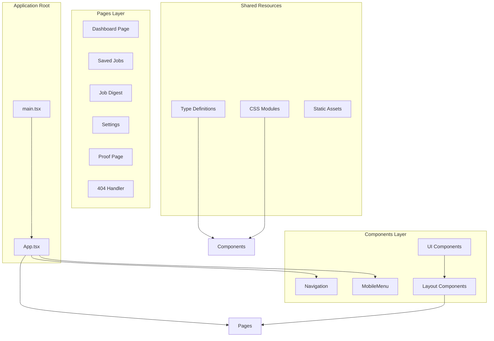
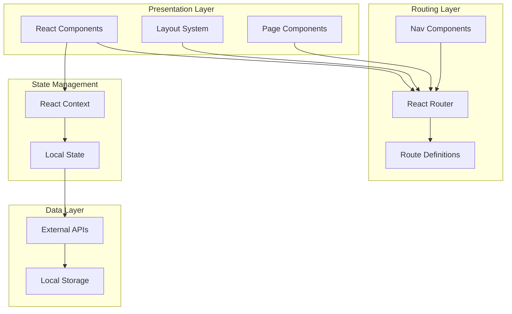
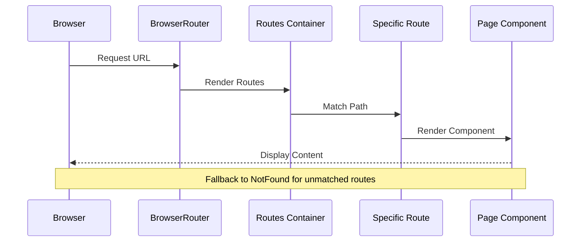
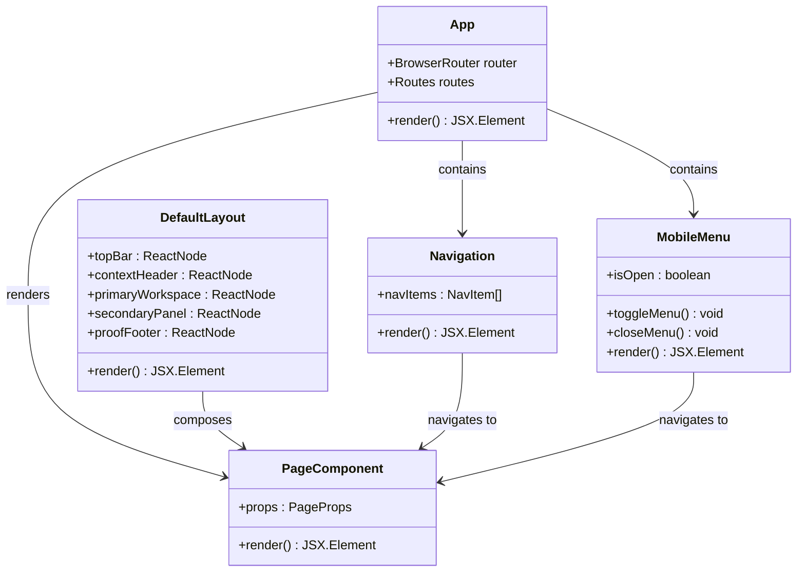
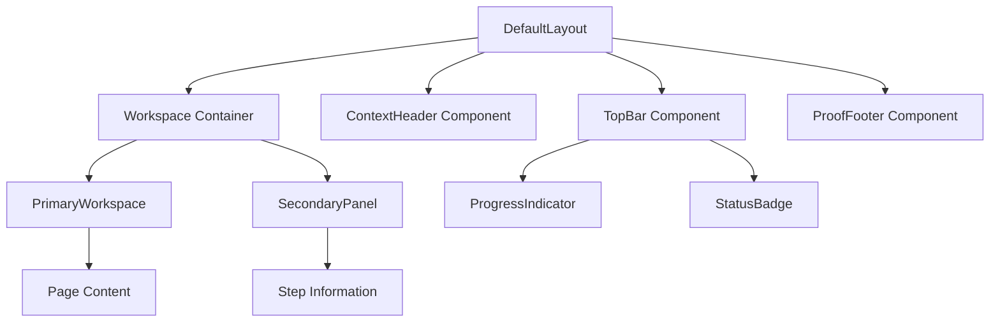
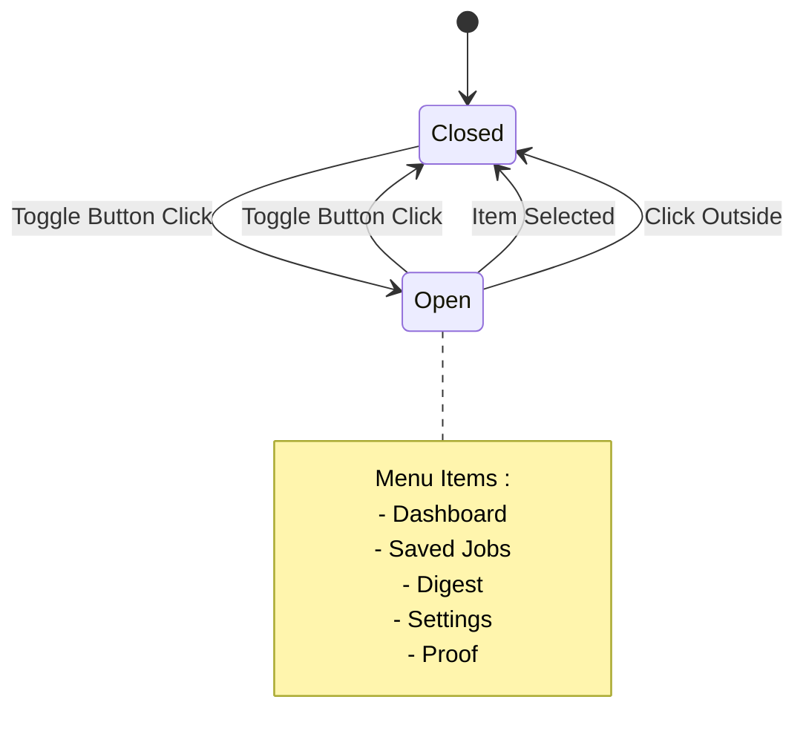

# Application Architecture & Routing

<cite>
**Referenced Files in This Document**
- [App.tsx](file://src/App.tsx)
- [main.tsx](file://src/main.tsx)
- [Navigation.tsx](file://src/components/Navigation/Navigation.tsx)
- [MobileMenu.tsx](file://src/components/MobileMenu/MobileMenu.tsx)
- [DefaultLayout.tsx](file://src/layouts/DefaultLayout/DefaultLayout.tsx)
- [Dashboard.tsx](file://src/pages/Dashboard.tsx)
- [NotFound.tsx](file://src/pages/NotFound.tsx)
- [index.ts (pages)](file://src/pages/index.ts)
- [index.ts (layouts)](file://src/layouts/index.ts)
- [index.ts (types)](file://src/types/index.ts)
- [TopBar.tsx](file://src/components/TopBar/TopBar.tsx)
- [ContextHeader.tsx](file://src/components/ContextHeader/ContextHeader.tsx)
- [PrimaryWorkspace.tsx](file://src/components/PrimaryWorkspace/PrimaryWorkspace.tsx)
- [SecondaryPanel.tsx](file://src/components/SecondaryPanel/SecondaryPanel.tsx)
- [package.json](file://package.json)
</cite>

## Table of Contents
1. [Introduction](#introduction)
2. [Project Structure](#project-structure)
3. [Core Components](#core-components)
4. [Architecture Overview](#architecture-overview)
5. [Routing System](#routing-system)
6. [Component Architecture](#component-architecture)
7. [Layout System](#layout-system)
8. [Navigation Components](#navigation-components)
9. [Page Components](#page-components)
10. [Type System](#type-system)
11. [Performance Considerations](#performance-considerations)
12. [Troubleshooting Guide](#troubleshooting-guide)
13. [Conclusion](#conclusion)

## Introduction

The Job Notification App is a modern React application built with TypeScript that follows a component-based architecture with a focus on design system principles. The application utilizes React Router for client-side navigation and implements a responsive layout system with mobile-first design considerations.

The application serves as a job notification platform with core features including dashboard functionality, saved job management, digest generation, settings configuration, and proof-of-concept demonstrations. The architecture emphasizes modularity, reusability, and maintainability through well-defined component boundaries and TypeScript type safety.

## Project Structure

The project follows a structured React application organization with clear separation of concerns:



**Diagram sources**
- [main.tsx:1-11](file://src/main.tsx#L1-L11)
- [App.tsx:1-45](file://src/App.tsx#L1-L45)

**Section sources**
- [main.tsx:1-11](file://src/main.tsx#L1-L11)
- [App.tsx:1-45](file://src/App.tsx#L1-L45)

## Core Components

The application's core architecture revolves around several fundamental components that work together to provide a cohesive user experience:

### Application Bootstrap

The application starts with a minimal bootstrap process that renders the root component within React's strict mode for development validation.

### Router Configuration

The routing system is configured using React Router's modern API with BrowserRouter as the routing provider. The router manages five main routes plus a catch-all for 404 handling.

### Header Components

The application header consists of three main components working in concert:
- Brand logo and navigation branding
- Desktop navigation menu
- Mobile-responsive navigation menu

**Section sources**
- [main.tsx:1-11](file://src/main.tsx#L1-L11)
- [App.tsx:7-21](file://src/App.tsx#L7-L21)
- [Navigation.tsx:12-34](file://src/components/Navigation/Navigation.tsx#L12-L34)
- [MobileMenu.tsx:13-66](file://src/components/MobileMenu/MobileMenu.tsx#L13-L66)

## Architecture Overview

The application follows a layered architecture pattern with clear separation between presentation, routing, and data management concerns:



**Diagram sources**
- [App.tsx:23-42](file://src/App.tsx#L23-L42)
- [Navigation.tsx:12-34](file://src/components/Navigation/Navigation.tsx#L12-L34)
- [MobileMenu.tsx:13-66](file://src/components/MobileMenu/MobileMenu.tsx#L13-L66)

The architecture emphasizes:
- **Component Composition**: Reusable UI components with well-defined props interfaces
- **Separation of Concerns**: Clear boundaries between routing, layout, and page components
- **Responsive Design**: Mobile-first approach with adaptive navigation patterns
- **Type Safety**: Comprehensive TypeScript integration for component props and state

## Routing System

The routing system is implemented using React Router v7 with a clean and maintainable configuration:



**Diagram sources**
- [App.tsx:25-41](file://src/App.tsx#L25-L41)
- [index.ts (pages):1-7](file://src/pages/index.ts#L1-L7)

### Route Configuration

The routing system defines seven distinct routes:

| Route Path | Component | Description | Behavior |
|------------|-----------|-------------|----------|
| `/` | Redirect | Home route | Redirects to `/dashboard` |
| `/dashboard` | Dashboard | Main application view | Primary content area |
| `/saved` | Saved | Saved jobs collection | Job management interface |
| `/digest` | Digest | Job digest generation | Content summarization |
| `/settings` | Settings | Application configuration | User preferences |
| `/proof` | Proof | Demonstration page | Example implementation |
| `*` | NotFound | 404 handler | Error boundary |

### Navigation Implementation

Both desktop and mobile navigation systems use the same route definitions through React Router's NavLink component, ensuring consistent navigation behavior across devices.

**Section sources**
- [App.tsx:29-37](file://src/App.tsx#L29-L37)
- [Navigation.tsx:4-10](file://src/components/Navigation/Navigation.tsx#L4-L10)
- [MobileMenu.tsx:5-11](file://src/components/MobileMenu/MobileMenu.tsx#L5-L11)

## Component Architecture

The application employs a sophisticated component architecture that promotes reusability and maintainability:



**Diagram sources**
- [App.tsx:23-42](file://src/App.tsx#L23-L42)
- [Navigation.tsx:12-34](file://src/components/Navigation/Navigation.tsx#L12-L34)
- [MobileMenu.tsx:13-66](file://src/components/MobileMenu/MobileMenu.tsx#L13-L66)
- [DefaultLayout.tsx:5-24](file://src/layouts/DefaultLayout/DefaultLayout.tsx#L5-L24)

### Component Composition Pattern

The application extensively uses composition over inheritance, allowing components to be combined in flexible ways while maintaining type safety through TypeScript interfaces.

### Props Interface Design

Each component defines a comprehensive props interface that specifies:
- Required vs optional properties
- Type constraints for each prop
- Default value handling
- ReactNode support for flexible content composition

**Section sources**
- [DefaultLayout.tsx:5-24](file://src/layouts/DefaultLayout/DefaultLayout.tsx#L5-L24)
- [index.ts (types):94-101](file://src/types/index.ts#L94-L101)

## Layout System

The layout system provides a flexible foundation for organizing page content with responsive design considerations:



**Diagram sources**
- [DefaultLayout.tsx:14-23](file://src/layouts/DefaultLayout/DefaultLayout.tsx#L14-L23)
- [TopBar.tsx:7-27](file://src/components/TopBar/TopBar.tsx#L7-L27)
- [ContextHeader.tsx:5-16](file://src/components/ContextHeader/ContextHeader.tsx#L5-L16)
- [PrimaryWorkspace.tsx:5-14](file://src/components/PrimaryWorkspace/PrimaryWorkspace.tsx#L5-L14)
- [SecondaryPanel.tsx:6-41](file://src/components/SecondaryPanel/SecondaryPanel.tsx#L6-L41)

### Layout Composition

The DefaultLayout component serves as a container that organizes the application's visual hierarchy:
- **Top Bar**: Application branding and progress indicators
- **Context Header**: Page-specific headline and subtext
- **Workspace Area**: Primary content with optional secondary panel
- **Proof Footer**: Completion status indicators

### Responsive Design Integration

The layout system accommodates different screen sizes through:
- Flexible grid-based workspace arrangement
- Conditional rendering of secondary panels
- Adaptive spacing and typography scaling

**Section sources**
- [DefaultLayout.tsx:14-23](file://src/layouts/DefaultLayout/DefaultLayout.tsx#L14-L23)
- [TopBar.tsx:14-26](file://src/components/TopBar/TopBar.tsx#L14-L26)
- [SecondaryPanel.tsx:18-40](file://src/components/SecondaryPanel/SecondaryPanel.tsx#L18-L40)

## Navigation Components

The navigation system provides both desktop and mobile experiences with consistent functionality:



**Diagram sources**
- [MobileMenu.tsx:14-22](file://src/components/MobileMenu/MobileMenu.tsx#L14-L22)
- [Navigation.tsx:4-10](file://src/components/Navigation/Navigation.tsx#L4-L10)

### Desktop Navigation

The desktop Navigation component provides:
- Clean list-based navigation
- Active state indication through CSS classes
- Consistent styling with the overall design system

### Mobile Navigation

The MobileMenu component implements:
- Hamburger menu icon with state-based animations
- Slide-down dropdown interface
- Automatic menu closure on item selection
- Accessible ARIA attributes for screen readers

### Navigation State Management

Both navigation components share the same route definitions and maintain synchronization through:
- Centralized route configuration
- Consistent path matching
- Active state detection via React Router

**Section sources**
- [Navigation.tsx:12-34](file://src/components/Navigation/Navigation.tsx#L12-L34)
- [MobileMenu.tsx:13-66](file://src/components/MobileMenu/MobileMenu.tsx#L13-L66)

## Page Components

The application includes six distinct page components, each serving specific functional purposes:

### Dashboard Page

The Dashboard serves as the primary application interface with:
- Empty state messaging for initial user experience
- Foundation for future job data integration
- Consistent styling with the application's design language

### Error Handling

The NotFound component provides:
- Professional 404 error presentation
- Clear user guidance for navigation recovery
- Consistent styling with placeholder page patterns

### Page Structure Pattern

All page components follow a consistent pattern:
- Self-contained component definition
- Local CSS module integration
- Export default for easy import
- Minimal prop requirements

**Section sources**
- [Dashboard.tsx:3-14](file://src/pages/Dashboard.tsx#L3-L14)
- [NotFound.tsx:3-14](file://src/pages/NotFound.tsx#L3-L14)

## Type System

The application implements a comprehensive TypeScript type system that ensures type safety across all components:

```mermaid
classDiagram
class StatusType {
<<enumeration>>
"not-started"
"in-progress"
"shipped"
}
class ButtonVariant {
<<enumeration>>
"primary"
"secondary"
}
class ButtonSize {
<<enumeration>>
"sm"
"md"
"lg"
}
class ButtonProps {
+children : ReactNode
+variant : ButtonVariant
+size : ButtonSize
+disabled : boolean
+onClick : Function
+type : "button"|"submit"|"reset"
+className : string
}
class InputProps {
+label : string
+placeholder : string
+value : string
+onChange : Function
+error : string
+disabled : boolean
+type : string
+id : string
+className : string
}
StatusType --> ButtonProps : used in
ButtonVariant --> ButtonProps : used in
ButtonSize --> ButtonProps : used in
```

**Diagram sources**
- [index.ts (types):10](file://src/types/index.ts#L10)
- [index.ts (types):15](file://src/types/index.ts#L15)
- [index.ts (types):16](file://src/types/index.ts#L16)
- [index.ts (types):22-30](file://src/types/index.ts#L22-L30)

### Type Categories

The type system organizes types into logical categories:

**Status Types**: Defines workflow states for job notifications
**Button Types**: Standardizes button variants and sizing options
**Component Props**: Provides comprehensive interfaces for all UI components
**Layout Props**: Specifies structure requirements for layout components

### Type Benefits

The comprehensive type system provides:
- Compile-time error detection
- Enhanced developer experience with IntelliSense
- Runtime type validation through React prop checking
- Improved code maintainability and refactoring safety

**Section sources**
- [index.ts (types):1-102](file://src/types/index.ts#L1-L102)

## Performance Considerations

The application architecture incorporates several performance optimization strategies:

### Lazy Loading Opportunities

The modular component structure naturally supports:
- Code splitting for route-based lazy loading
- Dynamic imports for heavy components
- Bundle optimization through tree shaking

### Rendering Optimizations

Performance-conscious design decisions include:
- Minimal re-renders through proper component composition
- Efficient state management with React hooks
- CSS-in-JS for scoped styling without global conflicts

### Bundle Size Management

The build configuration supports:
- Tree shaking for unused exports
- Modern JavaScript compilation for optimal bundle size
- Asset optimization through Vite's build pipeline

## Troubleshooting Guide

Common issues and their solutions:

### Routing Issues

**Problem**: Routes not displaying correctly
**Solution**: Verify route paths match between Navigation components and App routing configuration

**Problem**: 404 errors on navigation
**Solution**: Check that all route paths are properly defined and exported

### Component Issues

**Problem**: Type errors in component props
**Solution**: Ensure all required props are provided and match the defined TypeScript interfaces

**Problem**: Styling conflicts between components
**Solution**: Verify CSS module scoping and avoid global style overrides

### Build Issues

**Problem**: Development server not starting
**Solution**: Check Node.js version compatibility and install dependencies

**Problem**: Build failures with TypeScript errors
**Solution**: Run type checking separately and fix reported type violations

**Section sources**
- [package.json:1-27](file://package.json#L1-L27)

## Conclusion

The Job Notification App demonstrates a well-architected React application that effectively combines modern development practices with thoughtful design principles. The application's architecture provides a solid foundation for growth and maintenance while delivering a responsive, user-friendly experience.

Key architectural strengths include:
- **Modular Component Design**: Clear separation of concerns with reusable components
- **Type Safety**: Comprehensive TypeScript integration ensuring code reliability
- **Responsive Architecture**: Mobile-first design with adaptive navigation
- **Scalable Layout System**: Flexible layout components supporting various page compositions
- **Maintainable Routing**: Clean route configuration with consistent navigation patterns

The application serves as an excellent example of modern React development practices, providing a template for similar job notification or workflow management applications.