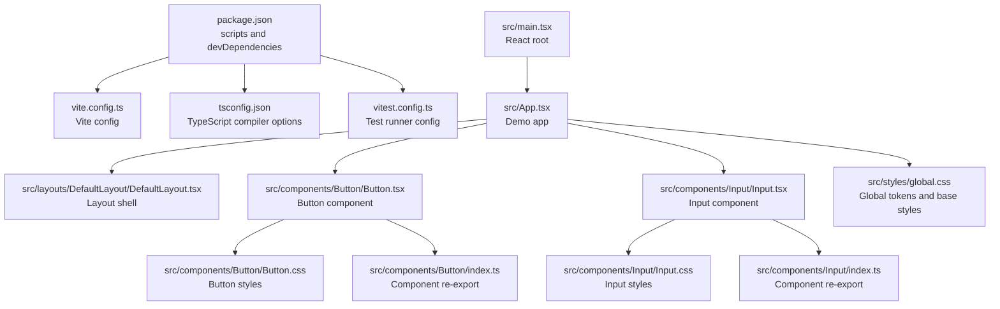
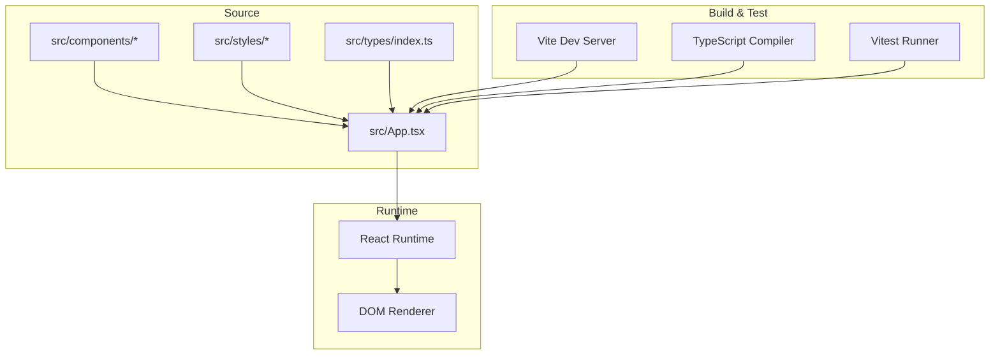
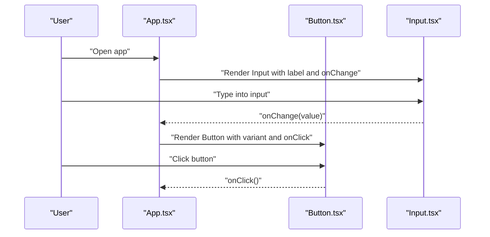
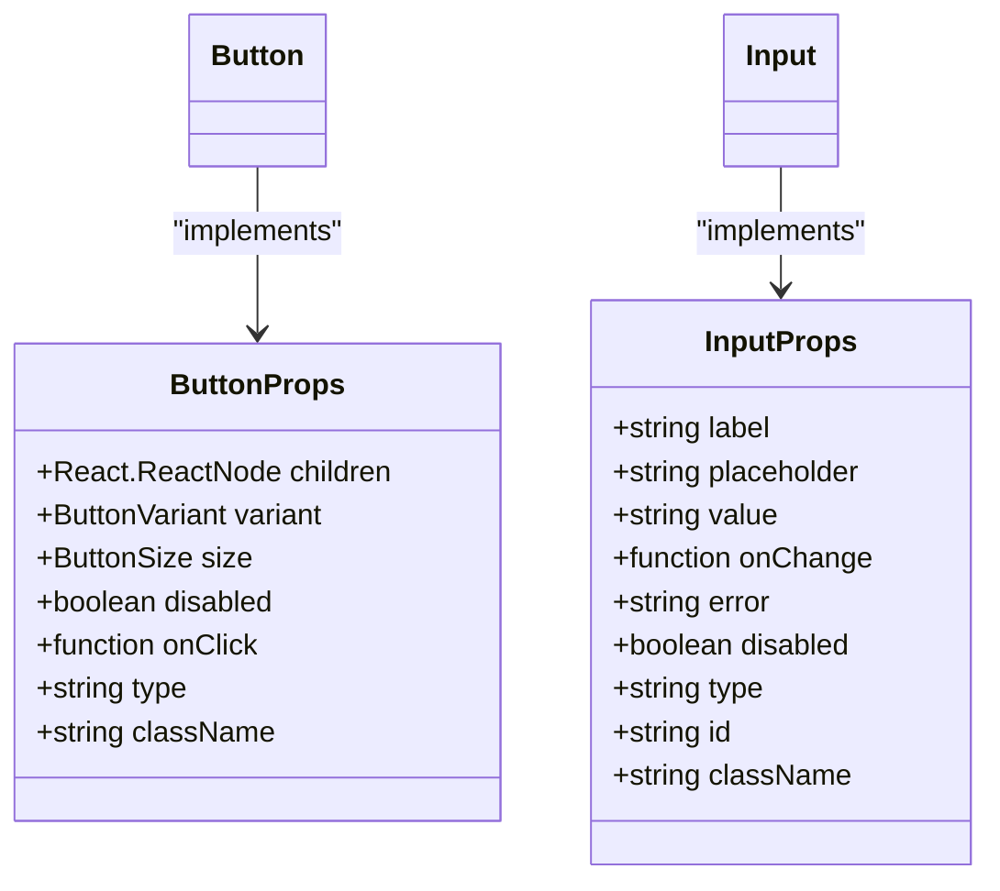

# Getting Started

<cite>
**Referenced Files in This Document**
- [package.json](file://package.json)
- [vite.config.ts](file://vite.config.ts)
- [tsconfig.json](file://tsconfig.json)
- [vitest.config.ts](file://vitest.config.ts)
- [src/main.tsx](file://src/main.tsx)
- [src/App.tsx](file://src/App.tsx)
- [src/types/index.ts](file://src/types/index.ts)
- [src/styles/global.css](file://src/styles/global.css)
- [src/components/Button/Button.tsx](file://src/components/Button/Button.tsx)
- [src/components/Button/Button.css](file://src/components/Button/Button.css)
- [src/components/Button/index.ts](file://src/components/Button/index.ts)
- [src/components/Input/Input.tsx](file://src/components/Input/Input.tsx)
- [src/components/Input/Input.css](file://src/components/Input/Input.css)
- [src/components/Input/index.ts](file://src/components/Input/index.ts)
- [src/layouts/DefaultLayout/DefaultLayout.tsx](file://src/layouts/DefaultLayout/DefaultLayout.tsx)
- [tests/setup.ts](file://tests/setup.ts)
</cite>

## Table of Contents
1. [Introduction](#introduction)
2. [Project Structure](#project-structure)
3. [Core Components](#core-components)
4. [Architecture Overview](#architecture-overview)
5. [Installation and Setup](#installation-and-setup)
6. [Quick Start Guide](#quick-start-guide)
7. [Build and Development Scripts](#build-and-development-scripts)
8. [Integration Into Existing Applications](#integration-into-existing-applications)
9. [Troubleshooting](#troubleshooting)
10. [Appendices](#appendices)

## Introduction
This guide helps you install, run, and integrate the design system into your React application. It covers environment prerequisites, installation via package managers, development workflow, component usage, and how to build and test the system.

## Project Structure
The design system is organized around reusable React components, shared styles, and TypeScript types. The Vite toolchain powers development and builds, while Vitest runs tests.

**Diagram sources**
- [package.json:1-22](file://package.json#L1-L22)
- [vite.config.ts:1-8](file://vite.config.ts#L1-L8)
- [tsconfig.json:1-27](file://tsconfig.json#L1-L27)
- [vitest.config.ts:1-10](file://vitest.config.ts#L1-L10)
- [src/main.tsx:1-11](file://src/main.tsx#L1-L11)
- [src/App.tsx:1-148](file://src/App.tsx#L1-L148)
- [src/layouts/DefaultLayout/DefaultLayout.tsx:1-27](file://src/layouts/DefaultLayout/DefaultLayout.tsx#L1-L27)
- [src/components/Button/Button.tsx:1-34](file://src/components/Button/Button.tsx#L1-L34)
- [src/components/Button/Button.css:1-65](file://src/components/Button/Button.css#L1-L65)
- [src/components/Button/index.ts:1-3](file://src/components/Button/index.ts#L1-L3)
- [src/components/Input/Input.tsx:1-50](file://src/components/Input/Input.tsx#L1-L50)
- [src/components/Input/Input.css:1-59](file://src/components/Input/Input.css#L1-L59)
- [src/components/Input/index.ts:1-3](file://src/components/Input/index.ts#L1-L3)
- [src/styles/global.css:1-157](file://src/styles/global.css#L1-L157)

**Section sources**
- [package.json:1-22](file://package.json#L1-L22)
- [vite.config.ts:1-8](file://vite.config.ts#L1-L8)
- [tsconfig.json:1-27](file://tsconfig.json#L1-L27)
- [vitest.config.ts:1-10](file://vitest.config.ts#L1-L10)
- [src/main.tsx:1-11](file://src/main.tsx#L1-L11)
- [src/App.tsx:1-148](file://src/App.tsx#L1-L148)
- [src/styles/global.css:1-157](file://src/styles/global.css#L1-L157)

## Core Components
This system provides foundational UI elements with consistent styling and behavior. The most commonly used components include Button and Input, along with supporting layout and typography.

Key capabilities:
- Button supports variants and sizes, with disabled and click handling.
- Input supports label, placeholder, value binding, error messaging, and accessibility attributes.
- DefaultLayout composes top bar, context header, primary workspace, secondary panel, and footer.

**Section sources**
- [src/components/Button/Button.tsx:1-34](file://src/components/Button/Button.tsx#L1-L34)
- [src/components/Input/Input.tsx:1-50](file://src/components/Input/Input.tsx#L1-L50)
- [src/layouts/DefaultLayout/DefaultLayout.tsx:1-27](file://src/layouts/DefaultLayout/DefaultLayout.tsx#L1-L27)
- [src/types/index.ts:13-40](file://src/types/index.ts#L13-L40)

## Architecture Overview
The design system is a Vite-powered React application with TypeScript and CSS Modules via CSS custom properties. Tests are executed with Vitest in a jsdom environment.

**Diagram sources**
- [src/App.tsx:1-148](file://src/App.tsx#L1-L148)
- [src/components/Button/Button.tsx:1-34](file://src/components/Button/Button.tsx#L1-L34)
- [src/components/Input/Input.tsx:1-50](file://src/components/Input/Input.tsx#L1-L50)
- [src/styles/global.css:1-157](file://src/styles/global.css#L1-L157)
- [src/types/index.ts:1-100](file://src/types/index.ts#L1-L100)
- [vite.config.ts:1-8](file://vite.config.ts#L1-L8)
- [tsconfig.json:1-27](file://tsconfig.json#L1-L27)
- [vitest.config.ts:1-10](file://vitest.config.ts#L1-L10)

## Installation and Setup
Prerequisites:
- Node.js matching the project’s TypeScript and Vite versions (as configured).
- A package manager: npm or yarn.

Steps:
1. Install dependencies
   - npm: Run the package manager install command in the project root.
   - yarn: Run the package manager install command in the project root.
2. Confirm TypeScript and Vite configurations are compatible with your Node.js version.

Notes:
- The project uses bundler module resolution and ES modules. Ensure your environment supports these settings.

**Section sources**
- [package.json:12-20](file://package.json#L12-L20)
- [tsconfig.json:10-16](file://tsconfig.json#L10-L16)

## Quick Start Guide
Follow these steps to import and use core components in your React application.

Step-by-step:
1. Import Button and Input in your component file.
2. Add the global styles to your app entry to ensure design tokens and base styles are applied.
3. Render Button and Input with props appropriate to your use case.
4. Optionally wrap content in DefaultLayout to match the system’s page structure.

Basic usage patterns:
- Button: Provide variant and size, handle clicks, and disable when needed.
- Input: Bind value and onChange, show optional labels and errors, and set input type.

Example references:
- Button component definition and props: [src/components/Button/Button.tsx:1-34](file://src/components/Button/Button.tsx#L1-L34), [src/types/index.ts:20-28](file://src/types/index.ts#L20-L28)
- Input component definition and props: [src/components/Input/Input.tsx:1-50](file://src/components/Input/Input.tsx#L1-L50), [src/types/index.ts:30-40](file://src/types/index.ts#L30-L40)
- Global styles import: [src/styles/global.css:1-6](file://src/styles/global.css#L1-L6)
- Layout composition: [src/layouts/DefaultLayout/DefaultLayout.tsx:1-27](file://src/layouts/DefaultLayout/DefaultLayout.tsx#L1-L27)

**Section sources**
- [src/components/Button/Button.tsx:1-34](file://src/components/Button/Button.tsx#L1-L34)
- [src/components/Input/Input.tsx:1-50](file://src/components/Input/Input.tsx#L1-L50)
- [src/styles/global.css:1-6](file://src/styles/global.css#L1-L6)
- [src/layouts/DefaultLayout/DefaultLayout.tsx:1-27](file://src/layouts/DefaultLayout/DefaultLayout.tsx#L1-L27)
- [src/types/index.ts:20-40](file://src/types/index.ts#L20-L40)

## Build and Development Scripts
Available scripts:
- dev: Starts the Vite development server.
- build: Runs TypeScript emit and builds the project with Vite.
- preview: Serves the production build locally.
- test: Runs Vitest tests.

How to use:
- Development: Execute the dev script to start the local server.
- Production build: Execute the build script to produce optimized assets.
- Preview: Execute the preview script to inspect the production build.
- Testing: Execute the test script to run unit tests.

Environment configuration:
- Vite plugin for React is enabled.
- TypeScript is configured for modern ECMAScript modules and strictness.
- Vitest runs in jsdom with a setup file for DOM testing utilities.

**Section sources**
- [package.json:6-11](file://package.json#L6-L11)
- [vite.config.ts:1-8](file://vite.config.ts#L1-L8)
- [tsconfig.json:1-27](file://tsconfig.json#L1-L27)
- [vitest.config.ts:1-10](file://vitest.config.ts#L1-L10)
- [tests/setup.ts:1-2](file://tests/setup.ts#L1-L2)

## Integration Into Existing Applications
To integrate the design system into an existing React app:

1. Copy or link the relevant parts:
   - Components: src/components/Button and src/components/Input (and their styles).
   - Types: src/types/index.ts.
   - Styles: src/styles/global.css and related tokens.
   - Layout: src/layouts/DefaultLayout if you want to reuse the page shell.

2. Add global styles:
   - Import the global CSS at the root of your application so design tokens and base styles are available.

3. Use components:
   - Import Button and Input from their respective directories.
   - Pass props as defined in the TypeScript interfaces.

4. Align build configuration:
   - Ensure your project uses a compatible TypeScript version and module resolution strategy.
   - If you use Vite, enable the React plugin similarly.

References:
- Component exports and entry points: [src/components/Button/index.ts:1-3](file://src/components/Button/index.ts#L1-L3), [src/components/Input/index.ts:1-3](file://src/components/Input/index.ts#L1-L3)
- Component props: [src/types/index.ts:20-40](file://src/types/index.ts#L20-L40)
- Global styles: [src/styles/global.css:1-157](file://src/styles/global.css#L1-L157)

**Section sources**
- [src/components/Button/index.ts:1-3](file://src/components/Button/index.ts#L1-L3)
- [src/components/Input/index.ts:1-3](file://src/components/Input/index.ts#L1-L3)
- [src/types/index.ts:20-40](file://src/types/index.ts#L20-L40)
- [src/styles/global.css:1-157](file://src/styles/global.css#L1-L157)

## Troubleshooting
Common setup issues and resolutions:

- TypeScript errors or missing types
  - Cause: Mismatched TypeScript version or module resolution settings.
  - Resolution: Align your TypeScript version with the project configuration and ensure bundler module resolution is enabled.

- Vite plugin not found
  - Cause: Missing or incorrect Vite plugin configuration.
  - Resolution: Enable the React plugin in your Vite config as shown in the project’s configuration.

- Tests fail in jsdom environment
  - Cause: Missing DOM testing utilities.
  - Resolution: Ensure your test setup includes DOM helpers similar to the project’s setup file.

- Styles not applying
  - Cause: Global styles not imported at the app root.
  - Resolution: Import the global CSS file at your application’s entry point.

**Section sources**
- [tsconfig.json:10-16](file://tsconfig.json#L10-L16)
- [vite.config.ts:1-8](file://vite.config.ts#L1-L8)
- [vitest.config.ts:1-10](file://vitest.config.ts#L1-L10)
- [tests/setup.ts:1-2](file://tests/setup.ts#L1-L2)
- [src/styles/global.css:1-6](file://src/styles/global.css#L1-L6)

## Appendices

### TypeScript and JavaScript Usage Notes
- TypeScript: Use the provided props interfaces to type Button and Input components.
- JavaScript: You can consume the same components without explicit typing; pass props as documented by the interfaces.

References:
- Button props: [src/types/index.ts:20-28](file://src/types/index.ts#L20-L28)
- Input props: [src/types/index.ts:30-40](file://src/types/index.ts#L30-L40)

### Example Workflows

#### Using Button and Input in a Demo

**Diagram sources**
- [src/App.tsx:14-148](file://src/App.tsx#L14-L148)
- [src/components/Button/Button.tsx:5-31](file://src/components/Button/Button.tsx#L5-L31)
- [src/components/Input/Input.tsx:5-47](file://src/components/Input/Input.tsx#L5-L47)

### Component APIs

**Diagram sources**
- [src/types/index.ts:20-40](file://src/types/index.ts#L20-L40)
- [src/components/Button/Button.tsx:5-13](file://src/components/Button/Button.tsx#L5-L13)
- [src/components/Input/Input.tsx:5-15](file://src/components/Input/Input.tsx#L5-L15)