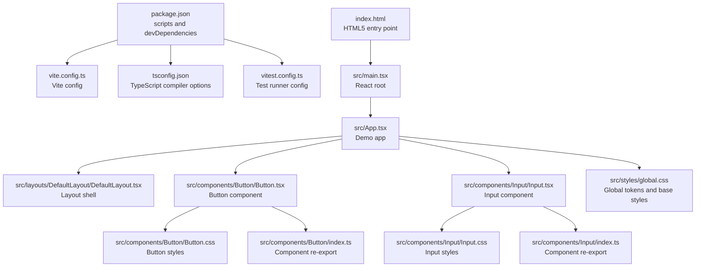
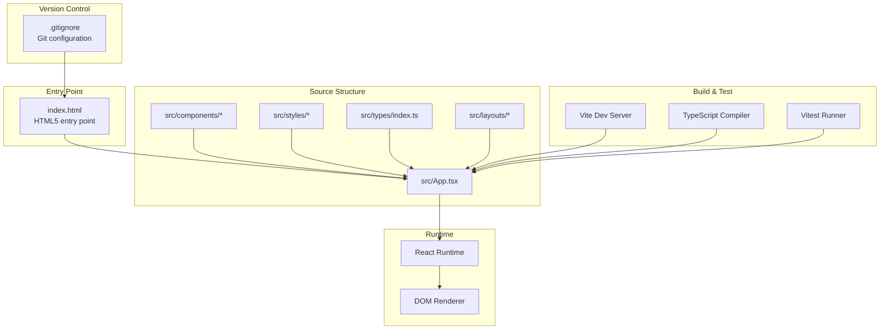
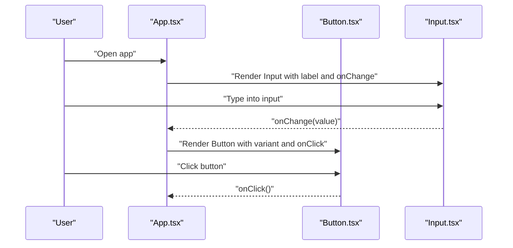
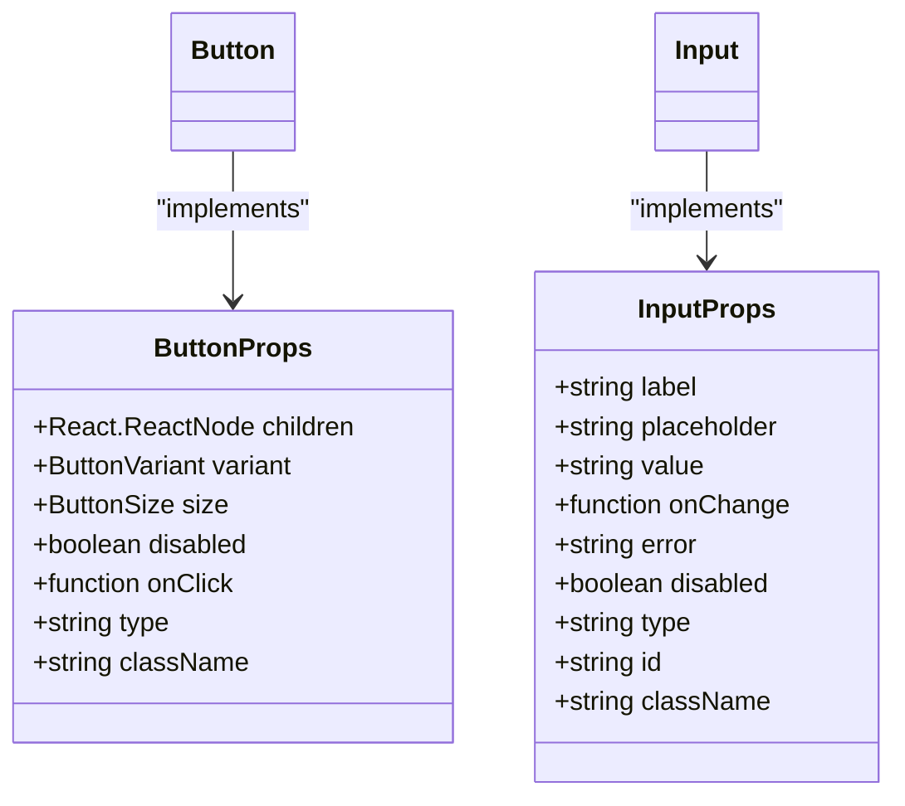

# Getting Started

<cite>
**Referenced Files in This Document**
- [.gitignore](file://.gitignore)
- [index.html](file://index.html)
- [package.json](file://package.json)
- [vite.config.ts](file://vite.config.ts)
- [tsconfig.json](file://tsconfig.json)
- [vitest.config.ts](file://vitest.config.ts)
- [src/main.tsx](file://src/main.tsx)
- [src/App.tsx](file://src/App.tsx)
- [src/index.css](file://src/index.css)
- [src/types/index.ts](file://src/types/index.ts)
- [src/styles/global.css](file://src/styles/global.css)
- [src/components/Button/Button.tsx](file://src/components/Button/Button.tsx)
- [src/components/Button/Button.css](file://src/components/Button/Button.css)
- [src/components/Button/index.ts](file://src/components/Button/index.ts)
- [src/components/Input/Input.tsx](file://src/components/Input/Input.tsx)
- [src/components/Input/Input.css](file://src/components/Input/Input.css)
- [src/components/Input/index.ts](file://src/components/Input/index.ts)
- [src/layouts/DefaultLayout/DefaultLayout.tsx](file://src/layouts/DefaultLayout/DefaultLayout.tsx)
- [tests/setup.ts](file://tests/setup.ts)
</cite>

## Update Summary
**Changes Made**
- Updated TypeScript JSX compilation support with @types/react dependency
- Modernized React import patterns and component typing
- Enhanced TypeScript configuration with react-jsx JSX setting
- Improved development environment setup with proper TypeScript and React integration

## Table of Contents
1. [Introduction](#introduction)
2. [Version Control and Repository Setup](#version-control-and-repository-setup)
3. [Project Structure](#project-structure)
4. [Core Components](#core-components)
5. [Architecture Overview](#architecture-overview)
6. [Installation and Setup](#installation-and-setup)
7. [Quick Start Guide](#quick-start-guide)
8. [Build and Development Scripts](#build-and-development-scripts)
9. [Integration Into Existing Applications](#integration-into-existing-applications)
10. [Troubleshooting](#troubleshooting)
11. [Appendices](#appendices)

## Introduction
This guide helps you install, run, and integrate the design system into your React application. The design system is built with modern web technologies including Git version control, Vite for development and build, TypeScript for type safety, and Vitest for testing. It provides reusable React components with consistent styling and behavior, featuring modern TypeScript JSX compilation support and contemporary React import patterns.

## Version Control and Repository Setup
The design system uses Git for version control and follows industry-standard practices for repository management. The repository includes proper configuration files for Git and a standard HTML5 entry point.

**Git Infrastructure Features:**
- `.gitignore` configured to exclude logs, node_modules, and IDE-specific files
- Standard HTML5 entry point (`index.html`) as the application's main entry point
- Proper package management with npm/yarn/pnpm support
- Modern development workflow with Vite and TypeScript

**Repository Structure Benefits:**
- Clean separation of concerns with dedicated directories for source code, tests, and assets
- Scalable architecture supporting component-based development
- Comprehensive testing infrastructure with Vitest
- Type-safe development with TypeScript and modern JSX compilation

**Section sources**
- [.gitignore:1-25](file://.gitignore#L1-L25)
- [index.html:1-14](file://index.html#L1-L14)

## Project Structure
The design system is organized around reusable React components, shared styles, and TypeScript types. The Vite toolchain powers development and builds, while Vitest runs tests. The project follows a modular architecture with clear separation between components, layouts, and shared resources, utilizing modern TypeScript JSX compilation.



**Diagram sources**
- [package.json:1-23](file://package.json#L1-L23)
- [vite.config.ts:1-8](file://vite.config.ts#L1-L8)
- [tsconfig.json:1-28](file://tsconfig.json#L1-L28)
- [vitest.config.ts:1-10](file://vitest.config.ts#L1-L10)
- [index.html:1-14](file://index.html#L1-L14)
- [src/main.tsx:1-11](file://src/main.tsx#L1-L11)
- [src/App.tsx:1-148](file://src/App.tsx#L1-L148)
- [src/layouts/DefaultLayout/DefaultLayout.tsx:1-27](file://src/layouts/DefaultLayout/DefaultLayout.tsx#L1-L27)
- [src/components/Button/Button.tsx:1-34](file://src/components/Button/Button.tsx#L1-L34)
- [src/components/Button/Button.css:1-65](file://src/components/Button/Button.css#L1-L65)
- [src/components/Button/index.ts:1-3](file://src/components/Button/index.ts#L1-L3)
- [src/components/Input/Input.tsx:1-50](file://src/components/Input/Input.tsx#L1-L50)
- [src/components/Input/Input.css:1-59](file://src/components/Input/Input.css#L1-L59)
- [src/components/Input/index.ts:1-3](file://src/components/Input/index.ts#L1-L3)
- [src/styles/global.css:1-157](file://src/styles/global.css#L1-L157)

**Section sources**
- [package.json:1-23](file://package.json#L1-L23)
- [vite.config.ts:1-8](file://vite.config.ts#L1-L8)
- [tsconfig.json:1-28](file://tsconfig.json#L1-L28)
- [vitest.config.ts:1-10](file://vitest.config.ts#L1-L10)
- [index.html:1-14](file://index.html#L1-L14)
- [src/main.tsx:1-11](file://src/main.tsx#L1-L11)
- [src/App.tsx:1-148](file://src/App.tsx#L1-L148)
- [src/styles/global.css:1-157](file://src/styles/global.css#L1-L157)

## Core Components
This system provides foundational UI elements with consistent styling and behavior. The most commonly used components include Button and Input, along with supporting layout and typography components. All components are fully typed with modern TypeScript patterns and use contemporary React import conventions.

Key capabilities:
- **Button**: Supports variants (primary/secondary), sizes (sm/md/lg), disabled states, and click handling with proper TypeScript interfaces
- **Input**: Supports label, placeholder, value binding, error messaging, accessibility attributes, and various input types with comprehensive type safety
- **DefaultLayout**: Composes top bar, context header, primary workspace, secondary panel, and footer for complete page structure
- **Type Safety**: Full TypeScript support with comprehensive prop interfaces using React.FC and proper type annotations
- **Modern React Patterns**: Components use modern React import patterns with explicit React imports and type annotations

**Section sources**
- [src/components/Button/Button.tsx:1-34](file://src/components/Button/Button.tsx#L1-L34)
- [src/components/Input/Input.tsx:1-50](file://src/components/Input/Input.tsx#L1-L50)
- [src/layouts/DefaultLayout/DefaultLayout.tsx:1-27](file://src/layouts/DefaultLayout/DefaultLayout.tsx#L1-L27)
- [src/types/index.ts:13-40](file://src/types/index.ts#L13-L40)

## Architecture Overview
The design system is a Vite-powered React application with TypeScript and CSS Modules via CSS custom properties. Tests are executed with Vitest in a jsdom environment. The architecture emphasizes modularity, type safety, and developer experience with modern TypeScript JSX compilation and contemporary React patterns.



**Diagram sources**
- [.gitignore:1-25](file://.gitignore#L1-L25)
- [index.html:1-14](file://index.html#L1-L14)
- [src/App.tsx:1-148](file://src/App.tsx#L1-L148)
- [src/components/Button/Button.tsx:1-34](file://src/components/Button/Button.tsx#L1-L34)
- [src/components/Input/Input.tsx:1-50](file://src/components/Input/Input.tsx#L1-L50)
- [src/styles/global.css:1-157](file://src/styles/global.css#L1-L157)
- [src/types/index.ts:1-102](file://src/types/index.ts#L1-L102)
- [vite.config.ts:1-8](file://vite.config.ts#L1-L8)
- [tsconfig.json:1-28](file://tsconfig.json#L1-L28)
- [vitest.config.ts:1-10](file://vitest.config.ts#L1-L10)

## Installation and Setup
Prerequisites:
- **Node.js**: Compatible with the project's TypeScript and Vite versions
- **Git**: Required for version control and repository management
- **Package Manager**: npm, yarn, or pnpm (all supported)
- **Git Client**: For repository operations and version control

Setup Steps:
1. **Clone the Repository**
   ```bash
   git clone <repository-url>
   cd design-system
   ```

2. **Install Dependencies**
   ```bash
   # Using npm
   npm install
   
   # Using yarn
   yarn install
   
   # Using pnpm
   pnpm install
   ```

3. **Verify Configuration**
   - Confirm TypeScript and Vite configurations are compatible with your Node.js version
   - Check that Git is properly initialized with `.gitignore` configured
   - Verify TypeScript JSX compilation is set to `react-jsx` for optimal React development

**Updated** Enhanced TypeScript configuration now includes modern JSX compilation settings and proper React type definitions

**Section sources**
- [package.json:12-20](file://package.json#L12-L20)
- [tsconfig.json:10-16](file://tsconfig.json#L10-L16)
- [.gitignore:1-25](file://.gitignore#L1-L25)

## Quick Start Guide
Follow these steps to import and use core components in your React application.

Step-by-step:
1. **Import Components**: Import Button and Input from their respective directories
2. **Add Global Styles**: Import global CSS at your app entry to ensure design tokens and base styles are applied
3. **Render Components**: Use Button and Input with appropriate props for your use case
4. **Optional Layout**: Wrap content in DefaultLayout to match the system's page structure

Basic usage patterns:
- **Button**: Provide variant and size, handle clicks, and disable when needed
- **Input**: Bind value and onChange, show optional labels and errors, and set input type

Example references:
- Button component definition and props: [src/components/Button/Button.tsx:1-34](file://src/components/Button/Button.tsx#L1-L34), [src/types/index.ts:20-28](file://src/types/index.ts#L20-L28)
- Input component definition and props: [src/components/Input/Input.tsx:1-50](file://src/components/Input/Input.tsx#L1-L50), [src/types/index.ts:30-40](file://src/types/index.ts#L30-L40)
- Global styles import: [src/styles/global.css:1-6](file://src/styles/global.css#L1-L6)
- Layout composition: [src/layouts/DefaultLayout/DefaultLayout.tsx:1-27](file://src/layouts/DefaultLayout/DefaultLayout.tsx#L1-L27)

**Updated** Components now use modern React import patterns with explicit React imports and TypeScript type annotations for better development experience

**Section sources**
- [src/components/Button/Button.tsx:1-34](file://src/components/Button/Button.tsx#L1-L34)
- [src/components/Input/Input.tsx:1-50](file://src/components/Input/Input.tsx#L1-L50)
- [src/styles/global.css:1-6](file://src/styles/global.css#L1-L6)
- [src/layouts/DefaultLayout/DefaultLayout.tsx:1-27](file://src/layouts/DefaultLayout/DefaultLayout.tsx#L1-L27)
- [src/types/index.ts:20-40](file://src/types/index.ts#L20-L40)

## Build and Development Scripts
Available scripts:
- **dev**: Starts the Vite development server with hot reloading
- **build**: Runs TypeScript emit and builds the project with Vite
- **preview**: Serves the production build locally for testing
- **test**: Runs Vitest tests in watch mode

How to use:
- **Development**: Execute `npm run dev` to start the local development server
- **Production build**: Execute `npm run build` to produce optimized assets
- **Preview**: Execute `npm run preview` to inspect the production build
- **Testing**: Execute `npm run test` to run unit tests with Vitest

Environment configuration:
- **Vite**: React plugin enabled for JSX transformation
- **TypeScript**: Configured for modern ECMAScript modules and strict type checking with react-jsx JSX compilation
- **Vitest**: Runs in jsdom environment with DOM testing utilities

**Updated** TypeScript configuration now uses `react-jsx` JSX factory for optimal React development experience with better performance and type inference

**Section sources**
- [package.json:6-11](file://package.json#L6-L11)
- [vite.config.ts:1-8](file://vite.config.ts#L1-L8)
- [tsconfig.json:1-28](file://tsconfig.json#L1-L28)
- [vitest.config.ts:1-10](file://vitest.config.ts#L1-L10)
- [tests/setup.ts:1-2](file://tests/setup.ts#L1-L2)

## Integration Into Existing Applications
To integrate the design system into an existing React app:

1. **Copy Relevant Parts**:
   - **Components**: `src/components/Button` and `src/components/Input` (and their styles)
   - **Types**: `src/types/index.ts` for prop interfaces
   - **Styles**: `src/styles/global.css` and related token files
   - **Layout**: `src/layouts/DefaultLayout` if you want the complete page shell

2. **Add Global Styles**:
   ```javascript
   // At your application's entry point
   import './styles/global.css';
   ```

3. **Use Components**:
   ```javascript
   import { Button, Input } from './components/Button';
   // or
   import { Button, Input } from './components/Input';
   ```

4. **Align Build Configuration**:
   - Ensure your project uses compatible TypeScript version
   - Enable React plugin in Vite if using Vite
   - Configure module resolution for ES modules
   - Set TypeScript JSX to `react-jsx` for optimal React development

References:
- Component exports and entry points: [src/components/Button/index.ts:1-3](file://src/components/Button/index.ts#L1-L3), [src/components/Input/index.ts:1-3](file://src/components/Input/index.ts#L1-L3)
- Component props: [src/types/index.ts:20-40](file://src/types/index.ts#L20-L40)
- Global styles: [src/styles/global.css:1-157](file://src/styles/global.css#L1-L157)

**Updated** Added TypeScript JSX configuration requirement for optimal React development experience

**Section sources**
- [src/components/Button/index.ts:1-3](file://src/components/Button/index.ts#L1-L3)
- [src/components/Input/index.ts:1-3](file://src/components/Input/index.ts#L1-L3)
- [src/types/index.ts:20-40](file://src/types/index.ts#L20-L40)
- [src/styles/global.css:1-157](file://src/styles/global.css#L1-L157)

## Troubleshooting
Common setup issues and resolutions:

**Git and Repository Issues:**
- **Git not installed or configured**
  - Cause: Missing Git client
  - Resolution: Install Git and configure user.name and user.email
- **Repository cloning issues**
  - Cause: Network connectivity or authentication problems
  - Resolution: Check internet connection and Git credentials

**TypeScript and JSX Compilation Issues:**
- **TypeScript version mismatch**
  - Cause: Mismatched TypeScript version or module resolution settings
  - Resolution: Align your TypeScript version with project configuration
- **JSX compilation errors**
  - Cause: Incorrect JSX factory configuration
  - Resolution: Ensure TypeScript JSX is set to `react-jsx` in tsconfig.json
- **Missing React types**
  - Cause: Missing @types/react dependency
  - Resolution: Install @types/react dependency for proper TypeScript JSX compilation

**Vite Development Issues:**
- **Vite plugin not found**
  - Cause: Missing or incorrect Vite plugin configuration
  - Resolution: Enable the React plugin in Vite config
- **Port conflicts during development**
  - Cause: Port 5173 already in use
  - Resolution: Change Vite port in config or stop conflicting processes

**Testing Environment Problems:**
- **Tests fail in jsdom environment**
  - Cause: Missing DOM testing utilities
  - Resolution: Ensure test setup includes DOM helpers
- **CSS modules not loading**
  - Cause: Missing CSS preprocessing configuration
  - Resolution: Configure Vite for CSS modules or use standard CSS imports

**Styles and Assets:**
- **Styles not applying**
  - Cause: Global styles not imported at app root
  - Resolution: Import global CSS file at application entry point
- **HTML5 entry point issues**
  - Cause: Missing or misconfigured index.html
  - Resolution: Ensure index.html exists with proper root div and script tag

**Modern React Import Pattern Issues:**
- **React import errors**
  - Cause: Missing React import in components
  - Resolution: Ensure components import React explicitly for JSX compilation
- **Type annotation warnings**
  - Cause: Missing type annotations or React.FC usage
  - Resolution: Use proper TypeScript React patterns with explicit type annotations

**Section sources**
- [.gitignore:1-25](file://.gitignore#L1-L25)
- [tsconfig.json:10-16](file://tsconfig.json#L10-L16)
- [vite.config.ts:1-8](file://vite.config.ts#L1-L8)
- [vitest.config.ts:1-10](file://vitest.config.ts#L1-L10)
- [tests/setup.ts:1-2](file://tests/setup.ts#L1-L2)
- [src/styles/global.css:1-6](file://src/styles/global.css#L1-L6)
- [index.html:1-14](file://index.html#L1-L14)

## Appendices

### TypeScript and JavaScript Usage Notes
- **TypeScript**: Use the provided prop interfaces to type Button and Input components with modern React patterns
- **JavaScript**: You can consume the same components without explicit typing; pass props as documented by the interfaces
- **Modern JSX Compilation**: TypeScript uses `react-jsx` JSX factory for optimal React development experience
- **React Import Patterns**: Components use explicit React imports and React.FC type annotations for better type inference

References:
- Button props: [src/types/index.ts:20-28](file://src/types/index.ts#L20-L28)
- Input props: [src/types/index.ts:30-40](file://src/types/index.ts#L30-L40)

### Example Workflows

#### Using Button and Input in a Demo


**Diagram sources**
- [src/App.tsx:14-148](file://src/App.tsx#L14-L148)
- [src/components/Button/Button.tsx:5-31](file://src/components/Button/Button.tsx#L5-L31)
- [src/components/Input/Input.tsx:5-47](file://src/components/Input/Input.tsx#L5-L47)

### Component APIs



**Diagram sources**
- [src/types/index.ts:20-40](file://src/types/index.ts#L20-L40)
- [src/components/Button/Button.tsx:5-13](file://src/components/Button/Button.tsx#L5-L13)
- [src/components/Input/Input.tsx:5-15](file://src/components/Input/Input.tsx#L5-L15)

### Modern TypeScript Configuration
The design system uses modern TypeScript configuration optimized for React development:

- **JSX Factory**: `react-jsx` for optimal React JSX compilation
- **Module Resolution**: `bundler` for modern module resolution
- **Strict Mode**: Enabled for better type safety
- **React Types**: @types/react dependency for comprehensive React type definitions

**Section sources**
- [tsconfig.json:10-16](file://tsconfig.json#L10-L16)
- [package.json:15](file://package.json#L15)