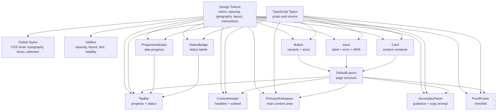
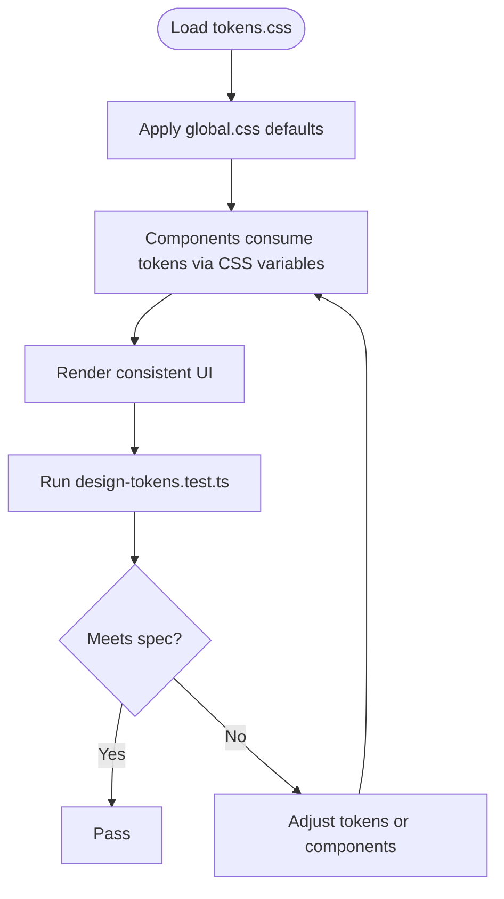
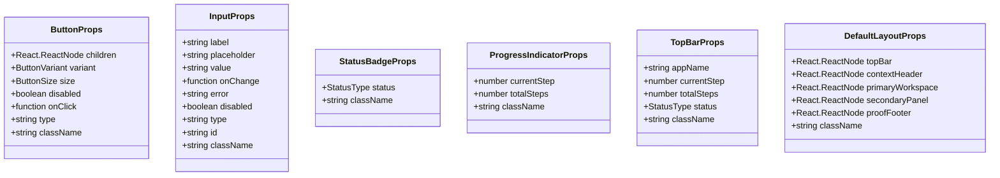
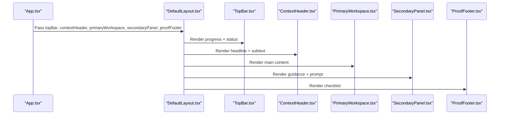
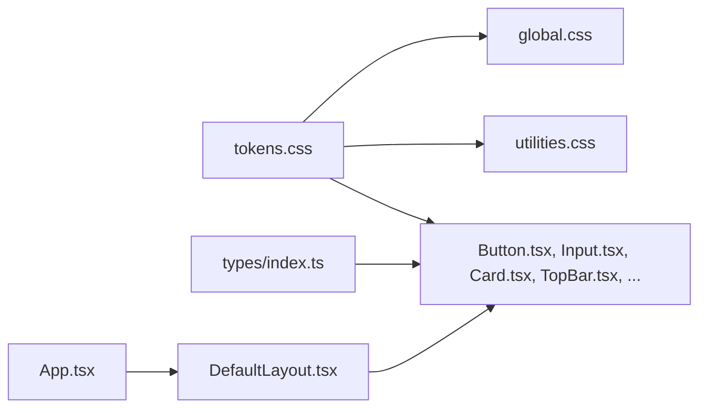

# Introduction & Design Principles

<cite>
**Referenced Files in This Document**
- [tokens.css](file://src/styles/tokens.css)
- [global.css](file://src/styles/global.css)
- [utilities.css](file://src/styles/utilities.css)
- [App.tsx](file://src/App.tsx)
- [DefaultLayout.tsx](file://src/layouts/DefaultLayout/DefaultLayout.tsx)
- [Button.tsx](file://src/components/Button/Button.tsx)
- [Input.tsx](file://src/components/Input/Input.tsx)
- [Card.tsx](file://src/components/Card/Card.tsx)
- [TopBar.tsx](file://src/components/TopBar/TopBar.tsx)
- [ContextHeader.tsx](file://src/components/ContextHeader/ContextHeader.tsx)
- [PrimaryWorkspace.tsx](file://src/components/PrimaryWorkspace/PrimaryWorkspace.tsx)
- [SecondaryPanel.tsx](file://src/components/SecondaryPanel/SecondaryPanel.tsx)
- [ProofFooter.tsx](file://src/components/ProofFooter/ProofFooter.tsx)
- [ProgressIndicator.tsx](file://src/components/ProgressIndicator/ProgressIndicator.tsx)
- [StatusBadge.tsx](file://src/components/StatusBadge/StatusBadge.tsx)
- [index.ts (types)](file://src/types/index.ts)
- [design-tokens.test.ts](file://tests/design-tokens.test.ts)
- [design-constraints.test.ts](file://tests/design-constraints.test.ts)
- [package.json](file://package.json)
</cite>

## Table of Contents
1. [Introduction](#introduction)
2. [Project Structure](#project-structure)
3. [Core Components](#core-components)
4. [Architecture Overview](#architecture-overview)
5. [Detailed Component Analysis](#detailed-component-analysis)
6. [Dependency Analysis](#dependency-analysis)
7. [Performance Considerations](#performance-considerations)
8. [Troubleshooting Guide](#troubleshooting-guide)
9. [Conclusion](#conclusion)

## Introduction
This project is a professional B2C design system built to deliver calm, intentional, and cohesive user interfaces. Its purpose is to provide a scalable foundation for creating thoughtful digital experiences that prioritize clarity, accessibility, and consistency across products and teams.

The design system is grounded in a clear philosophy:
- Calm: Avoids visual noise and overwhelming effects.
- Intentional: Every element serves a purpose and follows established constraints.
- Cohesive: Unified design language across components, layout, and interactions.

It targets frontend developers and product teams who need a reliable, test-verified design system that enforces consistency while remaining flexible and maintainable.

Why this design system exists
Unlike traditional component libraries that emphasize breadth of components and customization hooks, this system focuses on disciplined constraints and a tightly curated set of primitives. It ensures predictable outcomes by controlling color palettes, spacing, typography, motion, and layout. This approach reduces cognitive load, accelerates development, and improves accessibility and scalability.

How it differs from traditional component libraries
- Strict design constraints enforced via tests and tokens.
- Minimal color palette and typography scale.
- Thoughtful motion and interaction patterns.
- Layout primitives that encourage consistent page structures.
- Accessibility-first patterns baked into components and utilities.

## Project Structure
The design system is organized around three pillars:
- Design tokens: Centralized CSS variables defining color, spacing, typography, layout, and interaction scales.
- Component architecture: Reusable UI elements with controlled props and consistent styling.
- Layout system: A default page structure that composes top-level regions and enforces a primary/secondary split.

```mermaid
graph TB
subgraph "Styles"
T["tokens.css"]
G["global.css"]
U["utilities.css"]
end
subgraph "Types"
Types["types/index.ts"]
end
subgraph "Layouts"
DL["DefaultLayout.tsx"]
end
subgraph "Components"
Btn["Button.tsx"]
Inp["Input.tsx"]
Card["Card.tsx"]
TB["TopBar.tsx"]
CH["ContextHeader.tsx"]
PW["PrimaryWorkspace.tsx"]
SP["SecondaryPanel.tsx"]
PF["ProofFooter.tsx"]
PI["ProgressIndicator.tsx"]
SB["StatusBadge.tsx"]
end
App["App.tsx"]
App --> DL
DL --> TB
DL --> CH
DL --> PW
DL --> SP
DL --> PF
Btn --> Types
Inp --> Types
Card --> Types
TB --> Types
CH --> Types
PW --> Types
SP --> Types
PF --> Types
PI --> Types
SB --> Types
Btn --> T
Inp --> T
Card --> T
TB --> T
CH --> T
PW --> T
SP --> T
PF --> T
PI --> T
SB --> T
G --> T
U --> T
```

**Diagram sources**
- [tokens.css:1-108](file://src/styles/tokens.css#L1-L108)
- [global.css:1-157](file://src/styles/global.css#L1-L157)
- [utilities.css:1-162](file://src/styles/utilities.css#L1-L162)
- [App.tsx:1-148](file://src/App.tsx#L1-L148)
- [DefaultLayout.tsx:1-27](file://src/layouts/DefaultLayout/DefaultLayout.tsx#L1-L27)
- [Button.tsx:1-34](file://src/components/Button/Button.tsx#L1-L34)
- [Input.tsx:1-50](file://src/components/Input/Input.tsx#L1-L50)
- [Card.tsx:1-17](file://src/components/Card/Card.tsx#L1-L17)
- [TopBar.tsx:1-30](file://src/components/TopBar/TopBar.tsx#L1-L30)
- [ContextHeader.tsx:1-19](file://src/components/ContextHeader/ContextHeader.tsx#L1-L19)
- [PrimaryWorkspace.tsx:1-17](file://src/components/PrimaryWorkspace/PrimaryWorkspace.tsx#L1-L17)
- [SecondaryPanel.tsx:1-44](file://src/components/SecondaryPanel/SecondaryPanel.tsx#L1-L44)
- [ProofFooter.tsx](file://src/components/ProofFooter/ProofFooter.tsx)
- [ProgressIndicator.tsx:1-26](file://src/components/ProgressIndicator/ProgressIndicator.tsx#L1-L26)
- [StatusBadge.tsx:1-23](file://src/components/StatusBadge/StatusBadge.tsx#L1-L23)
- [index.ts (types):1-100](file://src/types/index.ts#L1-L100)

**Section sources**
- [tokens.css:1-108](file://src/styles/tokens.css#L1-L108)
- [global.css:1-157](file://src/styles/global.css#L1-L157)
- [utilities.css:1-162](file://src/styles/utilities.css#L1-L162)
- [App.tsx:1-148](file://src/App.tsx#L1-L148)
- [DefaultLayout.tsx:1-27](file://src/layouts/DefaultLayout/DefaultLayout.tsx#L1-L27)
- [index.ts (types):1-100](file://src/types/index.ts#L1-L100)

## Core Components
This section outlines the design system’s foundational elements and how they work together to enforce consistency and accessibility.

- Design tokens
  - Color system: A maximum of four main colors across the UI, with muted semantic colors and subtle accents.
  - Spacing system: A discrete set of spacing units to ensure rhythm and alignment.
  - Typography: Serif headings and sans-serif body with a base size optimized for readability.
  - Layout: Fixed heights and a primary/secondary workspace split.
  - Interactions: Consistent transitions and focus states.
  - Borders and shadows: Subtle borders and minimal elevation.

- Component architecture
  - Components expose a small, intentional set of props aligned with the design system’s constraints.
  - Components consume tokens via CSS variables for consistent rendering.
  - Accessibility is integrated by default (labels, ARIA attributes, focus styles).

- Layout system
  - A default page structure composed of top bar, context header, primary workspace, secondary panel, and footer.
  - Enforces a 70/30 split between primary workspace and secondary panel.

Practical examples
- Using tokens to build a button variant: The button component reads color and spacing tokens to render consistent primary and secondary variants.
- Building a form with accessible inputs: Inputs include labels, error messaging, and ARIA attributes to support assistive technologies.
- Composing a step-based workflow: The top bar integrates a progress indicator and status badge to communicate state clearly.

**Section sources**
- [tokens.css:8-107](file://src/styles/tokens.css#L8-L107)
- [global.css:18-127](file://src/styles/global.css#L18-L127)
- [utilities.css:11-162](file://src/styles/utilities.css#L11-L162)
- [Button.tsx:5-31](file://src/components/Button/Button.tsx#L5-L31)
- [Input.tsx:5-46](file://src/components/Input/Input.tsx#L5-L46)
- [TopBar.tsx:7-26](file://src/components/TopBar/TopBar.tsx#L7-L26)
- [DefaultLayout.tsx:5-24](file://src/layouts/DefaultLayout/DefaultLayout.tsx#L5-L24)

## Architecture Overview
The design system architecture connects tokens, components, and layout into a cohesive pipeline. Tokens define the visual language; components implement it; and the layout system orchestrates page regions.



**Diagram sources**
- [tokens.css:8-107](file://src/styles/tokens.css#L8-L107)
- [global.css:18-127](file://src/styles/global.css#L18-L127)
- [utilities.css:11-162](file://src/styles/utilities.css#L11-L162)
- [index.ts (types):8-99](file://src/types/index.ts#L8-L99)
- [DefaultLayout.tsx:5-24](file://src/layouts/DefaultLayout/DefaultLayout.tsx#L5-L24)
- [TopBar.tsx:7-26](file://src/components/TopBar/TopBar.tsx#L7-L26)
- [ProgressIndicator.tsx:5-23](file://src/components/ProgressIndicator/ProgressIndicator.tsx#L5-L23)
- [StatusBadge.tsx:11-19](file://src/components/StatusBadge/StatusBadge.tsx#L11-L19)
- [Button.tsx:5-31](file://src/components/Button/Button.tsx#L5-L31)
- [Input.tsx:5-46](file://src/components/Input/Input.tsx#L5-L46)
- [Card.tsx:5-13](file://src/components/Card/Card.tsx#L5-L13)

## Detailed Component Analysis

### Design Tokens and Utilities
- Purpose: Provide a single source of truth for visual properties.
- Implementation: CSS variables define colors, spacing, typography, layout, borders, shadows, transitions, and z-index scale.
- Usage: Components and utilities consume these variables to remain consistent.



**Diagram sources**
- [tokens.css:8-107](file://src/styles/tokens.css#L8-L107)
- [global.css:18-127](file://src/styles/global.css#L18-L127)
- [design-tokens.test.ts:13-105](file://tests/design-tokens.test.ts#L13-L105)

**Section sources**
- [tokens.css:8-107](file://src/styles/tokens.css#L8-L107)
- [global.css:18-127](file://src/styles/global.css#L18-L127)
- [utilities.css:11-162](file://src/styles/utilities.css#L11-L162)
- [design-tokens.test.ts:13-105](file://tests/design-tokens.test.ts#L13-L105)

### Component Props and Accessibility
- Purpose: Define a constrained, predictable API for components.
- Implementation: Strongly typed props specify variants, sizes, states, and accessibility attributes.
- Examples:
  - Button: variant, size, disabled, onClick, type, className.
  - Input: label, placeholder, value, onChange, error, disabled, type, id, className.
  - StatusBadge: status, className.
  - ProgressIndicator: currentStep, totalSteps, className.



**Diagram sources**
- [index.ts (types):20-99](file://src/types/index.ts#L20-L99)

**Section sources**
- [index.ts (types):8-99](file://src/types/index.ts#L8-L99)
- [Button.tsx:20-28](file://src/components/Button/Button.tsx#L20-L28)
- [Input.tsx:30-39](file://src/components/Input/Input.tsx#L30-L39)
- [StatusBadge.tsx:47-49](file://src/components/StatusBadge/StatusBadge.tsx#L47-L49)
- [ProgressIndicator.tsx:52-56](file://src/components/ProgressIndicator/ProgressIndicator.tsx#L52-L56)
- [TopBar.tsx:58-64](file://src/components/TopBar/TopBar.tsx#L58-L64)
- [DefaultLayout.tsx:92-99](file://src/layouts/DefaultLayout/DefaultLayout.tsx#L92-L99)

### Layout Composition
- Purpose: Establish a consistent page structure that guides user attention and content hierarchy.
- Implementation: DefaultLayout composes top bar, context header, primary workspace, secondary panel, and footer.
- Behavior: The primary workspace takes 70% width, and the secondary panel takes 30%.



**Diagram sources**
- [App.tsx:27-144](file://src/App.tsx#L27-L144)
- [DefaultLayout.tsx:5-24](file://src/layouts/DefaultLayout/DefaultLayout.tsx#L5-L24)
- [TopBar.tsx:7-26](file://src/components/TopBar/TopBar.tsx#L7-L26)
- [ContextHeader.tsx:5-15](file://src/components/ContextHeader/ContextHeader.tsx#L5-L15)
- [PrimaryWorkspace.tsx:5-13](file://src/components/PrimaryWorkspace/PrimaryWorkspace.tsx#L5-L13)
- [SecondaryPanel.tsx:6-40](file://src/components/SecondaryPanel/SecondaryPanel.tsx#L6-L40)
- [ProofFooter.tsx](file://src/components/ProofFooter/ProofFooter.tsx)

**Section sources**
- [App.tsx:27-144](file://src/App.tsx#L27-L144)
- [DefaultLayout.tsx:5-24](file://src/layouts/DefaultLayout/DefaultLayout.tsx#L5-L24)

### Practical Examples Demonstrating the Design System Approach
- Calm, intentional, and cohesive UI
  - Example: The showcase in the primary workspace demonstrates buttons, inputs, status controls, and step navigation using consistent tokens and layout.
- Accessibility-first patterns
  - Example: Inputs include labels, error messages, and ARIA attributes to support assistive technologies.
- Scalable component architecture
  - Example: Buttons and inputs accept variant and size props, enabling consistent scaling across screens and contexts.

**Section sources**
- [App.tsx:44-127](file://src/App.tsx#L44-L127)
- [Input.tsx:24-46](file://src/components/Input/Input.tsx#L24-L46)
- [Button.tsx:14-29](file://src/components/Button/Button.tsx#L14-L29)

## Dependency Analysis
The design system’s dependencies are intentionally minimal and explicit:
- Tokens drive global styles and utilities.
- Components depend on types and tokens.
- Layout composes components and coordinates page regions.



**Diagram sources**
- [tokens.css:8-107](file://src/styles/tokens.css#L8-L107)
- [global.css:18-127](file://src/styles/global.css#L18-L127)
- [utilities.css:11-162](file://src/styles/utilities.css#L11-L162)
- [index.ts (types):20-99](file://src/types/index.ts#L20-L99)
- [DefaultLayout.tsx:5-24](file://src/layouts/DefaultLayout/DefaultLayout.tsx#L5-L24)
- [App.tsx:27-144](file://src/App.tsx#L27-L144)

**Section sources**
- [tokens.css:8-107](file://src/styles/tokens.css#L8-L107)
- [global.css:18-127](file://src/styles/global.css#L18-L127)
- [utilities.css:11-162](file://src/styles/utilities.css#L11-L162)
- [index.ts (types):20-99](file://src/types/index.ts#L20-L99)
- [DefaultLayout.tsx:5-24](file://src/layouts/DefaultLayout/DefaultLayout.tsx#L5-L24)
- [App.tsx:27-144](file://src/App.tsx#L27-L144)

## Performance Considerations
- CSS variables minimize duplication and enable efficient updates.
- Discrete spacing and typography scales reduce layout thrashing.
- Minimal motion and subtle shadows keep rendering lightweight.
- Component composition avoids unnecessary re-renders by passing only required props.

## Troubleshooting Guide
Common issues and resolutions:
- Unexpected colors or spacing
  - Verify tokens and ensure components consume CSS variables.
  - Confirm global styles are imported and utilities are applied.
- Accessibility errors
  - Ensure inputs have labels and error roles; check ARIA attributes.
  - Validate focus states and keyboard navigation.
- Layout inconsistencies
  - Confirm the default layout is used and primary/secondary widths are respected.
  - Check that components are placed within the correct regions.

Validation via tests
- Design tokens verification tests ensure color, spacing, typography, transitions, and layout values meet specifications.
- Design constraints tests enforce philosophy rules such as no gradients, no glassmorphism, muted colors, and subtle borders.

**Section sources**
- [design-tokens.test.ts:13-105](file://tests/design-tokens.test.ts#L13-L105)
- [design-constraints.test.ts:15-172](file://tests/design-constraints.test.ts#L15-L172)

## Conclusion
This design system establishes a disciplined, scalable foundation for professional B2C products. By anchoring everything in carefully curated tokens, enforcing strict design constraints, and composing a clear layout system, it delivers calm, intentional, and cohesive user interfaces. Teams benefit from predictable components, accessibility-first patterns, and a shared vocabulary that grows with the product.