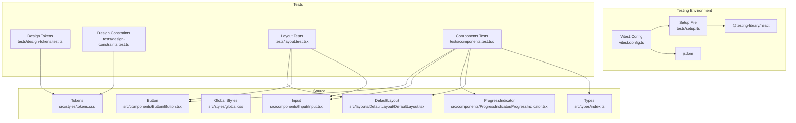
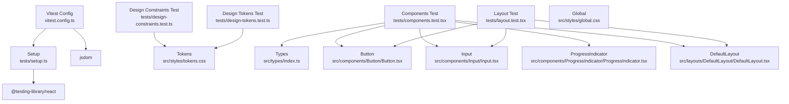
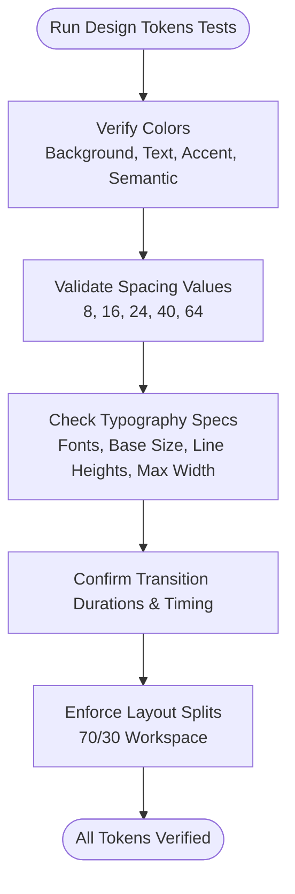
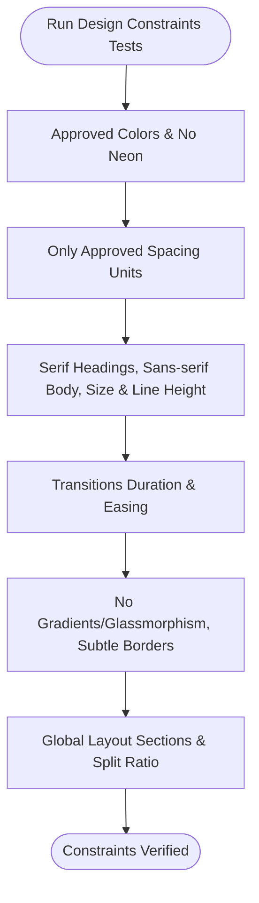
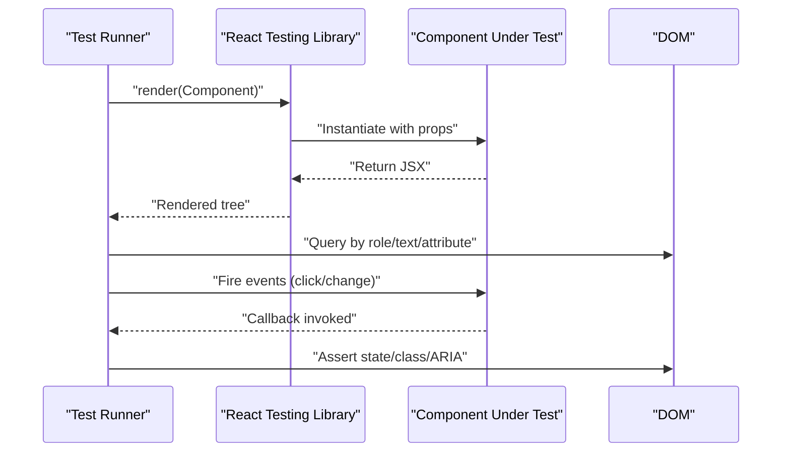
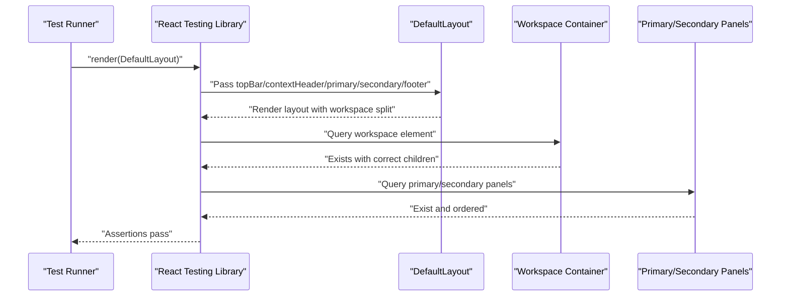
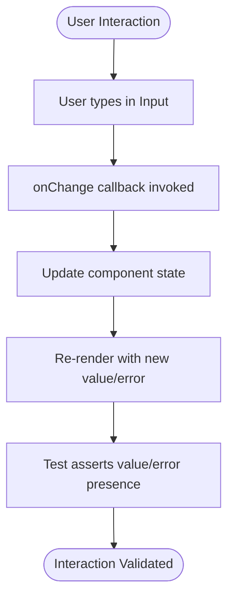
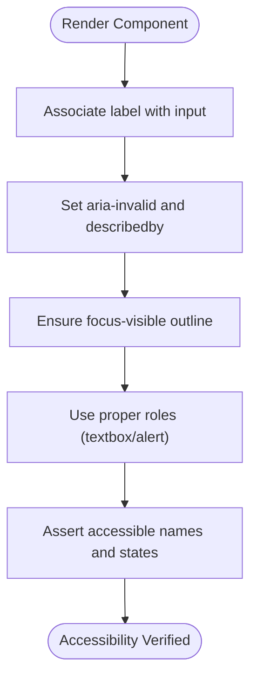
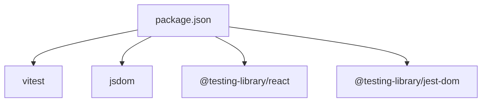

# Testing Strategy & Quality Assurance

<cite>
**Referenced Files in This Document**
- [vitest.config.ts](file://vitest.config.ts)
- [tests/setup.ts](file://tests/setup.ts)
- [package.json](file://package.json)
- [vite.config.ts](file://vite.config.ts)
- [tests/design-tokens.test.ts](file://tests/design-tokens.test.ts)
- [tests/design-constraints.test.ts](file://tests/design-constraints.test.ts)
- [tests/layout.test.tsx](file://tests/layout.test.tsx)
- [tests/components.test.tsx](file://tests/components.test.tsx)
- [src/styles/tokens.css](file://src/styles/tokens.css)
- [src/styles/global.css](file://src/styles/global.css)
- [src/types/index.ts](file://src/types/index.ts)
- [src/components/Button/Button.tsx](file://src/components/Button/Button.tsx)
- [src/components/Input/Input.tsx](file://src/components/Input/Input.tsx)
- [src/components/ProgressIndicator/ProgressIndicator.tsx](file://src/components/ProgressIndicator/ProgressIndicator.tsx)
- [src/layouts/DefaultLayout/DefaultLayout.tsx](file://src/layouts/DefaultLayout/DefaultLayout.tsx)
</cite>

## Table of Contents
1. [Introduction](#introduction)
2. [Project Structure](#project-structure)
3. [Core Components](#core-components)
4. [Architecture Overview](#architecture-overview)
5. [Detailed Component Analysis](#detailed-component-analysis)
6. [Dependency Analysis](#dependency-analysis)
7. [Performance Considerations](#performance-considerations)
8. [Troubleshooting Guide](#troubleshooting-guide)
9. [Conclusion](#conclusion)
10. [Appendices](#appendices)

## Introduction
This document defines a comprehensive testing strategy for the design system, focusing on quality assurance using Vitest and React Testing Library. It covers design token verification, component testing (unit, integration, accessibility), layout and responsive behavior validation, form component testing, state management and user interaction patterns, and snapshot testing for visual regression prevention. It also provides best practices for writing effective tests, maintaining coverage, and debugging failures.

## Project Structure
The testing setup leverages Vitest with jsdom as the DOM environment and React Testing Library for rendering and querying. The configuration loads a setup file that extends Jest DOM matchers for accessibility and DOM assertions.

**Diagram sources**
- [vitest.config.ts:1-10](file://vitest.config.ts#L1-L10)
- [tests/setup.ts:1-2](file://tests/setup.ts#L1-L2)
- [tests/design-tokens.test.ts:1-106](file://tests/design-tokens.test.ts#L1-L106)
- [tests/design-constraints.test.ts:1-173](file://tests/design-constraints.test.ts#L1-L173)
- [tests/layout.test.tsx:1-71](file://tests/layout.test.tsx#L1-L71)
- [tests/components.test.tsx:1-214](file://tests/components.test.tsx#L1-L214)
- [src/styles/tokens.css:1-108](file://src/styles/tokens.css#L1-L108)
- [src/styles/global.css:1-157](file://src/styles/global.css#L1-L157)
- [src/types/index.ts:1-100](file://src/types/index.ts#L1-L100)
- [src/components/Button/Button.tsx:1-34](file://src/components/Button/Button.tsx#L1-L34)
- [src/components/Input/Input.tsx:1-50](file://src/components/Input/Input.tsx#L1-L50)
- [src/components/ProgressIndicator/ProgressIndicator.tsx:1-26](file://src/components/ProgressIndicator/ProgressIndicator.tsx#L1-L26)
- [src/layouts/DefaultLayout/DefaultLayout.tsx:1-27](file://src/layouts/DefaultLayout/DefaultLayout.tsx#L1-L27)

**Section sources**
- [vitest.config.ts:1-10](file://vitest.config.ts#L1-L10)
- [tests/setup.ts:1-2](file://tests/setup.ts#L1-L2)
- [package.json:1-22](file://package.json#L1-L22)
- [vite.config.ts:1-8](file://vite.config.ts#L1-L8)

## Core Components
This section outlines the testing framework and foundational tests that ensure design system consistency.

- Testing Framework
  - Vitest configured with jsdom environment and global setup file.
  - React Testing Library used for rendering and querying components.
  - Jest DOM matchers extended via setup file for accessibility checks.

- Design Token Verification
  - Color system verification against approved palette and semantic usage.
  - Spacing system validation to enforce only approved units.
  - Typography constraints for fonts, sizes, line heights, and max widths.
  - Transition durations and easing functions.
  - Layout constraints for workspace splits and global sections.

- Design Constraints Verification
  - Enforces philosophy constraints: no gradients, no glassmorphism, no neon colors, minimal animation, subtle borders.
  - Validates typography families and sizes.
  - Ensures transitions adhere to timing and easing.
  - Confirms visual effects constraints and layout structure.

- Layout Testing
  - Verifies correct 70/30 workspace split and section ordering.
  - Ensures global layout structure compliance across header, workspace, and footer regions.

- Component Testing
  - Unit tests for props, variants, sizes, disabled states, and event handlers.
  - Integration tests validating composition of components within layouts.
  - Accessibility tests using roles, labels, and ARIA attributes.

**Section sources**
- [tests/design-tokens.test.ts:1-106](file://tests/design-tokens.test.ts#L1-L106)
- [tests/design-constraints.test.ts:1-173](file://tests/design-constraints.test.ts#L1-L173)
- [tests/layout.test.tsx:1-71](file://tests/layout.test.tsx#L1-L71)
- [tests/components.test.tsx:1-214](file://tests/components.test.tsx#L1-L214)
- [src/styles/tokens.css:1-108](file://src/styles/tokens.css#L1-L108)
- [src/styles/global.css:1-157](file://src/styles/global.css#L1-L157)

## Architecture Overview
The testing architecture centers on a single Vitest configuration that enables React Testing Library rendering and DOM assertions. Design token and constraint tests validate CSS custom properties and design philosophy adherence. Component and layout tests ensure correct rendering, behavior, and accessibility.

**Diagram sources**
- [vitest.config.ts:1-10](file://vitest.config.ts#L1-L10)
- [tests/setup.ts:1-2](file://tests/setup.ts#L1-L2)
- [tests/design-tokens.test.ts:1-106](file://tests/design-tokens.test.ts#L1-L106)
- [tests/design-constraints.test.ts:1-173](file://tests/design-constraints.test.ts#L1-L173)
- [tests/layout.test.tsx:1-71](file://tests/layout.test.tsx#L1-L71)
- [tests/components.test.tsx:1-214](file://tests/components.test.tsx#L1-L214)
- [src/styles/tokens.css:1-108](file://src/styles/tokens.css#L1-L108)
- [src/styles/global.css:1-157](file://src/styles/global.css#L1-L157)
- [src/types/index.ts:1-100](file://src/types/index.ts#L1-L100)
- [src/components/Button/Button.tsx:1-34](file://src/components/Button/Button.tsx#L1-L34)
- [src/components/Input/Input.tsx:1-50](file://src/components/Input/Input.tsx#L1-L50)
- [src/components/ProgressIndicator/ProgressIndicator.tsx:1-26](file://src/components/ProgressIndicator/ProgressIndicator.tsx#L1-L26)
- [src/layouts/DefaultLayout/DefaultLayout.tsx:1-27](file://src/layouts/DefaultLayout/DefaultLayout.tsx#L1-L27)

## Detailed Component Analysis

### Design Token Verification Tests
These tests ensure the design system’s CSS custom properties remain consistent with the documented specification.

**Diagram sources**
- [tests/design-tokens.test.ts:14-105](file://tests/design-tokens.test.ts#L14-L105)
- [src/styles/tokens.css:8-107](file://src/styles/tokens.css#L8-L107)

**Section sources**
- [tests/design-tokens.test.ts:1-106](file://tests/design-tokens.test.ts#L1-L106)
- [src/styles/tokens.css:1-108](file://src/styles/tokens.css#L1-L108)

### Design Constraints Verification Tests
These tests enforce the design philosophy and prevent deviations from approved patterns.

**Diagram sources**
- [tests/design-constraints.test.ts:15-151](file://tests/design-constraints.test.ts#L15-L151)
- [src/styles/tokens.css:8-107](file://src/styles/tokens.css#L8-L107)

**Section sources**
- [tests/design-constraints.test.ts:1-173](file://tests/design-constraints.test.ts#L1-L173)
- [src/styles/tokens.css:1-108](file://src/styles/tokens.css#L1-L108)

### Component Testing Approaches
Component tests validate rendering, behavior, and accessibility across the design system.

**Diagram sources**
- [tests/components.test.tsx:16-49](file://tests/components.test.tsx#L16-L49)
- [tests/components.test.tsx:51-73](file://tests/components.test.tsx#L51-L73)
- [tests/components.test.tsx:99-110](file://tests/components.test.tsx#L99-L110)

Key patterns demonstrated:
- Button: variant, size, disabled state, click handler.
- Input: label association, change handler, error messaging, disabled state.
- ProgressIndicator: computed width based on current/total steps.
- Layout: composition of sections and workspace split.

**Section sources**
- [tests/components.test.tsx:1-214](file://tests/components.test.tsx#L1-L214)
- [src/components/Button/Button.tsx:1-34](file://src/components/Button/Button.tsx#L1-L34)
- [src/components/Input/Input.tsx:1-50](file://src/components/Input/Input.tsx#L1-L50)
- [src/components/ProgressIndicator/ProgressIndicator.tsx:1-26](file://src/components/ProgressIndicator/ProgressIndicator.tsx#L1-L26)
- [src/layouts/DefaultLayout/DefaultLayout.tsx:1-27](file://src/layouts/DefaultLayout/DefaultLayout.tsx#L1-L27)
- [src/types/index.ts:1-100](file://src/types/index.ts#L1-L100)

### Layout Testing Strategies
Layout tests ensure the global structure and workspace split are maintained.

**Diagram sources**
- [tests/layout.test.tsx:8-48](file://tests/layout.test.tsx#L8-L48)
- [src/layouts/DefaultLayout/DefaultLayout.tsx:5-23](file://src/layouts/DefaultLayout/DefaultLayout.tsx#L5-L23)

**Section sources**
- [tests/layout.test.tsx:1-71](file://tests/layout.test.tsx#L1-L71)
- [src/layouts/DefaultLayout/DefaultLayout.tsx:1-27](file://src/layouts/DefaultLayout/DefaultLayout.tsx#L1-L27)

### Form Components, State Management, and User Interactions
Form components integrate controlled state, validation feedback, and accessibility attributes.

**Diagram sources**
- [tests/components.test.tsx:57-67](file://tests/components.test.tsx#L57-L67)
- [src/components/Input/Input.tsx:18-20](file://src/components/Input/Input.tsx#L18-L20)

**Section sources**
- [tests/components.test.tsx:51-73](file://tests/components.test.tsx#L51-L73)
- [src/components/Input/Input.tsx:1-50](file://src/components/Input/Input.tsx#L1-L50)

### Accessibility Testing Patterns
Accessibility is validated through roles, labels, ARIA attributes, and focus states.

**Diagram sources**
- [tests/components.test.tsx:64-67](file://tests/components.test.tsx#L64-L67)
- [src/components/Input/Input.tsx:37-43](file://src/components/Input/Input.tsx#L37-L43)
- [src/styles/global.css:124-127](file://src/styles/global.css#L124-L127)

**Section sources**
- [tests/components.test.tsx:51-73](file://tests/components.test.tsx#L51-L73)
- [src/components/Input/Input.tsx:1-50](file://src/components/Input/Input.tsx#L1-L50)
- [src/styles/global.css:1-157](file://src/styles/global.css#L1-L157)

### Snapshot Testing for Visual Regression Prevention
Snapshot tests capture rendered output to detect unintended visual changes. Configure snapshot serialization and update snapshots when design changes are intentional.

Recommended approach:
- Use a dedicated snapshot test suite alongside component tests.
- Keep snapshots small and focused (e.g., minimal layout renders).
- Update snapshots after approving design changes; treat failing snapshots as regressions.

[No sources needed since this section provides general guidance]

## Dependency Analysis
Testing dependencies and their roles:

**Diagram sources**
- [package.json:12-20](file://package.json#L12-L20)

**Section sources**
- [package.json:1-22](file://package.json#L1-L22)

## Performance Considerations
- Prefer lightweight queries (role/text) over deep selectors to reduce brittle tests.
- Use rerender judiciously for size/variant toggles to avoid unnecessary re-renders.
- Limit DOM assertions to essential properties; rely on component APIs for behavior.
- Keep snapshot tests minimal to reduce maintenance overhead.

[No sources needed since this section provides general guidance]

## Troubleshooting Guide
Common issues and resolutions:
- Missing setup file: Ensure the setup file is loaded by Vitest config to enable DOM matchers.
- jsdom environment: Confirm jsdom is set as the test environment for DOM APIs.
- Accessible names: Use labels and roles to ensure screen reader-friendly tests.
- Event simulation: Use React Testing Library’s fireEvent helpers for realistic interactions.
- Debugging: Log container HTML during tests to inspect rendered structure.

**Section sources**
- [vitest.config.ts:4-8](file://vitest.config.ts#L4-L8)
- [tests/setup.ts:1-2](file://tests/setup.ts#L1-L2)
- [tests/components.test.tsx:27-32](file://tests/components.test.tsx#L27-L32)

## Conclusion
The design system employs a robust testing strategy grounded in Vitest and React Testing Library. Design token and constraint tests safeguard consistency, while component and layout tests validate behavior and accessibility. By following the outlined patterns and best practices, teams can maintain high-quality, reliable components and prevent visual regressions.

[No sources needed since this section summarizes without analyzing specific files]

## Appendices

### Best Practices for Writing Effective Tests
- Use descriptive test names that reflect intent.
- Separate concerns: unit vs integration tests.
- Prefer user-centric assertions (roles, labels) over implementation details.
- Keep tests deterministic; avoid randomness in inputs.
- Maintain a clear folder structure mirroring source organization.

[No sources needed since this section provides general guidance]

### Maintaining Test Coverage
- Track coverage via Vitest’s built-in coverage support.
- Prioritize critical paths: user interactions, error states, and layout integrity.
- Regularly review and refactor tests alongside component changes.

[No sources needed since this section provides general guidance]