# Usage Examples & Integration Patterns

<cite>
**Referenced Files in This Document**
- [App.tsx](file://src/App.tsx)
- [DefaultLayout.tsx](file://src/layouts/DefaultLayout/DefaultLayout.tsx)
- [TopBar.tsx](file://src/components/TopBar/TopBar.tsx)
- [ContextHeader.tsx](file://src/components/ContextHeader/ContextHeader.tsx)
- [PrimaryWorkspace.tsx](file://src/components/PrimaryWorkspace/PrimaryWorkspace.tsx)
- [SecondaryPanel.tsx](file://src/components/SecondaryPanel/SecondaryPanel.tsx)
- [ProofFooter.tsx](file://src/components/ProofFooter/ProofFooter.tsx)
- [Button.tsx](file://src/components/Button/Button.tsx)
- [Input.tsx](file://src/components/Input/Input.tsx)
- [Card.tsx](file://src/components/Card/Card.tsx)
- [StatusBadge.tsx](file://src/components/StatusBadge/StatusBadge.tsx)
- [ProgressIndicator.tsx](file://src/components/ProgressIndicator/ProgressIndicator.tsx)
- [tokens.css](file://src/styles/tokens.css)
- [index.ts](file://src/types/index.ts)
- [package.json](file://package.json)
</cite>

## Table of Contents
1. [Introduction](#introduction)
2. [Project Structure](#project-structure)
3. [Core Components](#core-components)
4. [Architecture Overview](#architecture-overview)
5. [Detailed Component Analysis](#detailed-component-analysis)
6. [Integration Patterns](#integration-patterns)
7. [Responsive Design & Mobile-First](#responsive-design--mobile-first)
8. [Accessibility Implementation](#accessibility-implementation)
9. [State Management Patterns](#state-management-patterns)
10. [Performance Considerations](#performance-considerations)
11. [Troubleshooting Guide](#troubleshooting-guide)
12. [Conclusion](#conclusion)

## Introduction
This document provides practical usage examples and integration patterns for the design system. It demonstrates how to compose components into functional user interfaces, covering forms, navigation, content layouts, and interactive workflows. Real-world scenarios include dashboard-style layouts, guided step workflows, and admin-like interfaces. It also documents state management patterns, responsive design approaches, accessibility practices, and performance best practices.

## Project Structure
The design system is organized around atomic components, layout containers, and shared design tokens. Components expose typed props via a central types module, enabling predictable composition and strong IDE support. Layouts orchestrate multiple components into coherent page structures.

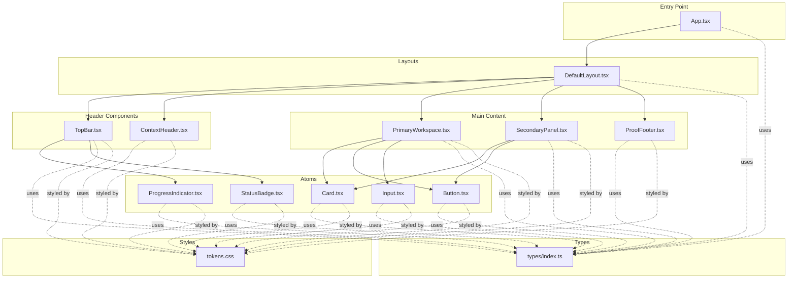

**Diagram sources**
- [App.tsx:14-145](file://src/App.tsx#L14-L145)
- [DefaultLayout.tsx:5-24](file://src/layouts/DefaultLayout/DefaultLayout.tsx#L5-L24)
- [TopBar.tsx:7-26](file://src/components/TopBar/TopBar.tsx#L7-L26)
- [ContextHeader.tsx:5-15](file://src/components/ContextHeader/ContextHeader.tsx#L5-L15)
- [PrimaryWorkspace.tsx:5-13](file://src/components/PrimaryWorkspace/PrimaryWorkspace.tsx#L5-L13)
- [SecondaryPanel.tsx:6-40](file://src/components/SecondaryPanel/SecondaryPanel.tsx#L6-L40)
- [ProofFooter.tsx:5-28](file://src/components/ProofFooter/ProofFooter.tsx#L5-L28)
- [Button.tsx:5-31](file://src/components/Button/Button.tsx#L5-L31)
- [Input.tsx:5-46](file://src/components/Input/Input.tsx#L5-L46)
- [Card.tsx:5-13](file://src/components/Card/Card.tsx#L5-L13)
- [StatusBadge.tsx:11-19](file://src/components/StatusBadge/StatusBadge.tsx#L11-L19)
- [ProgressIndicator.tsx:5-22](file://src/components/ProgressIndicator/ProgressIndicator.tsx#L5-L22)
- [tokens.css:8-107](file://src/styles/tokens.css#L8-L107)
- [index.ts:13-99](file://src/types/index.ts#L13-L99)

**Section sources**
- [App.tsx:14-145](file://src/App.tsx#L14-L145)
- [DefaultLayout.tsx:5-24](file://src/layouts/DefaultLayout/DefaultLayout.tsx#L5-L24)
- [index.ts:13-99](file://src/types/index.ts#L13-L99)
- [tokens.css:8-107](file://src/styles/tokens.css#L8-L107)

## Core Components
This section highlights the foundational components and their props, enabling predictable composition across interfaces.

- Button
  - Variants: primary, secondary
  - Sizes: sm, md, lg
  - Supports disabled state and click handlers
  - Props: children, variant, size, disabled, onClick, type, className
  - Example usage: [Button.tsx:5-31](file://src/components/Button/Button.tsx#L5-L31), [index.ts:20-28](file://src/types/index.ts#L20-L28)

- Input
  - Features: label, placeholder, value, onChange, error messaging, disabled, type, id
  - Accessibility: aria-invalid and aria-describedby for error state
  - Example usage: [Input.tsx:5-46](file://src/components/Input/Input.tsx#L5-L46), [index.ts:30-40](file://src/types/index.ts#L30-L40)

- Card
  - Purpose: container for grouped content
  - Example usage: [Card.tsx:5-13](file://src/components/Card/Card.tsx#L5-L13), [index.ts:42-45](file://src/types/index.ts#L42-L45)

- StatusBadge
  - Statuses: not-started, in-progress, shipped
  - Example usage: [StatusBadge.tsx:11-19](file://src/components/StatusBadge/StatusBadge.tsx#L11-L19), [index.ts:47-50](file://src/types/index.ts#L47-L50)

- ProgressIndicator
  - Displays current step and total steps with progress bar
  - Example usage: [ProgressIndicator.tsx:5-22](file://src/components/ProgressIndicator/ProgressIndicator.tsx#L5-L22), [index.ts:52-56](file://src/types/index.ts#L52-L56)

- TopBar
  - Composes app name, progress indicator, and status badge
  - Example usage: [TopBar.tsx:7-26](file://src/components/TopBar/TopBar.tsx#L7-L26), [index.ts:58-64](file://src/types/index.ts#L58-L64)

- ContextHeader
  - Provides headline and subtext for context
  - Example usage: [ContextHeader.tsx:5-15](file://src/components/ContextHeader/ContextHeader.tsx#L5-L15), [index.ts:66-70](file://src/types/index.ts#L66-L70)

- PrimaryWorkspace
  - Main content area for primary tasks
  - Example usage: [PrimaryWorkspace.tsx:5-13](file://src/components/PrimaryWorkspace/PrimaryWorkspace.tsx#L5-L13), [index.ts:72-75](file://src/types/index.ts#L72-L75)

- SecondaryPanel
  - Sidebar panel with step guidance and optional copyable prompt
  - Example usage: [SecondaryPanel.tsx:6-40](file://src/components/SecondaryPanel/SecondaryPanel.tsx#L6-L40), [index.ts:77-82](file://src/types/index.ts#L77-L82)

- ProofFooter
  - Completion checklist with check/uncheck indicators
  - Example usage: [ProofFooter.tsx:5-28](file://src/components/ProofFooter/ProofFooter.tsx#L5-L28), [index.ts:84-90](file://src/types/index.ts#L84-L90)

**Section sources**
- [Button.tsx:5-31](file://src/components/Button/Button.tsx#L5-L31)
- [Input.tsx:5-46](file://src/components/Input/Input.tsx#L5-L46)
- [Card.tsx:5-13](file://src/components/Card/Card.tsx#L5-L13)
- [StatusBadge.tsx:11-19](file://src/components/StatusBadge/StatusBadge.tsx#L11-L19)
- [ProgressIndicator.tsx:5-22](file://src/components/ProgressIndicator/ProgressIndicator.tsx#L5-L22)
- [TopBar.tsx:7-26](file://src/components/TopBar/TopBar.tsx#L7-L26)
- [ContextHeader.tsx:5-15](file://src/components/ContextHeader/ContextHeader.tsx#L5-L15)
- [PrimaryWorkspace.tsx:5-13](file://src/components/PrimaryWorkspace/PrimaryWorkspace.tsx#L5-L13)
- [SecondaryPanel.tsx:6-40](file://src/components/SecondaryPanel/SecondaryPanel.tsx#L6-L40)
- [ProofFooter.tsx:5-28](file://src/components/ProofFooter/ProofFooter.tsx#L5-L28)
- [index.ts:13-99](file://src/types/index.ts#L13-L99)

## Architecture Overview
The application composes a layout container with header, workspace, sidebar, and footer components. State is managed at the application level and passed down as props to components, enabling predictable updates across the UI.

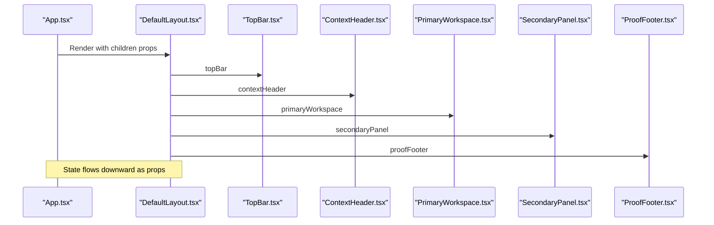

**Diagram sources**
- [App.tsx:28-144](file://src/App.tsx#L28-L144)
- [DefaultLayout.tsx:13-23](file://src/layouts/DefaultLayout/DefaultLayout.tsx#L13-L23)

**Section sources**
- [App.tsx:28-144](file://src/App.tsx#L28-L144)
- [DefaultLayout.tsx:13-23](file://src/layouts/DefaultLayout/DefaultLayout.tsx#L13-L23)

## Detailed Component Analysis

### Button Component
- Composition pattern: Accepts children and applies variant/size classes
- Accessibility: Uses button element with explicit type and disabled state
- Example integration: Demonstrated in App.tsx with primary/secondary/disabled variants

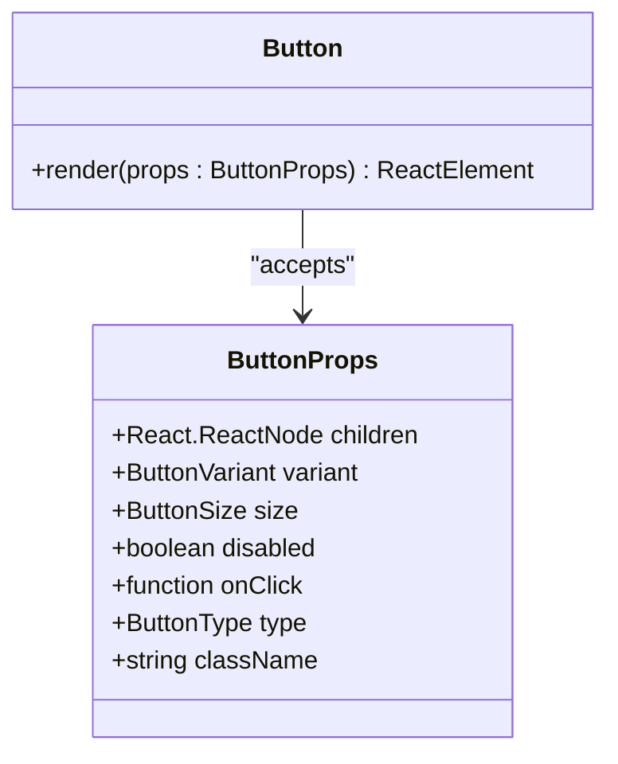

**Diagram sources**
- [Button.tsx:5-31](file://src/components/Button/Button.tsx#L5-L31)
- [index.ts:20-28](file://src/types/index.ts#L20-L28)

**Section sources**
- [Button.tsx:5-31](file://src/components/Button/Button.tsx#L5-L31)
- [index.ts:20-28](file://src/types/index.ts#L20-L28)

### Input Component
- Form integration: Controlled input with onChange handler and optional error messaging
- Accessibility: Associates label with input via generated id, sets aria-invalid and aria-describedby
- Example integration: Used in App.tsx within a Card for form demonstrations

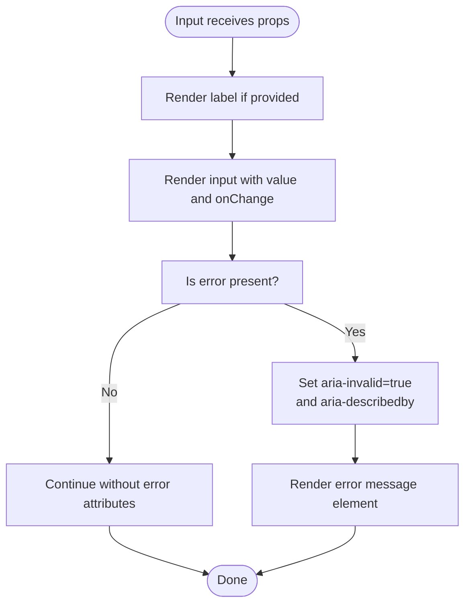

**Diagram sources**
- [Input.tsx:5-46](file://src/components/Input/Input.tsx#L5-L46)

**Section sources**
- [Input.tsx:5-46](file://src/components/Input/Input.tsx#L5-L46)

### TopBar Component
- Orchestration: Composes ProgressIndicator and StatusBadge
- Props contract: appName, currentStep, totalSteps, status
- Example integration: Used as topBar in DefaultLayout

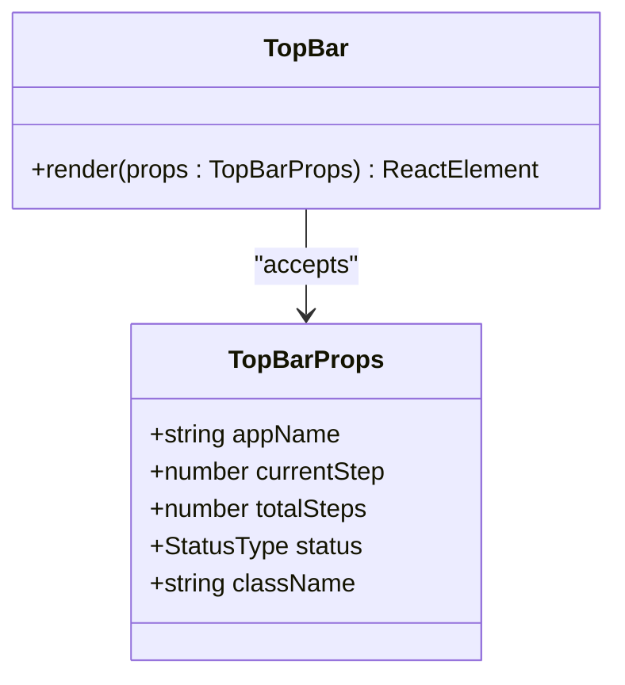

**Diagram sources**
- [TopBar.tsx:7-26](file://src/components/TopBar/TopBar.tsx#L7-L26)
- [index.ts:58-64](file://src/types/index.ts#L58-L64)

**Section sources**
- [TopBar.tsx:7-26](file://src/components/TopBar/TopBar.tsx#L7-L26)
- [index.ts:58-64](file://src/types/index.ts#L58-L64)

### DefaultLayout Container
- Composition: Accepts topBar, contextHeader, primaryWorkspace, secondaryPanel, proofFooter
- Purpose: Establishes the page shell and grid-like arrangement

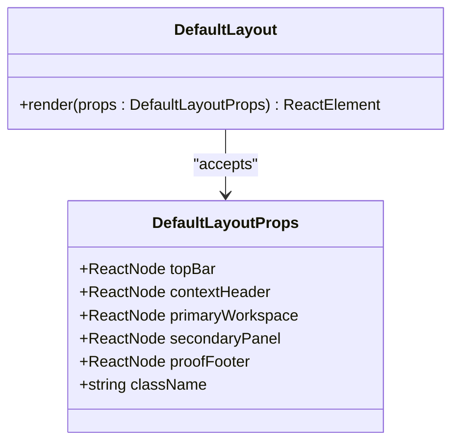

**Diagram sources**
- [DefaultLayout.tsx:5-24](file://src/layouts/DefaultLayout/DefaultLayout.tsx#L5-L24)
- [index.ts:92-99](file://src/types/index.ts#L92-L99)

**Section sources**
- [DefaultLayout.tsx:5-24](file://src/layouts/DefaultLayout/DefaultLayout.tsx#L5-L24)
- [index.ts:92-99](file://src/types/index.ts#L92-L99)

## Integration Patterns

### Forms
- Pattern: Use Input with controlled value and onChange to update local state
- Validation: Pass error string to render assistive messaging and set aria-invalid
- Example reference: [App.tsx:50-78](file://src/App.tsx#L50-L78)

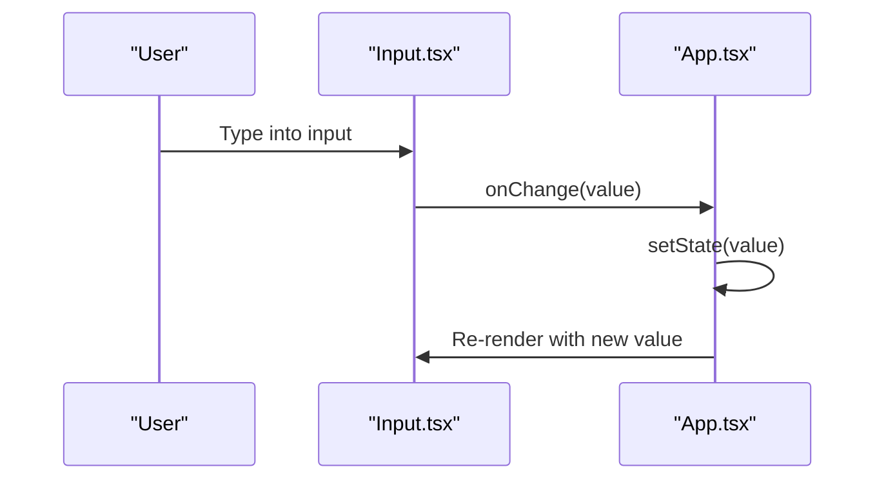

**Diagram sources**
- [Input.tsx:18-20](file://src/components/Input/Input.tsx#L18-L20)
- [App.tsx:18](file://src/App.tsx#L18)

**Section sources**
- [Input.tsx:18-20](file://src/components/Input/Input.tsx#L18-L20)
- [App.tsx:18](file://src/App.tsx#L18)

### Navigation & Step Workflows
- Pattern: Use Button to navigate between steps and update currentStep state
- Visual feedback: TopBar displays ProgressIndicator reflecting currentStep/totalSteps
- Example reference: [App.tsx:108-127](file://src/App.tsx#L108-L127), [TopBar.tsx:19-20](file://src/components/TopBar/TopBar.tsx#L19-L20)

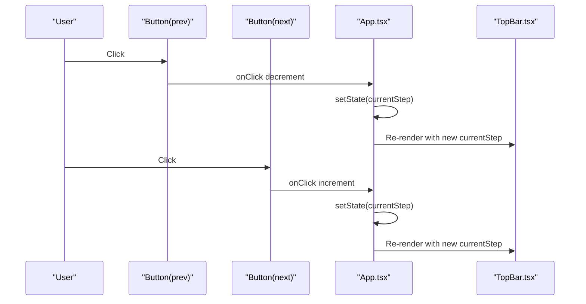

**Diagram sources**
- [App.tsx:110-125](file://src/App.tsx#L110-L125)
- [TopBar.tsx:19-20](file://src/components/TopBar/TopBar.tsx#L19-L20)

**Section sources**
- [App.tsx:110-125](file://src/App.tsx#L110-L125)
- [TopBar.tsx:19-20](file://src/components/TopBar/TopBar.tsx#L19-L20)

### Content Layouts
- Pattern: Wrap primary content in PrimaryWorkspace; place contextual guidance in SecondaryPanel
- Example reference: [App.tsx:43-139](file://src/App.tsx#L43-L139)

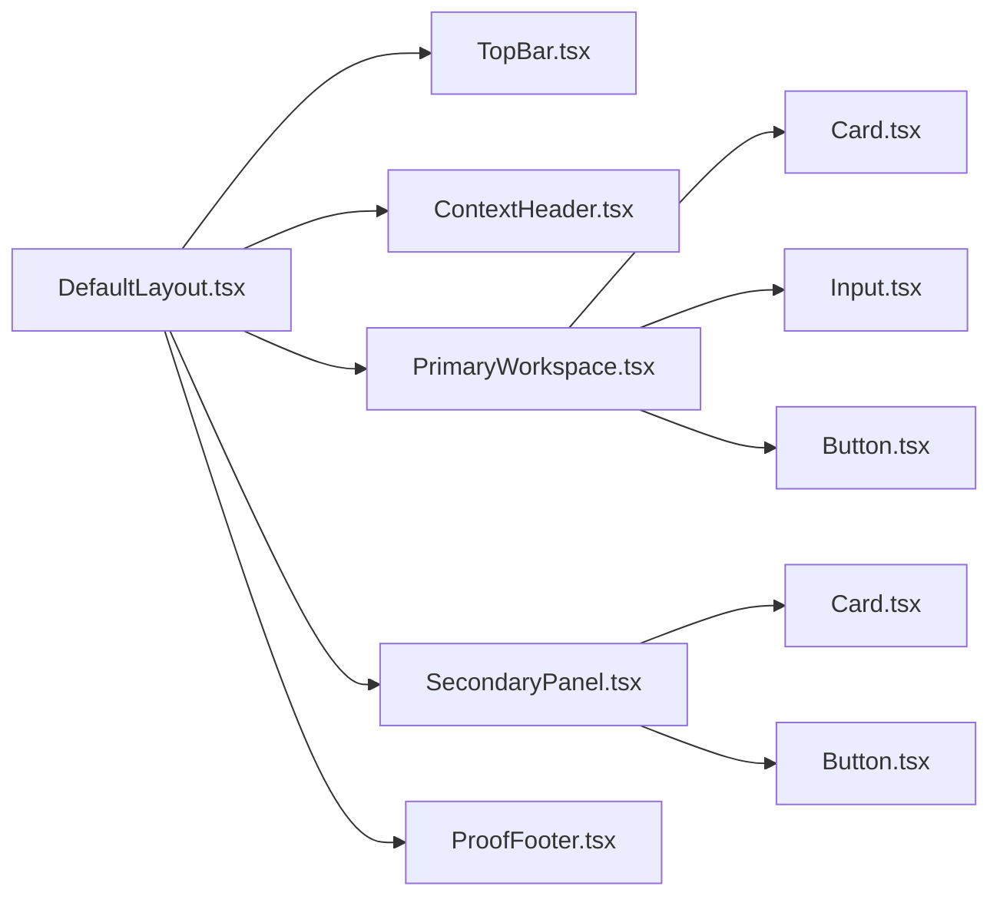

**Diagram sources**
- [App.tsx:43-139](file://src/App.tsx#L43-L139)
- [DefaultLayout.tsx:13-23](file://src/layouts/DefaultLayout/DefaultLayout.tsx#L13-L23)

**Section sources**
- [App.tsx:43-139](file://src/App.tsx#L43-L139)
- [DefaultLayout.tsx:13-23](file://src/layouts/DefaultLayout/DefaultLayout.tsx#L13-L23)

### Interactive Workflows
- Pattern: Use Button variants to trigger state changes (e.g., status updates)
- Example reference: [App.tsx:82-105](file://src/App.tsx#L82-L105)

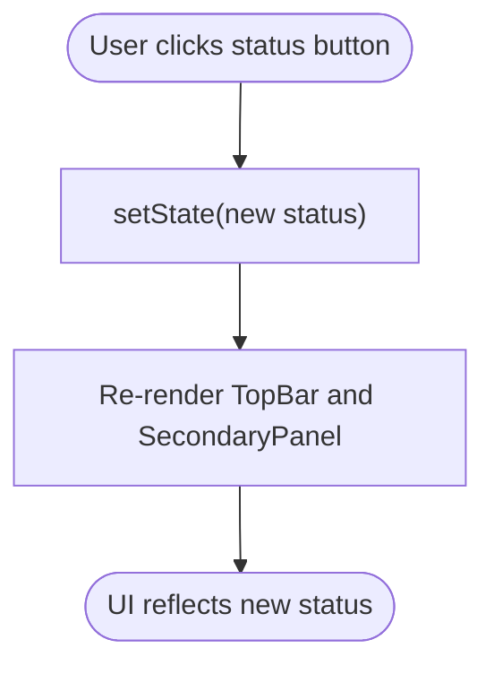

**Diagram sources**
- [App.tsx:83-103](file://src/App.tsx#L83-L103)

**Section sources**
- [App.tsx:83-103](file://src/App.tsx#L83-L103)

### Real-World Scenarios

#### Dashboard Layout
- Structure: TopBar for branding and progress, ContextHeader for page context, PrimaryWorkspace for KPI cards and charts, SecondaryPanel for quick actions, ProofFooter for completion checks
- Reference: [App.tsx:28-144](file://src/App.tsx#L28-L144)

#### Checkout Flow
- Structure: TopBar shows step count, PrimaryWorkspace contains form steps, SecondaryPanel provides order summary and copyable prompts, ProofFooter tracks completion
- Reference: [App.tsx:130-142](file://src/App.tsx#L130-L142)

#### Admin Interface
- Structure: ContextHeader for section title, PrimaryWorkspace for data tables/lists, SecondaryPanel for filters/actions, TopBar for status and progress
- Reference: [App.tsx:28-144](file://src/App.tsx#L28-L144)

**Section sources**
- [App.tsx:28-144](file://src/App.tsx#L28-L144)

## Responsive Design & Mobile-First
- Design tokens define spacing, typography, and layout constraints suitable for responsive grids
- Layout widths: primary workspace and secondary panel widths are defined as percentages
- Recommendations:
  - Use CSS custom properties for consistent spacing and typography
  - Prefer percentage-based widths for panels and avoid fixed pixel sizes
  - Apply media queries to adjust spacing and font sizes for smaller screens
  - Keep focus styles and touch targets accessible on mobile devices

**Section sources**
- [tokens.css:74-80](file://src/styles/tokens.css#L74-L80)
- [tokens.css:38-42](file://src/styles/tokens.css#L38-L42)
- [tokens.css:51-69](file://src/styles/tokens.css#L51-L69)

## Accessibility Implementation
- Input component:
  - Associates label with input via generated id
  - Sets aria-invalid and aria-describedby when error is present
  - Reference: [Input.tsx:16-44](file://src/components/Input/Input.tsx#L16-L44)
- Buttons:
  - Explicit button type and disabled state
  - Reference: [Button.tsx:22-27](file://src/components/Button/Button.tsx#L22-L27)
- Status and progress:
  - Semantic status labels and visible progress text
  - Reference: [StatusBadge.tsx:5-19](file://src/components/StatusBadge/StatusBadge.tsx#L5-L19), [ProgressIndicator.tsx:12-20](file://src/components/ProgressIndicator/ProgressIndicator.tsx#L12-L20)

Best practices:
- Always pair labels with inputs using htmlFor and id
- Provide meaningful aria-invalid and aria-describedby attributes for error states
- Ensure sufficient color contrast and keyboard navigability
- Use semantic HTML elements and explicit button types

**Section sources**
- [Input.tsx:16-44](file://src/components/Input/Input.tsx#L16-L44)
- [Button.tsx:22-27](file://src/components/Button/Button.tsx#L22-L27)
- [StatusBadge.tsx:5-19](file://src/components/StatusBadge/StatusBadge.tsx#L5-L19)
- [ProgressIndicator.tsx:12-20](file://src/components/ProgressIndicator/ProgressIndicator.tsx#L12-L20)

## State Management Patterns
- Centralized state in App.tsx manages currentStep, totalSteps, status, and input value
- Props-down, events-up pattern: Components receive state via props and emit updates via callbacks
- Example references:
  - Step navigation: [App.tsx:110-125](file://src/App.tsx#L110-L125)
  - Status toggles: [App.tsx:83-103](file://src/App.tsx#L83-L103)
  - Input binding: [App.tsx:53-67](file://src/App.tsx#L53-L67)

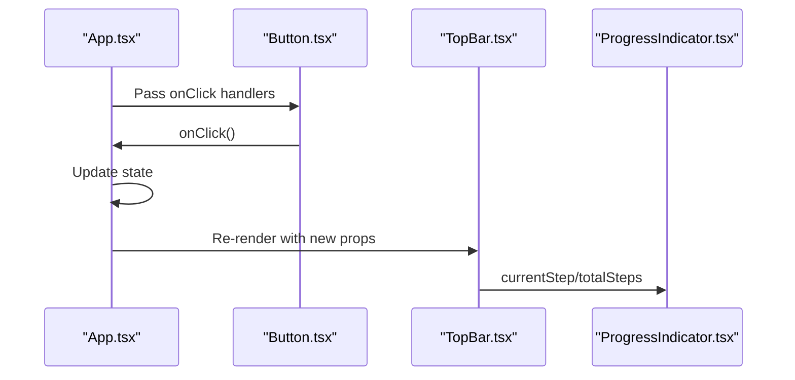

**Diagram sources**
- [App.tsx:110-125](file://src/App.tsx#L110-L125)
- [App.tsx:83-103](file://src/App.tsx#L83-L103)
- [TopBar.tsx:19-20](file://src/components/TopBar/TopBar.tsx#L19-L20)

**Section sources**
- [App.tsx:110-125](file://src/App.tsx#L110-L125)
- [App.tsx:83-103](file://src/App.tsx#L83-L103)
- [App.tsx:53-67](file://src/App.tsx#L53-L67)

## Performance Considerations
- Component composition: Keep components small and focused to minimize re-renders
- Avoid unnecessary re-creations: Memoize handlers and derived values when appropriate
- CSS custom properties: Use tokens for consistent styles to reduce CSS overrides
- Bundle size: Keep component imports scoped and avoid unused variants
- Testing: Leverage existing test suite to catch regressions during refactors

**Section sources**
- [package.json:6-10](file://package.json#L6-L10)

## Troubleshooting Guide
- Input error state not announced:
  - Verify aria-invalid and aria-describedby are set when error is provided
  - Reference: [Input.tsx:37-43](file://src/components/Input/Input.tsx#L37-L43)
- Button not responding:
  - Confirm onClick handler is passed and not shadowed by disabled prop
  - Reference: [Button.tsx:25-27](file://src/components/Button/Button.tsx#L25-L27)
- Progress bar not updating:
  - Ensure currentStep and totalSteps are passed correctly to TopBar and ProgressIndicator
  - Reference: [TopBar.tsx:19-20](file://src/components/TopBar/TopBar.tsx#L19-L20), [ProgressIndicator.tsx:16-18](file://src/components/ProgressIndicator/ProgressIndicator.tsx#L16-L18)
- Layout misalignment:
  - Check CSS custom properties for layout widths and spacing
  - Reference: [tokens.css:77-80](file://src/styles/tokens.css#L77-L80), [tokens.css:38-42](file://src/styles/tokens.css#L38-L42)

**Section sources**
- [Input.tsx:37-43](file://src/components/Input/Input.tsx#L37-L43)
- [Button.tsx:25-27](file://src/components/Button/Button.tsx#L25-L27)
- [TopBar.tsx:19-20](file://src/components/TopBar/TopBar.tsx#L19-L20)
- [ProgressIndicator.tsx:16-18](file://src/components/ProgressIndicator/ProgressIndicator.tsx#L16-L18)
- [tokens.css:77-80](file://src/styles/tokens.css#L77-L80)
- [tokens.css:38-42](file://src/styles/tokens.css#L38-L42)

## Conclusion
The design system enables consistent, accessible, and performant UI development through small, composable components and a shared type system. By following the integration patterns outlined—props-down, events-up, controlled form elements, and thoughtful layout composition—you can build robust interfaces such as dashboards, checkout flows, and admin panels. Adhering to responsive and accessibility guidelines ensures inclusive experiences across devices and abilities.